# 웹사이트 배포 작업

## 일자

### 12월 17일
* wikidocs에서 점프투장고를 참조해 Lightsail을 이용한 배포계획 수립

  
### 12월 18일
* 점프투장고를 읽으며 조원과 회의

### 12월 19일
* 점프투장고를 참조해 첫 사이클을 하였으나, 실패로 끝남.

### 12월 20일
* 같은 조원과 화상회의를 통해 갈피를 잡기 시작

### 12월 21일
* 많은 시행착오와 고민을 통해 본격적 웹사이트 배포 작업 시행

### 12월 22일
* 웹사이트 배포 완료 (모든 기능은 추가하지는 않음.)
### 점프 투 장고에선 pybo 로 실습을 진행했지만 전 차이를 두기 위해 HelloWorld 라는 이름으로 실습했습니다!
### 12월 23일 (업로드 시작) 1장. 장고 개발 준비
- 파이썬 설치하기
- 장고 개발환경 준비하기
- 장고 프로젝트 생성하기
- 파이참 설치하고 장고 개발 서버 실행하기
### 12월 24일 2장. 장고의 기본 요소 익히기
- 주소와 화면을 연결하는 URL과 뷰
- 데이터를 관리하는 모델
- 개발 편의를 제공하는 장고 Admin
- 질문 목록과 질문 상세 기능 구현하기
- URL 더 똑똑하게 사용하기
- 답변 등록 기능 만들기
- 스태틱화면 예쁘게 꾸미기
- 부트스트랩으로 더 쉽게 화면 꾸미기
- 표준 HTML과 템플릿 상속 사용해 보기
- 질문 등록 기능 만들기
### 12월 25일 3장. 파이보 서비스 개발!
- 내비게이션 기능 추가하기
- 게시판 페이징 기능 추가하기
- 템플릿 필터 직접 만들어 보기
- 질문에 달린 답변 개수 표시하기
- 로그인 로그아웃 구현하기
- 회원가입 구현하기
- 모델에 글쓴이 추가하기
- 글쓴이 표시하기
- 게시물 수정 & 삭제 기능 추가하기
- 댓글 기능 추가하기
### 12월 26일 4장. 세상에 선보이는 파이보 서비스!
- 깃으로 버전 관리하기
- 깃허브 사용해 보기
- 파이보를 위한 서버 운영 방법 알아보기
- AWS 라이트세일 공개하기
- 세상에 파이보 공개하기


### 스샷첨부

* 디렉터리 생성
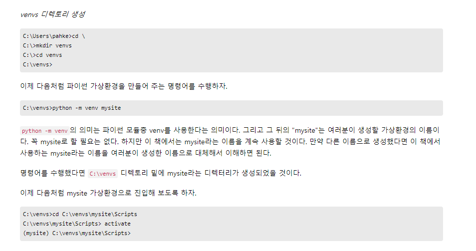
  
* 프로젝트 생성
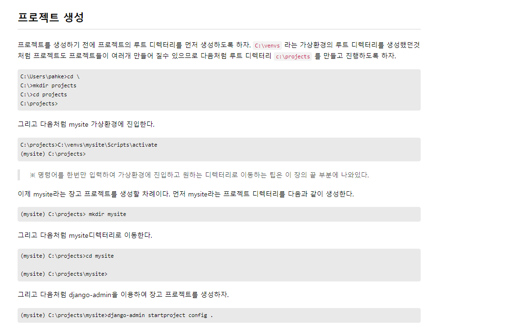

* 파이참 작업
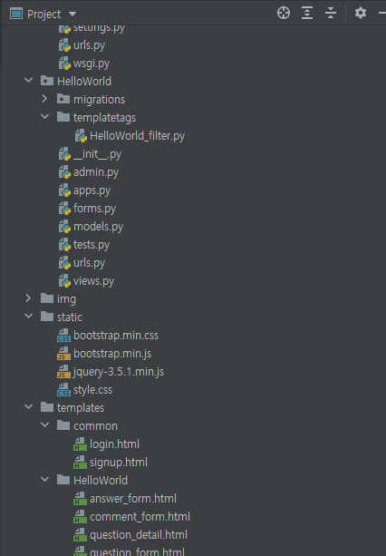
  
* Settings.py 수정 
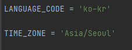
  
### 추가된 소스코드 
## 12월 23일 장고 개발 준비
## 파이썬 설치하기
- 파이썬 공식 홈페이지 주소 : www.python.org
```python
선택하셔야할 부분 install Now ,하단에 Add python.38 to path, install launcher for all users
```
## 파이썬 설치 확인하기
- 명령 프롬프트(CMD)
```python
C:\Users\park> python -V
python 3.8.5
```python
만약 명령어를 제대로 입력했는데도 파이썬 버전이 나타나지 않고 ‘찾을 수 없는 명령’이라는 오류 메시지가 출력된다면 
앞의 설치 과정에서 경로 설정에 문제가 있을 가능성이 크다. 이때는 1단계에서 내려받은 설치 파일을 다시 실행해 <Uninstall>을 눌러 삭제한 후 2단계부터 다시 설치하자.
```
## 장고 개발환경 준비하기
윈도우에서 명령 프롬프트를 실행하고 다음 명령어를 입력해 C:/venvs라는 디렉터리를 만들자.
- 명령 프롬프트
```python
C:\Users\park> cd \
C:\> mkdir venvs
C:\> cd venvs
```
## 가상 환경 만들기
파이썬 가상 환경을 만드는 다음 명령어를 입력해 실행하자.
- 명령 프롬프트
```python
C:\venvs> python -m venv mysite
```
명령에서 python -m venv는 파이썬 모듈 중 venv라는 모듈을 사용한다는 의미다.
## 가상 환경에 진입하기
가상 환경에 진입하려면 우리가 생성한 mysite 가상 환경에 있는 Scripts 디렉터리의 activate 명령을 수행해야 한다.
- 명령 프롬프트
```python
C:\venvs>cd C:\venvs\mysite\Scripts
C:\venvs\mysite\Scripts> activate
(mysite) C:\venvs\mysite\Scripts>
```
그러면 C:/ 왼쪽에 (mysite)라는 프롬프트를 확인할 수 있다. 이름에서 볼 수 있듯 현재 여러분이 진입한 가상 환경을 의미한다.
## 가상 환경애서 벗어나기
현재 진입한 가상 환경에서 벗어나려면 deactivate 라는 명령을 실행하면 된다. 이 명령은 어느 위치에서 실행해도 상관없다.
- 명령 프롬프트
```python
(mysite) C:\venvs\mysite\Scripts> deactivate
```
가상 환경에서 벗어났다면 C:/ 왼쪽에 있던 (mysite)라는 프롬프트가 사라졌을 것이다
## 가상 환경인지 확인하기
명령 프롬프트 왼쪽에 (mysite) 프롬프트가 보이는지 확인하자.
```python
C:\venvs\mysite\Scripts> activate
(mysite) C:\venvs\mysite\Scripts>
```
## 가상 환경에서 장고 설치하기
```python
mysite 가상 환경에 진입한 상태에서 pip install django==3.1.3 명령을 입력하자.
pip은 파이썬 라이브러리를 설치하고 관리해 주는 파이썬 도구이다. pip install django==3.1.3는 pip으로 장고 3.1.3 버전을 설치하는 명령이라고 생각하면 된다.
```
- 명령 프롬프트
```python
(mysite) C:\venvs\mysite\Scripts> pip install django==3.1.3
(생략)
WARNING: You are using pip version 19.2.3, however version 20.2.3 is available.
You should consider upgrading via the 'python -m pip install --upgrade pip' command.
```
그런데 마지막에 경고(WARNING) 문구가 보인다. pip이 최신 버전이 아니라는 내용이다.
## pip 최신 버전으로 설치하기
- 명령 프롬프트
```python
(mysite) C:\venvs\mysite\Scripts> python -m pip install --upgrade pip
(생략)
Successfully installed pip-20.0.2
```
## 장고 프로젝트 생성하기
장고에는 프로젝트라는 개념이 있는데, 장고의 프로젝트는 하나의 웹 사이트라고 생각하면 된다.
## 프로젝트 디렉터리 루트 디렉터리 생성하기
장고 프로젝트는 여러 개가 될 수 있으므로 프로젝트를 모아 둘 프로젝트 루트 디렉터리 셍성은 필수다.
- 명령 프롬프트
```python
C:\projects>C:\venvs\mysite\Scripts\activate
(mysite) C:\projects>
```
## 장고 프로젝트를 담을 디렉터리 생성하고 이동하기
장고 프로젝트를 담을 mysite 디렉터리를 생성하고 이동하자.
- 명령 프롬프트
```python
(mysite) C:\projects>mkdir mysite
(mysite) C:\projects>cd mysite
(mysite) C:\projects\mysite>
```
## 장고 프로젝트 생성하기
```python
mysite 디렉터리에서 django-admin이라는 도구로 장고 프로젝트를 생성하자. 
이때 config 다음에 점 기호(.)가 있음에 주의하자. 점 기호는 ‘현재 디렉터리를 프로젝트 디렉터리로 만들라’는 의미이다.
```
- 명령 프롬프트
```python
(mysite) C:\projects\mysite>django-admin startproject config .
```
## 장고 프로젝트 내용물 확인하기
위 단계들이 완료되면 다음과 같은 구조로 디렉터리가 구성되어 있는지, 파일이 잘 생성되어 있는지 확인해 보자.
- 디렉터리 구조와 파일
```python
C:\projects\mysite
├── config/
│      ├─ asgi.py
│      ├─ settings.py
│      ├─ urls.py
│      ├─ wsgi.py
│      └─ __init__.py
└── manage.py
```
## 개발 서버 구동하고 웹 사이트에 접속해 보기
개발 서버를 구동하고 웹 사이트에 접속해 보자.
## 개발 서버 구동하기
```python
python manage.py runserver 명령을 실행하면 개발 서버가 구동된다.
맨 아랫줄에는 ‘Quit the server with CTRL-BREAK’이라는 개발 서버 종료 방법도 안내되어 있다.
개발 서버를 종료하려면 <Ctrl+C>를 누르란 뜻이다.
```
- 명령 프롬프트
```python
(mysite) C:\projects\mysite>python manage.py runserver
(생략)
Quit the server with CTRL-BREAK.
```
개발 서버가 구동된 상태를 유지하고 웹 브라우저를 이용하여 127.0.0.1:8000에 접속해 보자. 
```python
- 개발 서버는 127.0.0.0, 즉 로컬호스트localhost로 실행되므로 로컬 서버라 부르기도 한다. 필자는 개발을 위해 실행된 개발 서버를 ‘개발 서버’라 부르겠다.
- 127.0.0.1:8000 대신 localhost:8000이라고 입력해도 같은 화면을 볼 수 있다. 127.0.0.1과 localhost는 현재 컴퓨터를 가리키는 아이피 주소다.
```
아직은 개발 서버 환경에서 사이트가 실행되고 있으므로 본인 컴퓨터에서만 서버가 열린다.
## 개발 서버 종료하기
<Ctrl+C> 를 눌러 개발 서버를 종료해 보자. 
```python
로컬 아이피 주소로 다른 사람이 접속할 수 없는 이유

앞에서 ‘아직은 여러분이 만든 사이트에 다른 사람이 접속할 수 없다’고 이야기했다. 왜 그럴까? 다른 사람이 여러분이 만든 사이트에 접속하려면 localhost나 127.0.0.1이라는 로컬 아이피 주소가 아닌 15.165.210.240과 같은 인터넷 세상 속의 아이피 주소 또는 pybo.kr과 같은 도메인이 필요하기 때문이다. 로컬 아이피 주소의 ‘로컬’은 지역이라는 뜻이며,
이는 곧 ‘내 PC’를 의미한다. 내 PC의 아이피 주소이므로 친구가 접속할 수 없다.
4장에서 인터넷 세상 속의 아이피 주소로 여러분이 만든 사이트에 접속하는 방법을 소개하므로 우선은 파이보 기능을 완성하는 데 집중하자.
```
## mysite 가상 환경에 간단히 진입하기
```python
mysite 가상 환경에 진입하려면 매번 명령 프롬프트를 실행하고 C:/venvs/mysite/Scripts 디렉터리로 이동하여 activate 명령을 수행해야 한다.
이런 일련의 과정을 한 번에 수행할 수 있는 배치 프로그램을 만들어 귀찮음을 덜어 보자.
```
## mysite.cmd 배치 파일 생성하기
```python
mysite.cmd 파일을 venvs 디렉터리에 만들고 다음과 같이 작성하여 저장하자.
확장자 .cmd가 붙은 파일은 배치(batch) 파일이라 부르며, 명령어 입력과 실행을 한 번에 해주는 파일이라 생각하면 된다.
```
- 파일 이름 [파일 이름: C:/venvs/mysite.cmd]
- mysite.cmd 안에 넣어야 할 소스 코드
```python
@echo off
cd c:/projects/mysite
c:/venvs/mysite/scripts/activate
```
배치 파일의 내용은 C:/projects/mysite 디렉터리로 이동한 다음, C:/venvs/mysite/scripts/activate 명령을 수행하라는 뜻이다.
## 배피 파일 위치를 PATH 환경 변수에 추가하기
```python
1. 윈도우 + R 키를 눌러서 실행화면 띄우기
2. sysdm.cpl 명령을 입력한 다음 <확인> 클릭
3. ‘시스템 속성’ 창이 나타난다. 여기서 <고급> 탭을 선택하고 <환경 변수> 클릭
4. ‘환경 변수’ 창이 나타난다. 여기서 사용자 변수 중 <Path>를 선택하고 <편집> 버튼 클릭
5. <새로 만들기> 버튼 클릭
6. C:/venvs(저는 c:/Users/parrk/Venvs)라는 디렉터리를 추가하고 <확인> 버튼
7.마지막으로 다음 ‘환경 변수’ 창에서 <확인> 버튼
```
## PATH 환경 변수 확인하기
```python
이렇게 하면 환경 변수 PATH에 C:/venvs 디렉터리가 추가되어 mysite.cmd 명령을 어디서든 실행할 수 있다.
명령 프롬프트를 다시 시작하자(그래야 변경된 환경 변수 PATH가 제대로 반영된다).
그리고 set path 명령을 실행하여 변경된 환경 변수 PATH의 내용을 확인해 보자. 
C:/venvs라는 디렉터리가 환경 변수 PATH에 포함되어 있으면 된다.
```
- 명령 프롬프트(CMD)
```python
C:\Users\park>set path
Path=C:\Windows\system32; (... 생략 ...) ;C:\venvs
PATHEXT=.COM;.EXE;.BAT;.CMD;.VBS;.VBE;.JS;.JSE;.WSF;.WSH;.MSC
```
## 배치 파일 실행하여 가상 환경에 진입하기
```python
이제 지금까지 만든 mysite 명령(배치 파일 이름)을 실행하여 가상 환경에 잘 진입하는지 확인해 보자.
참고로 윈도우에서 확장자가 .cmd인 파일은 확장자를 빼고 입력해도 된다.
```
- 명령 프롬프트
```python
C:\Users\parky> mysite
(mysite) C:\projects\mysite>
```
## 파이참 설치하고 장고 개발 서버 실행하기
보통 파이썬과 장고 개발에 많이 사용되는 에디터는 비주얼 스튜디오 코드와 파이참이다.
이 책에서는 파이참으로 장고 개발을 진행한다.
## 파이참 설치하기
윈도우용 파이참 설치 파일 주소: www.jetbrains.com/ko-kr/pycharm/download/#section=windows
```python
<Professional>과 <Community> 중 무료 버전인 <Community>를 선택하자. 파이참 설치 파일을 내려받은 후 설치를 진행하자.
설치할 때 특별히 주의할 점은 없으므로 끝까지 <Next>를 선택하여 설치하면 된다.
```
## 파이참 실행하기
```python
[윈도우 키]를 누르고 프로그램 목록에서 [JetBrains → PyCharm Community Edition]을 선택하면 파이참이 실행된다.
파이참을 처음 실행하는 독자라면 다음과 같은 설정 창이 나타날 것이다. 
테마, 플러그인 등의 옵션은 기본값으로 선택하고 넘어가자.
이어서 다음과 같은 창이 나오면 두 번째 메뉴인 <Open>을 선택하여 앞에서 우리가 생성한 장고 프로젝트인 C:/projects/mysite를 선택하자.
처음 프로젝트를 만들면 mysite 디렉터리 안에 main.py 파일이 자동으로 생성될 수 있다. 파일이 있다면 삭제 후 실습을 진행하자.
```
## 파이참 인터프리터 설정하고 개발 서버 한글로 실행하기
파이참으로 장고 프로젝트를 불러온 후 가장 먼저 해야 할 일은 장고 프로젝트가 바라봐야 할 파이썬 인터프리터 위치를 설정하는 것이다.
## 현재 파이썬 인터프리터 위치 확인하기
```python
파이참 메뉴에서 [File → Settings]를 눌러 설정 창을 열고 [Project: mysite → Project Interpreter]를 순서대로 눌러 파이썬 인터프리터 위치를 설정할 수 있는 창을 열자.
그런 다음 오른쪽 위에 보이는 Python Interpreter를 보자.
아마도 파이썬을 설치한 디렉터리로 설정되어 있을 것이다.
```
## 파이썬 인터프리터 위치를 가상 환경 위치로 수정하기
하지만 지금은 가상 환경을 사용하므로 파이썬 인터프리터 위치를 가상 환경 위치로 수정해야 한다.
```python 
1. Python Interpreter 오른쪽에 보이는 톱니바퀴 모양 아이콘을 누른 다음 <Add>를 누르자.
2. 파이썬 인터프리터 위치를 설정할 수 있는 ‘Add Python Interpreter’ 창이 나타난다.
3. <Existing environment>를 누른 다음 Interpreter 오른쪽에 보이는 <...>을 누르자.
4. C:/venvs/mysite/Scripts/python.exe를 선택한 후 <OK>를 누른다.
5. 나머지 창도 를 눌러 설정을 마치면 파이참이 mysite 가상 환경에 있는 파이썬 인터프리터를 인식하기 시작한다.
```
## 파이참에서 settings.py 파일 수정하기
```python
이제 파이참으로 장고를 개발할 준비가 완료되었다. 장고 개발을 맛보는 차원에서 장고의 설정값이 들어 있는 settings.py 파일을 수정해 보자.
파이참에서 settings.py 파일을 열어 LANGUAGE_CODE와 TIME_ZONE 설정값을 수정하자.
LANGUAGE_CODE를 en-us에서 ko-kr로 수정하고 TIME_ZONE을 UTC에서 Asia/Seoul로 수정했다.
언어와 시간을 한국 값으로 바꾼 것이다.
```
- [파일이름: C:/projects/mysite/config/settings.py]
```python
(... 생략 ...)
# ---------------------------------- [edit] ---------------------------------- #
LANGUAGE_CODE = 'ko-kr'

TIME_ZONE = 'Asia/Seoul'
# ---------------------------------------------------------------------------- #
(... 생략 ...)
```
## 개발 서버 다시 구동하기
앞의 실습을 잘 진행했다면 개발 서버가 종료된 상태이다.
개발 서버를 다시 구동하자. localhost:8000으로 접속하면 초기 화면이 영어에서 한글로 바뀌어 있다.
- 코드 : python manage.py runserver

## 12월 24일 장고의 기본 요소 익히기
## 주소와 화면을 연결하는 URL과 뷰 
이제부터 파이보를 만들면서 장고의 기능을 살펴볼 것이다.
가장 먼저 요청 URL을 어떻게 처 리하고 또 어떻게 파이썬 프로그램을 호출하는지 알아보자.
## 앱 생성하고 확인하기
```python
1장에서 mysite 프로젝트를 생성했다. 프로젝트에는 장고가 제공하는 기본 앱과 개발자(여러분)가 직접 만든 앱이 포함될 수 있으며,
장고에서 말하는 ‘앱’은 안드로이드 앱과 성격이 다르다고 언급했다.
그러면 장고의 앱이란 정말로 무엇일까? 우리의 파이보 서비스에 필요한 pybo(저는 HelloWorld로 만들었습니다.) 앱을 만들어 보며 알아보자.
```
## pybo 앱 생성하기
명령 프롬프트에서 django-admin의 startapp 명령을 이용하여 pybo 앱을 생성
- 명령 프롬프트
```python
(mysite) C:\projects\mysite>django-admin startapp pybo
(mysite) C:\projects\mysite>
```
## 생성된 앱 확인하기
```python
1단계를 진행하면 아무런 메시지가 나타나지 않을 것이다.
하지만 파이참에서 다음의 프로젝트 디렉터리 목록을 살펴보면 pybo라는 이름의 디렉터리가 생성되었음을 확인할 수 있다.
```
## 안녕하세요 파이보?
```python
지금부터 실습을 시작해 보자. 실습을 진행하면 파이보 서비스가 조금씩 완성될 것이다. 여기서 필자가 여러분에게 한 가지 부탁하고 싶은 것이 있다.
결과를 보기 위해 실습을 무작정 따라 하지 않길 바란다. 결과를 보고 싶은 조급한 마음은 이해하지만,
결과가 나온 이유를 명확하게 이해하면서 따라 해야 좋은 개발자가 될 수 있다.
```
## 개발 서버 구동하기
개발 서버를 구동하자.
- 명령 프롬프트
```python
(mysite) C:\projects\mysite> python manage.py runserver
```
## localhost:8000/pybo에 접속하기
```python
웹 브라우저 주소창에 다음을 입력하여 접속해 보자.
앞으로 이 과정을 ‘페이지를 요청한다’ 또는 localhost:8000을 생략하여 ‘/pybo/를 요청한다’라고 할 것이다.
```
## 오류 메시지 확인하기
그러면 ‘Page not found (404)’ 오류 페이지가 보인다.
## config/urls.py 수정하기
장고가 사용자의 페이지 요청을 이해할 수 있도록 config/urls.py 파일을 수정하자.
- [파일이름: C:\projects\mysite\config\urls.py]
```python
from django.contrib import admin
from django.urls import path
# ---------------------------------- [edit] ---------------------------------- #
from pybo import views
# ---------------------------------------------------------------------------- #

urlpatterns = [
    path('admin/', admin.site.urls),
# ---------------------------------- [edit] ---------------------------------- #    
    path('pybo/', views.index),
# ---------------------------------------------------------------------------- #    
]
```
코드의 urlpatterns 변수를 보면 path 함수를 사용하여 pybo/ URL과 views.index를 매핑했다.
views.index는 views.py 파일의 index 함수를 의미한다. 장고는 이런 식으로 URL과 뷰 함수를 매핑했다.
## config/urls.py 다시 살펴보기
```python
그런데 여러분이 urlpatterns에 입력한 URL은 웹 브라우저에 입력한 localhost:8000/pybo에서 호스트명 localhost와 포트 번호 :8000이 생략된 pybo/이다.
호스트명과 포트는 장고가 실행되는 환경에 따라 변하는 값이며 장고가 이미 알고 있는 값이다.
그러므로 urlpatterns에는 호스트명과 포트를 입력하지 않는다.
```
- [urls.py 파일의 urlpatterns]
```python
urlpatterns = [
    path('admin/', admin.site.urls),
    path('pybo/', views.index),
]
```
```python
그리고 pybo에 슬래시 /를 붙여 입력한 점에도 주목하자! 슬래시를 붙이면 사용자가 슬래시 없이 주소를 입력해도 장고가 자동으로 슬래시를 붙여 준다.
이는 URL을 정규화하는 장고의 기능 덕분이다.
특별한 경우가 아니라면 URL 매핑에는 호스트명과 포트를 생략하고 끝에는 슬래시를 붙이자.
```
- 웹 브라우저 주소창에 localhost:8000/pybo라고 입력하면 장고가 자동으로 localhost:8000/pybo/와 같이 슬래시를 붙여 준다.
```python
프로젝트 디렉터리는 BASE_DIR 변수에 저장되어 있다.

여러분의 파이보 프로젝트 디렉터리는 C:/projects/mysite일 것이다. 장고는 이 경로를 settings.py 파일의 BASE_DIR 변수에 저장한다.
이 책에서는 파일 경로를 언급할 때 BASE_DIR을 생략한다.
예를 들어 config/urls.py라 언급하면 BASE_DIR의 값인 C:/projects/mysite가 생략된 것이므로
실제 언급하는 파일 위치는 C:/projects/mysite/config/urls.py이다.
```
## 오류 메시지 확인하기
```python
다시 localhost:8000/pybo/ 에 접속해 보자.
그러면 웹 브라우저에 ‘사이트에 연결할 수 없음’ 오류가 표시되고, 개발 서버에는 다음과 같은 오류가 표시된다.
```
- 명령 프롬프트
```python
(... 생략 ...)
  File "c:\projects\mysite\config\urls.py", line 23, in <module>
    path('pybo/', views.index),
AttributeError: module 'pybo.views' has no attribute 'index'
```
config/urls.py 파일을 수정했음에도 이런 오류가 발생한 이유는 URL 매핑에 추가한 뷰 함수인 views.index가 없기 때문이다.
## pybo/views.py 작성하기
pybo/views.py 파일에 index 함수를 추가하자.
- [파일이름: c:\projects\mysite\pybo\views.py]
```python
# ---------------------------------- [edit] ---------------------------------- #
from django.http import HttpResponse


def index(request):
    return HttpResponse("안녕하세요 pybo에 오신것을 환영합니다.")
# ---------------------------------------------------------------------------- #
```
## 첫 번째 장고 프로그램 완성!
이제 /pybo/ 페이지에 접속하면 웹 브라우저에 “안녕하세요 pybo에 오신것을 환영합니다.”라는 문자열이 출력된다
## 장고 개발 흐름 정리하기
```python
1. 웹 브라우저 주소창에 localhost:8000/pybo 입력(장고 개발 서버에 /pybo 페이지 요청).
2. config/urls.py 파일에서 URL을 해석해 pybo/views.py 파일의 index 함수 호출.
3. pybo/views.py 파일의 index 함수를 실행하고 그 결과를 웹 브라우저에 전달.
```
## URL 분리하기
## config/urls.py 다시 살펴보기
```python
config/urls.py 파일을 다시 한번 살펴보자. 아까 얘기했듯이 pybo 앱 관련 파일은 대부분 pybo 디렉터리에 있다.
하지만 매핑을 위한 urls.py 파일은 pybo 디렉터리에 없다. 
그러므로 pybo 앱에 URL 매핑을 추가하려면 pybo 디렉터리가 아닌 config 디렉터리에 있는 urls.py 파일을 수정해야 한다.
```
- [파일이름: C:/projects/mysite/config/urls.py]
```python
from django.contrib import admin
from django.urls import path
from pybo import views

urlpatterns = [
    path('admin/', admin.site.urls),
    path('pybo/', views.index),
]
```
이 방식은 프로젝트의 짜임새를 전혀 고려하지 않은 것이다. pybo 앱 관련 urls.py 파일을 따로 구성할 방법은 없을까? 물론 있다.
## config/urls.py 수정하기
include 함수를 임포트해 pybo/의 URL 매핑을 path('pybo/', views.index)에서 path('pybo/', include('pybo.urls'))로 수정하자.
- [파일이름: c:\projects\mysite\config\urls.py]
```python
from django.contrib import admin
# ---------------------------------- [edit] ---------------------------------- #
from django.urls import path, include
# ---------------------------------------------------------------------------- #

urlpatterns = [
    path('admin/', admin.site.urls),
# ---------------------------------- [edit] ---------------------------------- #
    path('pybo/', include('pybo.urls')),
# ---------------------------------------------------------------------------- #    
]
```
## pybo/urls.py 생성하기(파일명에는 반드시 확장자 .py가 포함되어야 한다.)
pybo 앱 디렉터리에 urls.py 파일을 생성하자. [pybo → 마우스 오른쪽 클릭 → New → File]을 한 다음 파일명으로 urls.py를 입력
## pybo/urls.py 수정하기
pybo/urls.py 파일을 다음과 같이 수정하자.
- [파일이름: C:\projects\mysite\pybo\urls.py]
```python
# ---------------------------------- [edit] ---------------------------------- #
from django.urls import path

from . import views

urlpatterns = [
    path('', views.index),
]
# ---------------------------------------------------------------------------- #
```
다시 /pybo/에 접속해 보자.
## 데이터를 관리하는 모델 
```python
장고는 모델로 데이터를 관리한다. 모델로 데이터를 관리한다는 것은 무엇이며 어떤 이점이 있을까? 보통 웹 개발에서는 데이터의 저장 · 조회를 위해 SQL 쿼리문을 이용한다.
이 말은 데이터 저장 · 조회를 위해서는 별도의 SQL 쿼리문을 배워야 한다는 말과 같다.
학습 장벽이 하나 더 생기는 셈이다. 
하지만 놀랍게도 모델을 사용하면 SQL 쿼리문을 몰라도 데이터를 저장 · 조회할 수 있다.
모델이 무엇이길래 이렇게 파격적으로 이야기하는지 실습을 통해 알아보자.
```
## migrate와 테이블 알아보기
## 장고 개발 서버 구동 시 나오는 경고 메시지 살펴보기
모델을 알아보기 위해 python manage.py runserver 명령 실행 시 나오는 경고 메시지를 조금 더 자세히 살펴보자.
- 명령 프롬프트
```python
(mysite) c:\projects\mysite>python manage.py runserver
Watching for file changes with StatReloader
Performing system checks...
(생략)
Quit the server with CTRL-BREAK.
```
## config/settings.py 열어 기본으로 설치된 앱 확인하기
```python
그러면 경고 메시지에 표시된 앱은 어디서 확인할 수 있고, 왜 경고 메시지에 언급되었을까? 
그 이유는 config/settings.py 파일을 열어 보면 어느 정도 짐작할 수 있다. 
파일을 열어 INSTALLED_APPS 항목을 찾아보자.
```
- [파일이름: C:/projects/mysite/config/settings.py]
```python
(... 생략 ...)
INSTALLED_APPS = [
    'django.contrib.admin',
    'django.contrib.auth',
    'django.contrib.contenttypes',
    'django.contrib.sessions',
    'django.contrib.messages',
    'django.contrib.staticfiles',
]
(... 생략 ...)
```
## config/settings.py 에서 데이터베이스 정보 살펴보기
```python
살펴보는 김에 config/settings.py 파일을 조금 더 살펴보자. config/settings.py 파일에는 설치된 앱뿐만 아니라 사용하는 데이터베이스에 대한 정보도 정의되어 있다.
DATABASES 설정 중 default의 'ENGINE' 항목을 보면 데이터베이스 엔진이 django.db.backends.sqlite3로 정의되어 있음을 알 수 있다.
그리고 'NAME' 항목을 보면 데이터베이스는 BASE_DIR에 있는 db.sqlite3이라는 파일에 저장되는 것도 알 수 있다.
```
- BASE_DIR은 프로젝트 디렉터리를 의미하며, 현재 우리의 BASE_DIR은 C:/projects/mysite이다.
- 데이터베이스를 여러 개 사용할 때 default에 지정한 데이터베이스 외에 추가로 등록해 사용할 수 있다.
- [파일이름: C:/projects/mysite/config/settings.py]
```python
DATABASES = {
    'default': {
        'ENGINE': 'django.db.backends.sqlite3',
        'NAME': BASE_DIR / 'db.sqlite3',
    }
}
```
- SQLite는 파일 기반의 아주 작은 데이터베이스이다
```python
SQLite는 주로 소규모 프로젝트에서 사용되는 파일 기반의 가벼운 데이터베이스이다.
보통 초기 개발 단계에서 SQLite를 사용하여 빠르게 개발하고, 
서비스로 제공할 때 운영 환경에 어울리는 데이터베이스로 바꾼다.
```
## migrate 명령으로 앱이 필요로 하는 테이블 생성하기
```python
migrate 명령을 실행하여 경고 메시지에 있던 앱들이 필요로 하는 테이블들을 생성하자.
명령 프롬프트에서 python manage.py migrate를 입력하면 다음과 같은 메시지가 출력된다.
```
- [명령 프롬프트]
```python
(mysite) C:\projects\mysite>python manage.py migrate

Operations to perform:
  Apply all migrations: admin, auth, contenttypes, sessions
Running migrations:
  Applying contenttypes.0001_initial... OK
  Applying auth.0001_initial... OK
(생략)
```
## pybo/models.py에 질문 모델 작성하기
```python
질문 모델을 pybo/models.py에 작성해 보자. 질문 모델은 Question 클래스로 만든다. 
앞으로 대부분의 모델은 클래스로 만들 것이며,
이후 책에서는 클래스명으로 모델을 언급하겠다. 
이를테면 질문 모델은 Question 모델이라 하겠다.
```
- [파일이름: C:/projects/mysite/pybo/models.py]
```python
from django.db import models

# ---------------------------------- [edit] ---------------------------------- #
class Question(models.Model):
    subject = models.CharField(max_length=200)
    content = models.TextField()
    create_date = models.DateTimeField()
# ---------------------------------------------------------------------------- #
```
## pybo/models.py에 답변 모델 작성하기
이어서 같은 파일에 Answer 모델도 작성하자.
- [파일이름: C:/projects/mysite/pybo/models.py]
```python
from django.db import models


class Question(models.Model):
    subject = models.CharField(max_length=200)
    content = models.TextField()
    create_date = models.DateTimeField()

# ---------------------------------- [edit] ---------------------------------- #
class Answer(models.Model):
    question = models.ForeignKey(Question, on_delete=models.CASCADE)
    content = models.TextField()
    create_date = models.DateTimeField()
# ---------------------------------------------------------------------------- #
```
## config/settings.py를 열어 pybo 앱 등록하기
- [파일이름: C:/projects/mysite/config/settings.py]
```python
(... 생략 ...)
INSTALLED_APPS = [
# ---------------------------------- [edit] ---------------------------------- #
    'pybo.apps.PyboConfig',
# ---------------------------------------------------------------------------- #
    'django.contrib.admin',
    'django.contrib.auth',
    (... 생략 ...)
]
(... 생략 ...)
```
INSTALLED_APPS에 추가한 pybo.apps.PyboConfig 클래스는 pybo/apps.py 파일에 있는 클래스이다
## pybo/apps.py 열어 살펴보기
pybo/apps.py 파일을 열어 보자. 이 파일은 pybo 앱을 만들 때 자동으로 생성된 것이다. 
- [파일이름: C:/projects/mysite/pybo/apps.py]
```python
from django.apps import AppConfig

class PyboConfig(AppConfig):
    name = 'pybo'
```
## migrate로 테이블 생성하기
테이블을 생성을 위해 migrate 명령을 실행하자.
- [명령 프롬프트]
```python
(mysite) C:\projects\mysite>python manage.py migrate
Operations to perform:
  Apply all migrations: admin, auth, contenttypes, sessions
Running migrations:
  No migrations to apply.
  Your models have changes that are not yet reflected in a migration, and so won't be applied.
  Run 'manage.py makemigrations' to make new migrations, and then re-run 'manage.py migrate' to apply them.
```
## makemigrations로 테이블 작업 파일 생성하기
```python
그런데 migrate 명령이 제대로 수행되지 않는다! 왜냐하면 모델이 생성되거나 변경된 경우 migrate 명령을 실행하려면 테이블 작업 파일이 필요하고,
테이블 작업 파일을 만들려면 makemigrations 명령을 실행해야 하기 때문이다.
makemigrations 명령을 먼저 실행하자.
```
- [명령 프롬프트]
```python
(mysite) c:\projects\mysite>python manage.py makemigrations
Migrations for 'pybo':
  pybo\migrations\0001_initial.py
    - Create model Question
    - Create model Answer
```
makemigrations 명령은 장고가 테이블 작업을 수행하기 위한 파일들을 생성한다.
## makemigrations로 생성된 파일 위치 살펴보기
makemigrations 명령을 수행하면 pybo/migrations/0001_initial.py이라는 파일이 자동으로 생성된다. 파일 위치를 확인해 보자.
## makemigrations 한 번 더 실행해 보기
```python
makemigrations 명령을 한 번 더 실행해도 'No changes detected'라는 메시지만 뜬다.
모델의 변경사항이 없다면 '모델 변경 사항 없음'이라고 알려 주는 것이다.
```
- [명령 프롬프트]
```python
(mysite) c:\projects\mysite>python manage.py makemigrations
No changes detected
```
## migrate 실행하기
```python
이제 드디어 migrate 명령을 실행할 때가 되었다.
이 명령을 실행하면 장고는 등록된 앱에 있는 모델을 참조하여 실제 테이블을 생성한다.
```
- [명령 프롬프트]
```python
(mysite) C:\projects\mysite>python manage.py migrate
Operations to perform:
  Apply all migrations: admin, auth, contenttypes, pybo, sessions
Running migrations:
  Applying pybo.0001_initial... OK
```
## 데이터 만들고 저장하고 조회하기
```python
지금까지 모델을 이용하여 실제 테이블을 만들었다.
그러면 장고에서는 모델을 어떻게 사용할까? 장고 셸을 사용하면 모델 사용법을 쉽게 익힐 수 있다.
```
## 장고 셸 실행하기
다음을 입력하여 장고 셸을 실행하자.
- [명령 프롬프트]
```python
(mysite) C:\projects\mysite>python manage.py shell
Python 3.8.2 (tags/v3.8.2:7b3ab59, Feb 25 2020, 22:45:29) [MSC v.1916 32 bit (Intel)] on win32
Type "help", "copyright", "credits" or "license" for more information.
(InteractiveConsole)
```
## Question, Answer 모델 임포트하기
장고 셸을 실행했으면 다음 명령으로 Question과 Answer 모델을 장고 셸에 임포트하자.
- [명령 프롬프트]
>>> from pybo.models import Question, Answer
> ## Questions 모델로 Question 모델 데이터 만들기
```python
Question 모델을 이용하여 Question 모델 데이터를 하나만 만들어 보자. Question 모델의 subject 속성에 제목을, content 속성에 질문 내용을 입력한다. 
create_date 속성은 DateTimeField이므로 timezone.now()로 현재 일시를 입력한다.
```
- [명령 프롬프트]
```python
>>> from django.utils import timezone
>>> q = Question(subject='pybo가 무엇인가요?', content='pybo에 대해서 알고 싶습니다.', create_date=timezone.now())
>>> q.save()
```
이 과정을 통해 객체 q가 생성된다. 객체가 생성된 다음 q.save()를 입력하면 Question 모델 데이터 1건이 데이터베이스에 저장된다.
## Question 모델 데이터의 id값 확인하기
Question 모델 데이터가 잘 생성되었는지 확인해 보자. 장고는 데이터 생성 시 데이터에 id값을 자동으로 넣어준다.
- [명령 프롬프트]
```python
>>> q.id
1
```
## Question 모델로 Question 모델 데이터 1개 더 만들기
이를 확인하기 위해 두 번째 Question 모델 데이터를 만들어 저장해 보자.
- [명령 프롬프트]
```python
>>> q = Question(subject='장고 모델 질문입니다.', content='id는 자동으로 생성되나요?', create_date=timezone.now())
>>> q.save()
>>> q.id
2
```
결과를 보면 두 번째로 생성한 Question 모델 데이터의 id는 예상대로 2이다.
## Question 모델 데이터 모두 조회하기
```python
지금까지의 실습 과정은 모두 Question 모델 데이터를 저장하기 위한 것이었다.
이번에는 저장된 데이터를 조회해 보자.
여기서는 특별히 모든 Question 모델 데이터를 조회하기 위해 Questions.objects.all()을 입력한다.
```
- [명령 프롬프트]
```python
>>> Question.objects.all()
<QuerySet [<Question: Question object (1)>, <Question: Question object (2)>]>
```
## Question 모델 데이터 조회 결과에 속성값 보여 주기
그런데 위의 결과는 데이터 유형을 출력한 것이므로 사람이 보기 불편하다. 
이때 Question 모델에 __str__ 메서드를 추가하면 된다.
- [파일이름: C:/projects/mysite/pybo/models.py ]
```python
(... 생략 ...)

class Question(models.Model):
    subject = models.CharField(max_length=200)
    content = models.TextField()
    create_date = models.DateTimeField()

# ---------------------------------- [edit] ---------------------------------- #
    def __str__(self):
        return self.subject
# ---------------------------------------------------------------------------- #

(... 생략 ...)
```
이렇게 수정하면 데이터 조회 시 id가 아닌 제목을 표시해 준다.
## Question 모델 데이터 다시 조회해 보기
```python
모델이 수정되었으므로 장고 셸을 다시 시작하자.
장고 셸에서 quit() 명령을 실행해 종료한 후 다시 장고 셸을 시작한다.
그다음, Question 모델을 다시 임포트한 후 Question 모델 데이터를 조회해 보자.
```
- [명령 프롬프트]
```python
(mysite) C:\projects\mysite>python manage.py shell
Python 3.8.2 (tags/v3.8.2:7b3ab59, Feb 25 2020, 22:45:29) [MSC v.1916 32 bit (Intel)] on win32
Type "help", "copyright", "credits" or "license" for more information.
(InteractiveConsole)
>>> from pybo.models import Question, Answer
>>> Question.objects.all()
<QuerySet [<Question: pybo가 무엇인가요?>, <Question: 장고 모델 질문입니다.>]>
```
## 조건으로 Question 모델 데이터 조회하기
```python
이전 단계에서는 Question 모델 데이터를 모두 조회했다.
조건을 주어 Question 모델 데이터를 조회하고 싶다면 filter 함수를 사용하면 된다.
```
- [명령 프롬프트]
```python
>>> Question.objects.filter(id=1)
<QuerySet [<Question: pybo가 무엇인가요?>]>
```
```python
filter 함수는 조건에 해당하는 데이터를 모두 찾아준다. 지금은 유일한 값인 id를 조건에 사용했으므로 Question 모델 데이터 하나만 나왔다.
하지만 filter 함수는 1개 이상의 데이터를 반환한다.
다만 filter 함수는 반환값이 리스트 형태인 QuerySet이므로 정말로 1개의 데이터만 조회하고 싶다면 filter 함수 대신 get 함수를 쓰는 것이 좋다.
```
## Question 모델 데이터 하나만 조회하기
get 함수를 사용하면 리스트가 아닌 데이터 하나만 조회할 수 있다.
## [명령 프롬프트]
```python
>>> Question.objects.get(id=1)
<Question: pybo가 무엇인가요?>
```
## get으로 조건에 맞지 않는 데이터 조회하기
조건에 맞지 않는 데이터를 get 함수로 조회하면 어떻게 될까? id가 3인 데이터를 조회해 보자.
- 명령 프롬프트
```python
>>> Question.objects.get(id=3)
Traceback (most recent call last):
  File "<console>", line 1, in <module>
  File "C:\venvs\mysite\lib\site-packages\django\db\models\manager.py", line 82, in manager_method
    return getattr(self.get_queryset(), name)(*args, **kwargs)
  File "C:\venvs\mysite\lib\site-packages\django\db\models\query.py", line 415, in get
    raise self.model.DoesNotExist(
pybo.models.Question.DoesNotExist: Question matching query does not exist.
```
그러면 이와 같은 오류 메시지를 볼 수 있다. 조건에 맞는 데이터 1개를 반환해야 하는데 조건에 맞는 데이터가 없으니 오류가 발생한 것이다.
## filter로 조건에 맞지 않는 데이터 조회하기
그러면 filter 함수는 어떨까? filter 함수로 조건에 맞지 않는 데이터를 조회해 보자.
- 명령 프롬프트
```python
>>> Question.objects.filter(id=3)
<QuerySet []>
```
```python
filter 함수는 조건에 맞는 데이터가 없으면 그저 빈 QuerySet을 반환한다.
get 함수는 반드시 1건의 데이터를 반환해야 한다는 특징이 있으므로 오류가 발생할 것이다.
이번에는 조금 더 유용한 데이터 조회 방법을 알아보자.
만약 제목에 '장고'라는 글자가 포함된 데이터를 조회하려면 어떻게 해야 할까?
```
## 제목의 일부를 이용하여 데이터 조회하기
```python
subject에 "장고"라는 문자열이 포함된 데이터를 조회하려면 조건에 subject__contains를 이용하면 된다.
이때 subject와 contains 사이의 언더스코어는 1개가 아니라 2개이다.
장고 셸에서 다음 코드를 입력해 보자.
```
- [명령 프롬프트]
```python
>>> Question.objects.filter(subject__contains='장고')
<QuerySet [<Question: 장고 모델 질문입니다.>]>
```
```python
subject__contains='장고'의 의미는 'subject 속성에 '장고'라는 문자열이 포함되어 있는가?'이다.
이 밖에도 filter 함수의 사용 방법은 무궁무진하다. 자세한 filter 함수의 사용 방법은 장고 공식 문서를 참조하자.

- 장고는 외워서 사용할 수 있는 프레임워크가 아니므로 장고 공식 문서를 자주 참고하는 습관을 들이는 것이 좋다.
- 장고 공식 문서(데이터 조회 관련): docs.djangoproject.com/en/3.0/topics/db/queries
```
## 데이터 수정하기
이번에는 지금까지 저장했던 Question 모델 데이터를 수정하자.
## Question 모델 데이터 수정하기
```python
Question 모델 데이터를 수정하려면 우선 수정할 데이터를 조회해야 한다.
다음은 id가 2인 데이터를 조회한 것이다. 이 데이터를 수정할 것이다.
```
- 명령 프롬프트
```python
>>> q = Question.objects.get(id=2)
>>> q
<Question: 장고 모델 질문입니다.>
```
## subject 속성 수정하기
subject 속성을 수정하자.
- 명령 프롬프트
```python
>>> q.subject = 'Django Model Question'
```
## 수정한 Question 모델 데이터 데이터베이스에 저장하기
```python
위의 단계만으로는 변경된 Question 모델 데이터가 데이터베이스에 적용되지 않는다.
반드시 다음처럼 save 함수를 실행해야 변경된 Question 모델 데이터가 데이터베이스에 반영된다.
```
- 명령 프롬프트
```python
>>> q.save()
>>> q
<Question: Django Model Question>
```
## 데이터 삭제하기
```python
이번에는 Question 모델 데이터를 데이터베이스에서 삭제해 보자.
```
## Question 모델 데이터 삭제하기
데이터 삭제는 데이터 수정과 비슷한 과정으로 진행된다. 여기서는 id가 1인 Question 모델 데이터를 삭제한다.
- 명령 프롬프트
```python
>>> q = Question.objects.get(id=1)
>>> q.delete()
(1, {'pybo.Question': 1})
```
```python
delete 함수를 수행하면 해당 데이터가 데이터베이스에서 즉시 삭제되며, 삭제된 데이터의 추가 정보가 반환된다.
(1, {'pybo.Question': 1})에서 앞의 1은 삭제된 Question 모델 데이터의 id를 의미하고 {'pybo.Question': 1}은 삭제된 모델 데이터의 개수를 의미한다.

Answer 모델을 만들 때 ForeignKey로 Question 모델과 연결한 것이 기억나는가? 만약 삭제한 Question 모델 데이터에 2개의
Answer 모델 데이터가 등록된 상태라면 (1, {'pybo.Answer': 2, 'pybo.Question': 1})와 같이 삭제된 답변 개수도 함께 반환될 것이다.
```
## 삭제 확인하기
Question 모델 데이터가 정말로 삭제되었는지 확인해 보자.
- 명령 프롬프트
```python
>>> Question.objects.all()
<QuerySet [<Question: Django Model Question>]>
```
결과를 보면 첫 번째 질문은 삭제되고, 두 번째 질문만 남아 있다.
## 연결된 데이터 알아보기
```python
앞에서 Answer 모델을 만들 때 ForeignKey로 Question 모델과 연결한 내용이 기억날 것이다.
Answer 모델은 Question 모델과 연결되어 있으므로 데이터를 만들 때 Question 모델 데이터가 필요하다.
```
## Answer 모델 데이터 만들기
id가 2인 Question 모델 데이터를 얻은 다음, 이를 이용하여 Answer 모델 데이터를 만들어 보자.
- 명령 프롬프트
```python
>>> q = Question.objects.get(id=2)
>>> q
<Question: Django Model Question>
>>> from django.utils import timezone
>>> a = Answer(question=q, content='네 자동으로 생성됩니다.', create_date=timezone.now())
>>> a.save()
```
## id 확인하기
Answer 모델 데이터에도 id가 있다.
- 명령 프롬프트
```python
>>> a.id
1
```
## Answer 모델 데이터 조회하기
Answer 모델 데이터를 get 함수로 조회해 보자. 조건은 id를 사용한다.
- 명령 프롬프트
```python
>>> a = Answer.objects.get(id=1)
>>> a
<Answer: Answer object (1)>
```
## 연결된 데이터로 조회하기: 답변에 있는 질문 조회하기
```python
Answer 모델 데이터에는 Question 모델 데이터가 연결되어 있으므로 Answer 모델 데이터에 연결된 Question 모델 데이터를 조회할 수 있다.
```
- 명령 프롬프트
```python
>>> a.question
<Question: Django Model Question>
```
```python
Answer 모델 객체인 a에는 question 속성이 있으므로 a를 통해 질문을 찾는 것은 매우 쉽다.
그렇다면 반대로 질문을 통해 답변을 찾을 수 있을까?
Question 모델에는 답변 속성이 없어서 불가능할 것 같지만 실제로는 가능하다.
```
## 연결된 데이터로 조회하기: 질문을 통해 답변 찾기
다음처럼 answer_set을 사용하면 된다.
- 명령 프롬프트
```python
>>> q.answer_set.all()
<QuerySet [<Answer: Answer object (1)>]>
```
```python
Question 모델과 Answer 모델처럼 서로 연결되어 있으면 연결모델명_set과 같은 방법으로 연결된 데이터를 조회할 수 있다. 
그리고 아마 여러분은 연결모델명_set을 써야 하는 경우와 그렇지 않은 경우가 헷갈릴 것이다.
```
```python
이때는 질문과 답변이 달리는 게시판을 상식적으로 생각해 보자. 질문 1개에는 1개 이상의 답변이 달릴 수 있으므로 질문에 달린 답변은 q.answer_set으로 조회해야 한다
(답변 세트를 조회). 답변은 질문 1개에 대한 것이므로 애초에 여러 개의 질문을 조회할 수 없다. 다시 말해 답변 1개 입장에서는 질문 1개만 연결되어 있으므로 a.question만 실행할 수 있다.
1개의 답변으로 여러 개의 질문을 a.question_set으로 조회하는 것은 불가능하며,
상식적으로 생각해 보아도 이상하다. 연결모델명_set은 정말 신통방통한 장고의 기능이 아닐 수 없다. 연결모델명_set은 자주 사용할 기능이니 꼭 기억하자.
```

장고 Admin을 사용하려면 슈퍼 유저를 먼저 생성해야 한다. 슈퍼 유저는 쉽게 말해 장고 운영자 계정이라 생각하면 된다.
## 슈퍼유저 생성하기

명령 프롬프트에서 python manage.py cratesuperuser 명령을 실행하여 슈퍼 유저를 생성하자.
사용자 이름에는 admin을 입력하고(다른 것을 입력해도 된다.), 이메일 주소는 가상의 이메일 주소를 적는다.
비밀번호는 여러분이 기억하기 쉬운 것으로 입력하자. 이때 단순한 구성의 비밀번호를 입력하면 경고 메세지가 나올 텐데, 이를 무시하는 옵션으로 'Bypass password validation and crate user anyway?'의 질문에 y를 입력해 답하자.
여기서는 학습을 위해 비밀번호를 단순하게 입력했다. 만약 실제 사이트를 운영할 계획이라면 보안에 취약한 비밀번호는 사용하면 안되므로 주의하자.

- 명령프롬프트
```python


(mysite) c:\projects\mysite> python manage.py cratesuperuser
사용자  이름 (leave blank to use 'pahke'): admin
이메일 주소: admin@mysite.com
Password:
password (again):
비밀번호가 너무 짧습니다. 최소 8 문자를 포함해야 합니다.
비밀번호가 너무 일상적인 단어입니다.
비밀번호가 전부 숫자로 되어 있습니다.
Bypass password validation and crate user anyway? [y/N]: y
Superuser created successfully.

여기서는 다음과 같은 정보로 슈퍼 유저를 생성했다.

항목 값
사용자명 admin
이메일 주소 admin@mysite.com
Password 1111
```
## 장고 Admin에 접속해 로그인하기
1단계를 통해 슈퍼 유저가 생성되었으니 장고 개발 서버를 구동한 후 localhost:8000/admin에 접속해 보자.


[장고 Admin 로그인 화면]

그리고 앞에서 입력한 사용자명과 비밀번호를 입력해 로그인까지 진행하면 다음과 같은 화면이 나타난다.
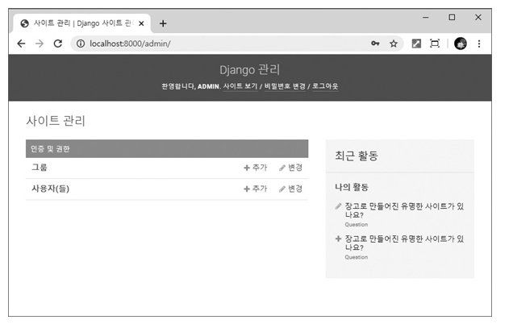

[장고 Admin 로그인 후 볼 수 있는 화면]

장고 Admin에서는 현재 등록된 그룹 및 사용자에 대한 정보 확인과 수정을 할 수 있다. 물론 그룹은 아직 등록하지 않았으므로 클릭해서 조회해 보아도 아무것도 표시되지 않는다. 그러면 본격적으로 장고 Admin의 재미있는 기능을 알아보자.

## 장고 Admin 모델 관리하기
우리는 Question, Answer 모델을 만들었다. 이 모델들을 장고 Admin에 등록하면 손쉽게 모델을 관리할 수 있다. 쉽게 말해 장고 셸로 수행했던 데이터 저장, 수정, 삭제 등의 작업을 장고 Admin에서 할 수 있다.
장고 Admin에서 어떤 마법이 벌어지는지 살펴보자. pybo/admin.py 파일을 열고 다음과 같이 코드를 입력하여 Question 모델을 장고 Admin에 등록하자.

```python
[파일이름: C:/projects/mysite/pybo/admin.py

from django.contrib import admin
from .models import Question

# ---------------------------------- [edit] ---------------------------------- #
class QuestionAdmin(admin.ModelAdmin):
    search_fields = ['subject']

admin.site.register(Question, QuestionAdmin)
```
## 장고 Admin에서 데이터 검색해 보기
장고 Admin으로 돌아가서 새로고침을 하면 검색 기능이 추가되었음을 알수있따. 검색어로 '장고'를 입력하고 <검색>을 눌러보자.


[장고 검색 시 볼 수 있는 화면]

그러면 제목에 '장고'가 포함된 Question 모델 데이터만 조회된다. 장고 Admin에는 이런 마법 같은 기능이 무궁무진하다.

장고 Admin의 기능이 궁금하다면 장고 공식 문서를 참고하자. 장고 공식 문서 주소(장고 Admin 기능):
docs.djangoproject.com/en/3.0/ref/contrib/admin

## 질문 목록 기능 구현하기
질문 목록 조회를 위해 pybo/views.py 파일을 열어 코드를 조금씩 수정해보자.

### [1] Question 모델 데이터 작성일시 역순으로 조회하기

Question 모델을 임포트해 Question 모델 데이터를 작성한 날짜의 역순으로 조회하기 위해 order_by 함수를 사용했다. 조회한 Question 모델 데이터는 context 변수에 저장했다. context 변수는 조금 후에 설명할 render 함수가 템플릿을 HTML로 변환하는 과정에서 사용되는 데이터이다.

```python
from django.http import HttpResponse
# ---------------------------------- [edit] ---------------------------------- #
from .models import Question
# ---------------------------------------------------------------------------- #

def index(request):
# ---------------------------------- [edit] ---------------------------------- #
    """
    pybo 목록 출력
    """

    question_list = Question.objects.order_by('-crate_date')
    context = {'question_list': question_list}
# ---------------------------------------------------------------------------- # 
    return HttpResponse("안녕하세요 pybo에 오신걸 환영합니다.")
```
order_by 함수는 조회한 데이터를 특정 속성으로 정렬하며, '-create_date'는 - 기호가 앞에 붙어 있으므로 작성일시의 역순을 의미한다.

### [2] render로 화면 출력하기

조회한 Question 모델 데이터를 템플릿 파일을 사용하여 화면에 출력할 수 있는 render 함수를 사용해 보자.

``` python
# ---------------------------------- [edit] ---------------------------------- #
from django.shortcuts import render
# ---------------------------------------------------------------------------- #
from .models import Question


def index(request):
    """
    pybo 목록출력
    """
    question_list = Question.objects.order_by('-create_date')
    context = {'question_list': question_list}
# ---------------------------------- [edit] ---------------------------------- #
    return render(request, 'pybo/question_list.html', context)
# ---------------------------------------------------------------------------- #
```
### [3] 템플릿을 모아 저장할 디렉터리 만들기

템플릿을 만들기 전에 템플릿을 저장할 디렉터리를 루트 디렉터리 바로 밑에 만든다.

* 루트디렉터리는 장고 프로젝트 디렉터리(C:/projects/mysite)를 의미한다.
```python
(mysite) c:\projects\mysite>mkdir templates
```

### [4] 템플릿 디렉터리 위치 config/settings.py에 등록하기

위에서 만든 템플릿 디렉터리르 장고 config/setting.py 파일에 등록하자. config/settings.py 파일을 열어 TEMPLATES 항목을 다음과 같이 수정한다.

```python
(... 생략 ...)
TEMPLATES = [
    {
        (... 생략 ...)
# ---------------------------------- [edit] ---------------------------------- #
        'DIRS': [BASE_DIR / 'templates'],
# ---------------------------------------------------------------------------- #
        (... 생략 ...)
    },
]
(... 생략 ...)
```
DIRS에는 템플릿 디렉터리를 여러 개 등록할 수 있다. 다만 현재 우리가 개발하는 파이보는 1개의 템플릿 디렉터리를 쓸 것이므로 BASE_DIR / 'templates'만 더 붙여 C:/projects/mysite/templates를 반환한다.

### [5] 템플릿 파일 만들기
위에서 만든 템플릿 디렉터리를 참고하여 qusetion_list.html 템플릿 파일을 mysite/templates/pybo/ 디렉터리에 생성하자. pybo 디렉터리를 templates 안에 새로 만들어 파일을 추가해야 한다.


[templates/pybo/ 위치에 저장된 question list.html 파일]

그리고 템플릿 파일을 다음과 같이 작성한다.

```python
<!-- ------------------------------- [edit] -------------------------------- -->

    <ul>
    
        <li><a href="/pybo/{{ question.id }}/">{{ question.subject }}</a></li>
    
    </ul>

   <p>질문이 없습니다.</p>

<!-- ----------------------------------------------------------------------- -->
```
 라는 문장이 눈에 띌 것이다. 바로 이것이 템플릿 태그이다. 템플릿 태그는 로 둘러싸인 문장을 말한다.

다음 표에 정리한 템플릿 태그의 의미를 살펴보면 파이썬 문법과 크게 다르지 않음을 알 수 있다. 템플릿 태그는 따로 문법을 설명하지 않고 그때그때 필요할 때마다 설명하겠다.

- 템플릿 태그에서 사용된 question_list가 바로 render 함수에서 템플릿으로 전달한 Question 모델 데이터이다.
- 만약 템플릿 태그의 자세한 내용이 궁금하다면 장고 공식 문서를 참고하자.
- 템플릿 장고 공식 문서 주소:docs.djangoproject.com/en/3.0/topics/templates


- 템플릿 태그! 3가지 유형만 정리하면 끝!

장고의 템플릿 태그는 분기, 반복, 객체 출력이라는 3가지 유형만 알면 된다. 분기 템플릿 태그는 다음과 같다. 문법을 보면 알겠지만 파이썬의 if 문과 다르지 않다. 다만 if 문이 끝나는 부분에 를 사용하는 점만 다르다.

```python

    <p>조건문1에 해당되는 경우</p>

    <p>조건문2에 해당되는 경우</p>

    <p>조건문1, 2에 모두 해당되지 않는 경우</p>

```
반복 템플릿 태그는 다음과 같다. 이 역시 파이썬의 for 문과 다르지 않으며, 역시 for 문의 마지막은 로 닫아야 한다.

```python

    <p>순서: {{ forloop.counter }} </p>
    <p>{{ item }}</p>

```
또한 반복 템플릿 안에서는 forloop 객체를 사용할 수도 있다. forloop 객체는 반복 중 유용한 값을 제공한다.

- forloop.counter : for 문의 순서로 1부터 표시
- forloop.counter() : for  문의 순서로 0부터 표시
- forloop.first : for 문의 첫 번째 순서인 경우 True
- forloop.last : for 문의 마지막 순서인 경우 True

객체 출력 템플릿 태그는 다음과 같다. 객체에 속성이 있으면 파이썬과 동일한 방법으로 점(.) 연산자를 사용한다.

```python
{{ question }}
{{ question.id }}
{{ question.subject }}
```
### [6] 질문 목록이 잘 출력되는지 확인해 보기

템플릿 디렉터리를 추가한 상태이므로 장고 개발 서버를 다시 시작해 /pybo/에 접속하자. 장고 개발 서버를 다시 시작하지 않으면 장고가 템플릿 디렉터리를 인식하지 못해 오류가 발생한다.

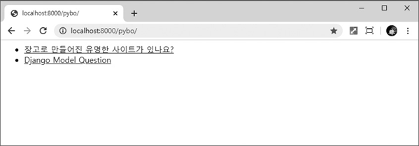

[/pybo/에서 볼 수 있는 질문 목록]

화면을 보면 이전에 등록한 질문 2건이 보인다. 직접 장고 쏄이나 장고 Admin에서 다른 질문도 추가해 보면서 질문 목록이 잘 만들어지는지 테스트 해본다.

## 질문 상세 기능 구현하기

### [1] 질문 목록에서 아무 질문이나 눌러보기
질문 목록 화면에서 아무 질문(예를 들면 Django Model Question)이나 눌러 보자. 그러면 다음과 같은 오류 화면이 나타난다.

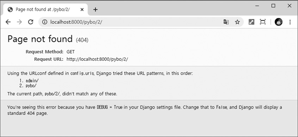

[질문 목록에서 질문을 눌러 이동한 화면(오류 화면)]

오류 화면이 나타난 이유는 /pybo/2/에 대한 URL 매핑을 추가하지 않았기 때문이다.

- 질문을 눌렀을 때 /pybo/2/와 같은 주소로 이동한 이유는 템플릿에서 href 엘리먼트에 link 속성을 추가했기 때문이다.


### [2] pybo/views.py 열어 화면 추가하기
pyvo/views.py 파일을 열어 detail 함수를 추가한다.
```python
# ---------------------------------- [edit] ---------------------------------- #
def detail(request, question_id):
    """
    pybo 내용 출력
    """
    question = Question.objects.get(id=question_id)
    context = {'question': question}
    return render(request, 'pybo/question_detail.html', context)
# ---------------------------------------------------------------------------- #
```
추가된 내용은 앞에서 만든 index 함수와 크게 다르지 않다. detail 함수의 매개변수 question_id가 추가된 점이 다르다. 바로 이것이 URL 매핑에 있떤 question_id이다. 즉, /pybo/2/ 페이지가 호출되면 최종으로 detail 함수의 매개변수 question_id에 2가 전달된다.

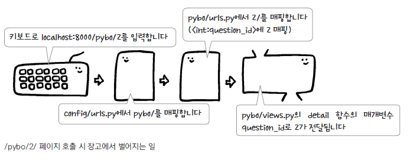

/pybo/2/ 페이지호출 시 장고에서 벌어지는 일

### [4] pybo/question_detail.html 작성하기
위에서 render 함수가 question_detail.html 파일을 사용하고 있으므로 이에 대한 작업도 해야 한다. templates/pybo 디렉터리에 question_detail.html 파일을 만든 후 다음처럼 코드를 작성한다.
```python
<!-- ------------------------------- [edit] -------------------------------- -->
<h1>{{ question.subject }}</h1>

<div>
    {{ question.content }}
</div>
<!-- ----------------------------------------------------------------------- -->
```
{{ question.subject }}, {{ question.content }}의 question 객체는 detail 함수에서 render 함수에 전달한 context에 저장한 데이터이다.

### [5] 질문 상세 페이지에 접속해 보기
/pybo/2/에 접속해 보자. 그러면 질문 상세 화면이 나타난다! 축하한다!

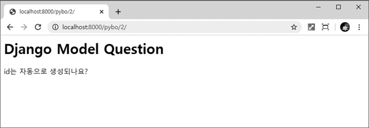

[/pybo/2/에 제대로 접속된 화면]

## 오류 화면 구현하기
지금까지 질문 목록, 질문 상세 기능을 구현했다. 그런데 사용자가 잘못된 주소에 접속하면 어떻게 처리해야 할까?

### [1] 잘못된 주소에 접속해 보기
/pybo/30/에 접속해 보자. 그러면 다음과 같은 DoesNotExist 오류 화면이 나온다.

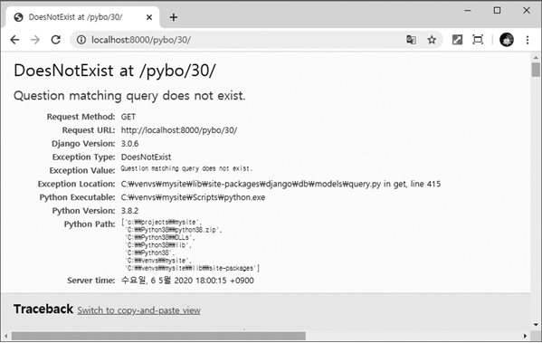

[/pybo/30/ 페이지 호출 시 나타나는 오류 화면]

당연한 오류이다. question_id가 30인 데이터를 조회하는 Question.object.get(id=30)에서 오류가 발생했기 때문이다.

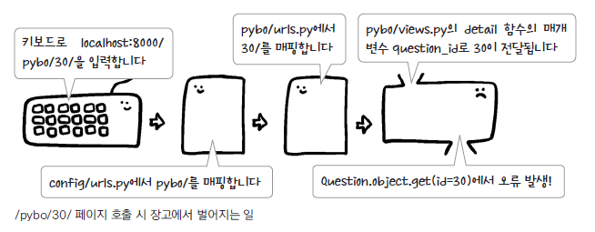

- 참고로 현재는 config/settings.py의 DEBUG 항목이 True로 설정되어 있어 개발자에게 여러 정보를 알려 주는 오류 화면이 나타난다. 그런데 실제 서비스 화면에는 그런 중요한 정보가 표현되면 안 된다. 그래서 서비스를 할 때는 DEBUG 항목을 False로 설정한다.
- cofing/settings.py의 DEBUG 항목을 False로 설정하는 부분은 4장에서 자세히 다룬다.
### [2] 페이지가 존재하지 않음(404 페이지) 출력하기
존재하지 않는 페이지에 접속하면 오류 대신 404 페이지를 출력하도록 detail 함수를 수정하자. Question.objects.get(id=question_id)를 get_object_or_404(Question, pk=question_id)로 수정하면 된다.
```python
# ---------------------------------- [edit] ---------------------------------- #
from django.shortcuts import render, get_object_or_404
# ---------------------------------------------------------------------------- #

(... 생략 ...)

def detail(request, question_id):
    """
    pybo 내용 출력
    """
# ---------------------------------- [edit] ---------------------------------- #    
    question = get_object_or_404(Question, pk=question_id)
# ---------------------------------------------------------------------------- #    
    context = {'question': question}
    return render(request, 'pybo/question_detail.html', context)
```
get_object_or_404 함수는 모델의 기본키를 이용하여 모델 객체 한 건을 반환한다. pk에 해당하는 건이 없으면 오류 대신 404 페이지를 반환한다.

### [3] 404 페이지 출력 확인하기
/pybo/30/에 접속하면 404 페이지가 출력된다.

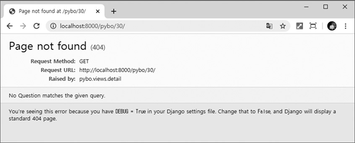

[get_object_or_404 함수로 나타나는 404 페이지]

웹 브라우저는 HTTP 요청을 하고, 장고는 그 요청에 응답을 한다. 보통의 경우에는 성공을 의미하는 200 응답 코드가 자동으로 반환된다. 하지만 요청하는 페이지가 없거나 서버에서 오류가 발생하면 다음과 같은 응답 코드가 반환된다.

200 : 성공

500 : 서버오류(Internal Server Error)

404 : 페이지 존재하지 않음(Not Found)

#### 장고 제네릭뷰 간단 소개
제네릭뷰(generic view)는 목록 조회나 상세 조회처럼 특정 패턴이 있는 뷰를 작성할 때 사용하는 매우 편리한 기능이다. 하지만 장고 입문자에게는 제네릭뷰의 실행 방식이 무척 이해하기 어렵다. 여러분에게는 제네릭뷰가 오히려 장고 학습에 혼란을 줄 수 있으므로 코너로 소개한다. 눈으로 코드를 살펴보기만 하자. 만약 우리가 views.py 파일에 작성한 index 함수나 detail 함수를 제네릭뷰로 변경하면 다음처럼 간략하게 작성할 수 있다.
```python
class IndexView(generic.ListView):
    """
    pybo 목록 출력
    """
    def get_queryset(self):
        return Question.objects.order_by('-create_date')


class DetailView(generic.DetailView):
    """
    pybo 내용 출력
    """
    model = Question
```
IndexView 클래스가 index 함수를 대체하고 DetailView 클래스가 detail 함수를 대체했다고 생각하면 된다. IndexView 클래스는 템플릿명이 명시적으로 지정되지 않으면 자동으로 모델명_list.html를 템플릿명으로 사용한다. 정리하자면 Question 모델을 사용하는 IndexView 클래스는 question_list.html, DetailView 클래스는 question_detail.html을 템플릿명으로 사용한다. 이어서 urls.py 파일은 다음과 같이 변경해야 한다.
```python
from django.urls import path

from . import views

app_name = 'pybo'
urlpatterns = [
    path('', views.IndexView.as_view()),
    path('<int:pk>/', views.DetailView.as_view()),
]
```
이렇듯 단순 모델의 목록 조회나 상세 조회는 제네릭뷰를 사용하면 매우 간편하다. 단 제네릭뷰는 복잡한 문제를 해결할 때 오히려 개발 난이도를 높이는 경우도 있으니 주의해야 한다.

## URL 더 똑똑하게 사용하기
이번에는 템플릿에서 사용한 URL 하드 코딩을 없애는 방법에 대해 알아보자. 그나저나 URL 하드 코딩이란 무엇일까? 잠시 question_list.html 템플릿에 사용된 href값을 보자.
```python
<li><a href="/pybo/{{ question.id }}/">{{ question.subject }}</a></li>
```
/pybo/{{ question.id }}는 질문 상세를 위한 URL 규칙이다. 하지만 이런 URL 규칙은 프로그램을 수정하면서 /pybo/question/2/ 또는 /pybo/2/question/으로 수정될 가능성도 있다. 이런 식으로 URL 규칙이 자주 변경된다면 템플릿에 사용된 모든 href값들을 일일이 찾아 수정해야 한다. URL 하드 코딩의 한계인 셈이다. 이런 문제를 해결하려면 해당 URL에 대한 실제 주소가 아닌 주소가 매핑된 URL 별칭을 사용해야 한다.

## URL 별칭으로 URL 하드 코딩 문제 해결하기
그러면 URL 별칭을 파이보에 적용해 보자.

### [1] pybo/urls.py 수정하여 URL 별칭 사용하기
템플릿의 href에 실제 주소가 아니라 URL 별칭을 사용하려면 우선 pybo/urls.py 파일을 수정해야 한다. path 함수에 있는 URL 매핑에 name 속성을 부여하자.
```python
from django.urls import path

from . import views

urlpatterns = [
# ---------------------------------- [edit] ---------------------------------- #
    path('', views.index, name='index'),
    path('<int:question_id>/', views.detail, name='detail'),
# ---------------------------------------------------------------------------- #    
]
```
이렇게 수정하면 실제 주소 /pybo/는 index라는 URL 별칭이, /pybo/2/는 detail이라는 URL 별칭이 생긴다.

### [2] pybo/question_list.html 템플릿에서 URL 별칭 사용하기
1단계에서 만든 별칭을 템플릿에서 사용하기 위해 /pybo/{{ question.id }}를 로 변경하자.
- question.id는 URL 매핑에 정의된 <int: question_id>를 의미한다.
```python
(... 생략 ...)
    
<!-- ------------------------------- [edit] -------------------------------- -->
        <li><a href="">{{ question.subject }}</a></li>
<!-- ----------------------------------------------------------------------- -->
    
(... 생략 ...)
```
## URL 네임스페이스 알아보기
여기서 한 가지 더 생각할 문제가 있다. 현재의 프로젝트에서는 pybo 앱 하나만 사용하지만, 이후 pybo 앱 이외의 다른 앱이 프로젝트에 추가될 수도 있다. 이때 서로 다른 앱에서 같은 URL 별칭을 사용하면 중복 문제가 생긴다.

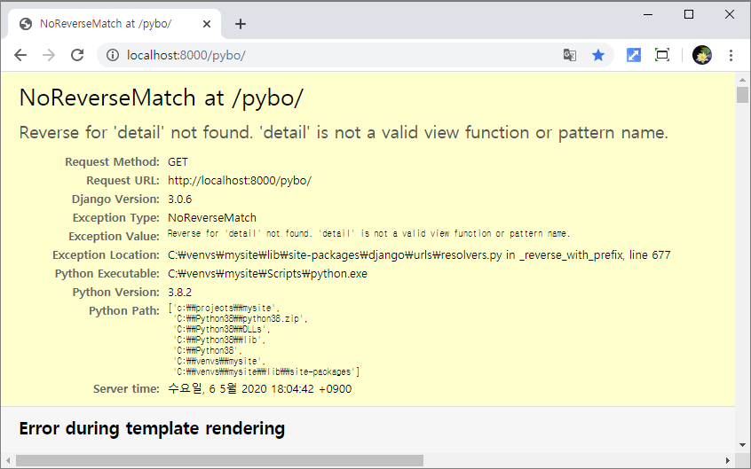

이 문제를 해결하려면 pybo/urls.py 파일에 네임스페이스(namespace)라는 개념을 도입해야 한다. 네임스페이스는 쉽게 말해 각각의 앱이 관리하는 독립된 이름 공간을 말한다.

### [1] pybo/urls.py에 네임스페이스 추가하기
pybo/urls.py 파일에 네임스페이스를 추가하려면 간단히 app_name 변수에 네임스페이스 이름을 저장하면 된다.
```python
from django.urls import path

from . import views

# ---------------------------------- [edit] ---------------------------------- #
app_name = 'pybo'
# ---------------------------------------------------------------------------- #

urlpatterns = [
    path('', views.index, name='index'),
    path('<int:question_id>/', views.detail, name='detail'),
]
```
네임스페이스 이름으로 'pybo'를 저장했다.

### [2] 네임스페이스 테스트하기 - 오류 발생!
/pybo/에 접속해 보자. 그러면 다음과 같은 오류가 발생한다.

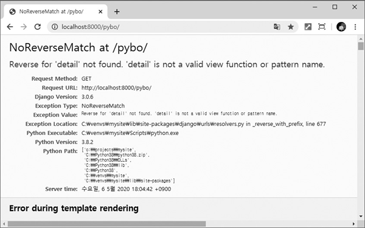

[/pybo/ 페이지 요청 시 발생하는 네임스페이스 오류]

### [3] pybo/question_list.html 수정하기
오류가 발생한 이유는 템플릿에서 아직 네임스페이스를 사용하고 있지 않기 때문이다. 을 으로 바꾸자.
```python
(... 생략 ...)
    
<!-- ------------------------------- [edit] -------------------------------- -->
        <li><a href="">{{ question.subject }}</a></li>
<!-- ----------------------------------------------------------------------- -->        
    
(... 생략 ...)
```
detail에 pybo라는 네임스페이스를 붙여준 것이다.

#### URL 별칭은 여러 곳에서 사용된다.
URL 별칭은 템플릿 외에도 여러 곳에서 사용된다. 예를 들어 URL 별칭은 redirect 함수에도 사용된다. 다음은 redirect 함수에서 pybo:detail을 사용한 예이다. 지금은 눈으로 살펴보고 넘어가자.
```python
redirect('pybo:detail', question_id=question.id)
```
## 답변 등록 기능 만들기
앞에서 질문 등록, 조회 기능을 만들었다. 이번에는 답변 등록과 답변을 보여주는 기능을 만들어 보자.

## 답변 저장하고 표시하기
### [1] 질문 상세 템플릿에 답변 등록 버튼 만들기

질문 상세 템플릿 pybo/question_detail.html 파일을 수정하자. form 엘리먼트 안에 textarea 엘리먼트와 input 엘리먼트를 포함시켜 답변 내용, 답변 등록 버튼을 추가하자.

- 장고 개발 시 form 데이터를 전송할 때는 보통 장고의 폼을 이용한다. 장고의 폼을 이용하는 방법은 조금 더 공부한 후 설명하겠다.
```python
<h1>{{ question.subject }}</h1>

<div>
    {{ question.content }}
</div>

<!-- ------------------------------- [edit] -------------------------------- -->
<form action="" method="post">

<textarea name="content" id="content" rows="15"></textarea>
<input type="submit" value="답변등록">
</form>
<!-- ----------------------------------------------------------------------- -->
```
<답변 등록> 버튼을 누를 때 호출되는 URL은 action 속성에 있는 이다. 그리고 form 엘리먼트 바로 아래에 있는 이 눈에 띌 것이다. 이 코드는 보안 관련 항목이니 좀 더 자세히 설명하겠다. 는 form 엘리먼트를 통해 전송된 데이터(답변)가 실제로 웹 브라우저에서 작성된 데이터인지 판단하는 검사기 역할을 한다. 그러므로 <form ...> 태그 바로 밑에 을 항상 입력해야 한다. 해킹처럼 올바르지 않은 방법으로 데이터가 전송되면 서버에서 발행한 csrf_token값과 해커가 보낸 csrf_token값이 일치하지 않으므로 오류를 발생시켜 보안을 유지할 수 있다.

#### csrf_token은 장고의 기본 기능이다
csrf_token을 사용하려면 장고에 CsrfViewMiddleware라는 미들웨어를 추가해야 한다. 하지만 이 미들웨어는 장고 프로젝트 생성 시 자동으로 config/settings.py 파일의 MIDDLEWARE라는 항목에 추가되므로 여러분이 직접 입력할 필요는 없다.
```python
(... 생략 ...)
MIDDLEWARE = [
    (... 생략 ...)
    'django.middleware.csrf.CsrfViewMiddleware',
    (... 생략 ...)
]
(... 생략 ...)
```
혹시라도 csrf_token을 사용하고 싶지 않다면 config/settings.py 파일의 MIDDLEWARE 항목에서 해당 코드를 주석 처리하면 되겠지만, csrf_token 기능을 굳이 제외할 필요는 없다.

### [2] 질문 상세 페이지에 접속해 보기
위의 단계를 마친 다음 pybo/2에 접속해 보자. 그러면 아마도 'answer_create를 찾을 수 없다'는 오류 화면이 나타날 것이다.

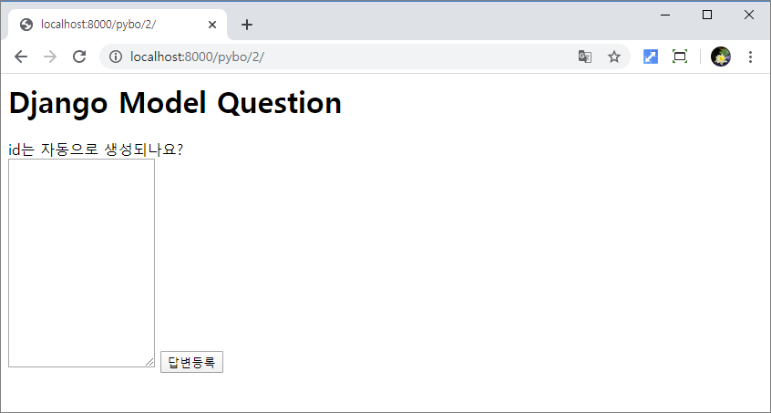

오류 발생 이유는 1단계에서 입력한 form 엘리먼트의 action 속성에 있는 에 해당하는 URL 매핑이 없기 때문이다.

### [3] 답변 등록을 위한 URL 매핑 등록하기
pybo/urls.py 파일에 답변 등록을 위한 URL 매핑을 등록하자.

```python
(... 생략 ...)
urlpatterns = [
    path('', views.index, name='index'),
    path('<int:question_id>/', views.detail, name='detail'),
# ---------------------------------- [edit] ---------------------------------- #
    path('answer/create/<int:question_id>/', views.answer_create, name='answer_create'),
# ---------------------------------------------------------------------------- #    
]
(... 생략 ...)
```
이 코드는 사용자가 상세 화면에서 <질문답변> 버튼을 눌렀을 때 작동할 form 엘리먼트의 /pybo/answer/create/2/에 대한 URL 매핑을 추가한 것이다.

### [4] answer_create 함수 추가하기
form 엘리먼트에 입력된 값을 받아 데이터베이스에 저장할 수 있도록 answer_create 함수를 pybo/views.py 파일에 추가하자.

```python
from django.shortcuts import render, get_object_or_404
from .models import Question
# ---------------------------------- [edit] ---------------------------------- #
from django.utils import timezone

(... 생략 ...)

def answer_create(request, question_id):
    """
    pybo 답변등록
    """
    question = get_object_or_404(Question, pk=question_id)
    question.answer_set.create(content=request.POST.get('content'), create_date=timezone.now())
# ---------------------------------------------------------------------------- #
```
answer_create 함수의 question_id 매개변수에는 URL 매핑 정보값이 넘어온다. 예를 들어 /pybo/answer/create/2가 요청되면 question_id에는 2가 넘어온다. request 매개변수에는 pybo/question_detail.html에서 textarea에 입력된 데이터가 파이썬 객체에 담겨 넘어온다. 이 값을 추출하기 위한 코드가 바로 request.POST.get('content')이다. 그리고 Question 모델을 통해 Answer 모델 데이터를 생성하기 위해 question.answer_set.create를 사용했다.

- request.POST.get('content')는 POST 형식으로 전송된 form 데이터 항목 중 name이 content인 값을 의미한다.
- Answer 모델이 Question 모델을 Foreign Key로 참조하고 있으므로 question.answer_set 같은 표현을 사용할 수 있다.

#### Answer 모델을 통해 데이터를 저장할 수도 있다
본 실습에서는 Answer 모델 데이터 저장을 위해 Question 모델을 사용했다. 하지만 Answer 모델을 직접 사용해도 Answer 모델 데이터를 저장할 수 있다.

[Answer 모델로 Answer 모델 데이터 저장하는 예]
```python
question = get_object_or_404(Question, pk=question_id)
answer = Answer(question=question, content=request.POST.get('content'), create_
date=timezone.now())
answer.save()
```

### [5] 답변 등록 후 상세 화면으로 이동하게 만들기
답변을 생성한 후 상세 화면을 호출하려면 redirect 함수를 사용하여 코드를 작성하면 된다. redirect 함수는 함수에 전달된 값을 참고하여 페이지 이동을 수행한다. redirect 함수의 첫 번째 인수에는 이동할 페이지의 별칭을, 두 번째 인수에는 해당 URL에 전달해야 하는 값을 입력한다.

```python
# ---------------------------------- [edit] ---------------------------------- #
from django.shortcuts import render, get_object_or_404, redirect
# ---------------------------------------------------------------------------- #
from .models import Question
from django.utils import timezone

(... 생략 ...)

def answer_create(request, question_id):
    """
    pybo 답변등록
    """
    question = get_object_or_404(Question, pk=question_id)
    question.answer_set.create(content=request.POST.get('content'), create_date=timezone.now())
# ---------------------------------- [edit] ---------------------------------- #    
    return redirect('pybo:detail', question_id=question.id)
# ---------------------------------------------------------------------------- #
```
질문 상세 페이지에 다시 접속해 보자. 그러면 다음처럼 답변을 등록할 수 있는 창과 <답변등록> 버튼이 보인다.

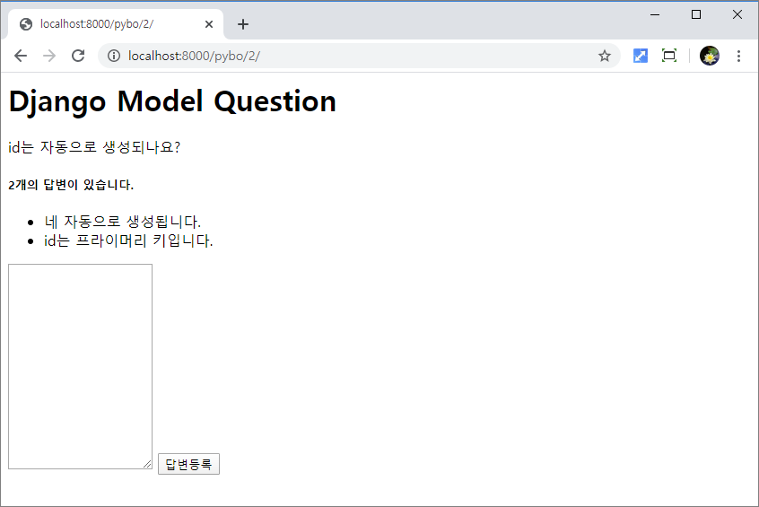

화면이 조금 엉성하다고 실망할 것 없다. 일단 핵심 기능을 완성한다 생각하고 넘어가자. 화면 다듬기는 기능을 완성한 후 진행할 것이다.

텍스트 창에 아무 값이나 입력하고 <답변등록>을 눌러 보자. 아마 아무런 변화가 없을 것이다. 왜냐하면 아직 등록한 답변을 표시하는 기능을 추가하지 않았기 때문이다. 이어서 답변 표시 기능을 만들어 보자.

### [6] 등록된 답변 표시하기
질문 상세 화면에 답변을 표시하려면 pybo/question_detail.html 파일을 수정해야 한다.
```python
<h1>{{ question.subject }}</h1>

<div>
    {{ question.content }}
</div>

<!-- ------------------------------- [edit] -------------------------------- -->
<h5>{{ question.answer_set.count }}개의 답변이 있습니다.</h5>
<div>
    <ul>
    
        <li>{{ answer.content }}</li>
    
    </ul>
</div>
<!-- ----------------------------------------------------------------------- -->

<form action="" method="post">

<textarea name="content" id="content" rows="15"></textarea>
<input type="submit" value="답변등록">
</form>
```
question.answer_set.count는 답변 개수를 의미한다. 질문 내용과 답변 입력 창 사이에 답변 표시 영역을 추가했다. 코드를 위처럼 수정한 후에 질문 상세 페이지에 접속하면 다음과 같은 화면을 볼 수 있다.

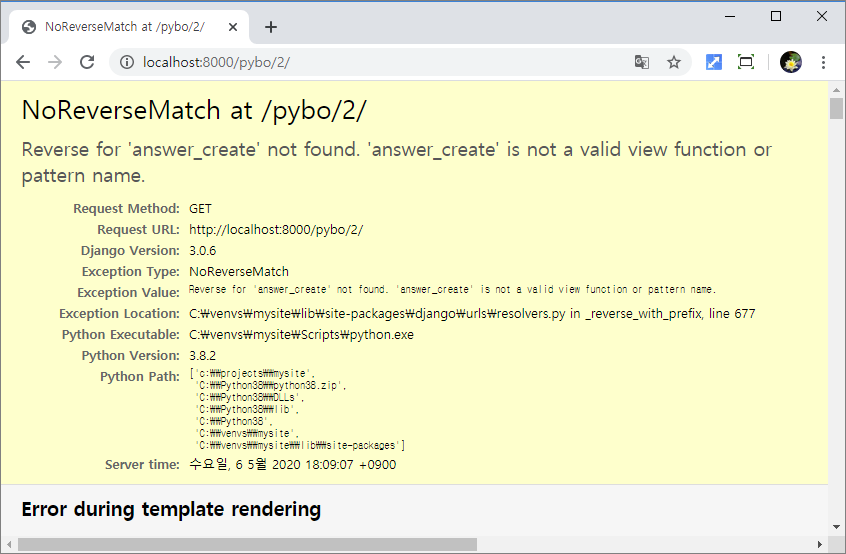

축하한다! 파이보의 답변 저장, 답변 조회 기능을 완성했다.

지금까지 질문과 답변을 등록하고 조회하는 기능을 만들었다. 그런데 그럴싸한 화면이 아니라서 아쉽다. 여기서는 스타일시트를 이용해 웹 페이지에 디자인을 적용하는 방법을 알아본다.

## 웹 페이지에 스타일시트 적용하기
웹 페이지에 디자인을 적용하려면 스타일시트(CSS)를 사용해야 하며, 스타일시트를 파이보에 적용하려면 CSS 파일이 스태틱(static) 디렉터리에 있어야 한다.
- CSS 파일은 장고에서 정적(static)파일로 분류한다. 정적 파일은 주로 이미지(.png, .jpg)나 자바스크립트(.js), 스타일시트(.css) 같은 파일을 의미한다.
### [1] 설정 파일에 스태틱 디렉터리 위치 추가하기
config/settings.py 파일을 열어 STATICFILES_DIRS에 스태틱 디렉터리 경로를 추가하자. BASE_DIR / 'static'은 C:/projects/mysite/static을 의미한다.
```python
(... 생략 ...)
STATIC_URL = '/static/'
# ---------------------------------- [edit] ---------------------------------- #
STATICFILES_DIRS = [
    BASE_DIR / 'static',
]
# ---------------------------------------------------------------------------- #
```
### [2] 스태틱 디렉터리 만들고 스타일시트 작성하기
프로젝트 루트 디렉터리에 static이라는 이름의 디렉터리를 생성하자. 루트 디렉터리는 C:/ projects/mysite를 의미한다.

```python
(mysite) C:/projects/mysite>mkdir static
```
#### 스태틱 디렉터리를 관리하는 방법
pybo 앱 디렉터리 바로 아래에 static이라는 디렉터리를 만들어도 장고에서 스태틱 디렉터리로 인식된다. 즉, 다음과 같이 static 디렉터리를 만들어도 된다.

[static 디렉터리 구성]
```python
C:/projects/mysite/pybo/static
```
하지만 이 방법 역시 템플릿 디렉터리를 구성할 때 설명했듯 프로젝트 관리를 불편하게 만든다. 이 책에서는 스태틱 디렉터리도 템플릿 디렉터리처럼 한곳으로 모아서 관리할 것이다.

static 디렉터리를 만들었으면 그곳에 style.css 파일을 만들어 다음 코드를 작성하자. 여기서는 답변을 등록할 때 사용하는 textarea를 100%로 넓히고, <답변등록> 버튼 위에 margin을 10px 추가했다.

```python
/* ---------------------------------- [edit] --------------------------------- */
textarea {
    width:100%;
}

input[type=submit] {
    margin-top:10px;
}
/* --------------------------------------------------------------------------- */
```

- CSS를 활용하면 이보다 더 예쁘게 만들 수 있다. 그것은 필자보다 디자인 감각이 뛰어난 독자 여러분 몫으로 남겨 둔다. 그 대신 다음 절에서 부트스트랩을 이용해 좀 더 예쁘게 만드는 방법을 소개한다.

### [3] 질문 상세 템플릿에 스타일 적용하기
pybo/question_detail.html 파일에 style.css 파일을 적용해 보자. 스태틱 파일을 사용하기위해 템플릿 파일 맨 위에  태그를 삽입하고, link 엘리먼트 href 속성에 를 적자.

```python
<!-- ------------------------------- [edit] -------------------------------- -->

<link rel="stylesheet" type="text/css" href="">
<!-- ----------------------------------------------------------------------- -->
<h1>{{ question.subject }}</h1>
(... 생략 ...)
```
추가한 코드는 static 디렉터리의 style.css 파일을 연결한다는 의미다. 질문 상세 화면은 다음과 같이 바뀔 것이다. 만약 아무런 변화가 없다면 개발 서버를 종료했다가 다시 실행해 보자.

- 개발 서버를 종료하려면 <Ctrl+C>를 누르면 된다.

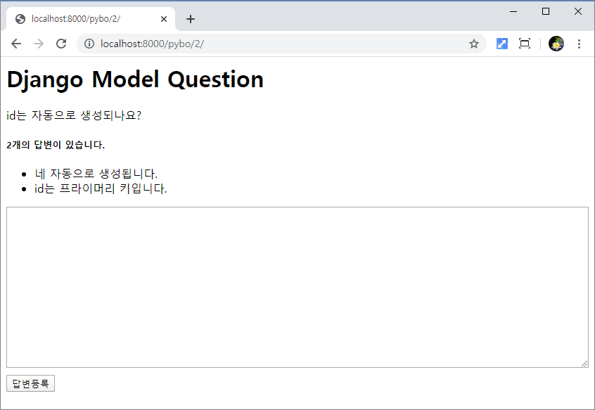

축하한다. 이제 조금은 그럴싸한 화면을 출력할 수 있게 되었다.

## 부트스트랩으로 더 쉽게 화면 꾸미기
웹 디자이너 없이 웹 프로그램을 만들다 보면 화면 디자인 작업을 하는 데 얼마나 많은 시간과 고민이 필요한지 알 수 있을 것이다. 이번에 소개하는 부트스트랩(Bootstrap)은 개발자 혼자서도 화면을 괜찮은 수준으로 만들 수 있게 도와주는 도구다. 부트스트랩은 트위터를 개발하면서 만들어졌고 지속적으로 관리되고 있는 오픈소스 프로젝트이다.

## 파이보에 부트스트랩 적용하기
파이보에 부트스트랩을 적용해 멋진 모습으로 변신시켜 보자.
### [1] 부트스트랩 설치하기
웹 브라우저를 열고 다음 URL에 접속한 다음 <Download>를 눌러 부트스트랩 설치 파일을 내려받자.

- 부트스트랩 4.5.3 버전 다운로드: getbootstrap.com/docs/4.5/getting-started/download
- 이 책에 실린 코드는 부트스트랩 버전5에서 정상 동작하지 않는다. 혹시 실습한 내용이 동일하게 보이지 않으면 부트스트랩 버전이 5가 아닌지 확인해 보자. 이 책은 부트스트랩 4.5.3 버전(버전 4의 마지막 버전)을 기준으로 실습을 진행한다.
- 부트스트랩은 2020년 12월 7일 기준으로 버전 5.0(베타)가 출시되었다.

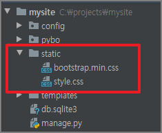

그러면 bootstrap-4.5.3-dist.zip 파일이 다운로드된다. 내려받은 파일의 압축을 해제하면 많은 파일이 들어 있다. 이 중에서 bootstrap.min.css 파일만 복사해서 mysite/static 디렉터리에 저장하자.

- 압축파일내 경로 : bootstrap-4.5.3-dist.zip\bootstrap-4.5.3-dist\css\bootstrap.min.css
- 카피한 경로 : C:\projects\mysite\static\bootstrap.min.css

### [2] 질문 목록 템플릿에 부트스트랩 적용하기
pybo/question_list.html 파일에 부트스트랩을 적용하기 위해  태그와 link 엘리먼트를 추가하자.

```python
<!-- ------------------------------- [edit] -------------------------------- -->

<link rel="stylesheet" type="text/css" href="">
<!-- ----------------------------------------------------------------------- -->

(... 생략 ...)
```
이어서 부트스트랩을 이용하여 템플릿을 다음과 같이 재구성하자. 여기서 사용된 container, my-3, thead-dark 등이 바로 부트스트랩이 제공하는 클래스이다.

```python
<!-- ------------------------------- [edit] -------------------------------- -->

<link rel="stylesheet" type="text/css" href="">
<div class="container my-3">
    <table class="table">
        <thead>
        <tr class="thead-dark">
            <th>번호</th>
            <th>제목</th>
            <th>작성일시</th>
        </tr>
        </thead>
        <tbody>
        
        
        <tr>
            <td>{{ forloop.counter }}</td>
            <td>
                <a href="">{{ question.subject }}</a>
            </td>
            <td>{{ question.create_date }}</td>
        </tr>
        
        
        <tr>
            <td colspan="3">질문이 없습니다.</td>
        </tr>
        
        </tbody>
    </table>
</div>
<!-- ----------------------------------------------------------------------- -->
```
기존에는 질문 목록을 ul 엘리먼트로 간단히 표시했지만, 여기서는 table 엘리먼트로 바꾸고 질문의 일련번호와 작성일시 항목도 추가했다. 질문의 일련번호는 {{ forloop.counter }}를 이용하여 표시했다. {{ forloop.counter }}는 에서 반복 시 자동으로 매겨지는 순섯값을 의미한다.

웹 브라우저에서 /pybo에 접속하면 부트스트랩이 적용된 화면을 볼 수 있다.

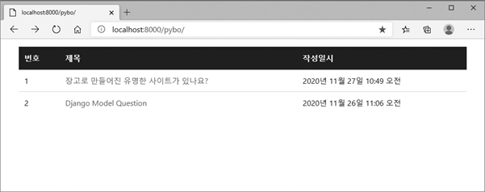

- 앞으로 다른 화면을 만들 때도 부트스트랩을 사용할 것이다. 그러나 이 책의 주제는 부트스트랩이 아니므로 간단히 설명한다. 혹시 자세한 내용이 궁금하다면 부트스트랩 공식 문서를 읽어 보기를 권한다.
- 부트스트랩 공식 문서: getbootstrap.com/docs/4.5/getting-started/introduction

### [3] 질문 상세 템플릿에 부트스트랩 사용하기
질문 상세 템플릿도 다음과 같이 부트스트랩을 적용하자.

```python
<!-- ------------------------------- [edit] -------------------------------- -->

<link rel="stylesheet" type="text/css" href="">
<div class="container my-3">
    <h2 class="border-bottom py-2">{{ question.subject }}</h2>
    <div class="card my-3">
        <div class="card-body">
            <div class="card-text" style="white-space: pre-line;">{{ question.content }}</div>
            <div class="d-flex justify-content-end">
                <div class="badge badge-light p-2">
                    {{ question.create_date }}
                </div>
            </div>
        </div>
    </div>
    <h5 class="border-bottom my-3 py-2">{{question.answer_set.count}}개의 답변이 있습니다.</h5>
    
    <div class="card my-3">
        <div class="card-body">
            <div class="card-text" style="white-space: pre-line;">{{ answer.content }}</div>
            <div class="d-flex justify-content-end">
                <div class="badge badge-light p-2">
                    {{ answer.create_date }}
                </div>
            </div>
        </div>
    </div>
    
    <form action="" method="post" class="my-3">
        
        <div class="form-group">
            <textarea name="content" id="content" class="form-control" rows="10"></textarea>
        </div>
        <input type="submit" value="답변등록" class="btn btn-primary">
    </form>
</div>
<!-- ----------------------------------------------------------------------- -->
```
질문, 답변은 하나의 뭉치에 해당되므로 부트스트랩의 card 컴포넌트를 사용했고, 질문 내용과 답변 내용은 style 속성으로 white-space: pre-line을 적용하여 텍스트의 줄바꿈을 정상적으로 보이게 만들었다. 부트스트랩 클래스 my-3은 상하 마진값 3을 의미한다. py-2는 상하 패딩값 2, p-2는 상하좌우 패딩값 2를 의미한다. d-flex justify-content-end는 컴포넌트 오른쪽 정렬을 의미한다.

- 부트스트랩 공식 문서(card 컴포넌트) : getbootstrap.com/docs/4.5/components/car

### [4] 질문 상세 화면 확인하기
질문 상세 화면이 어떻게 바뀌었는지 확인해 보자.

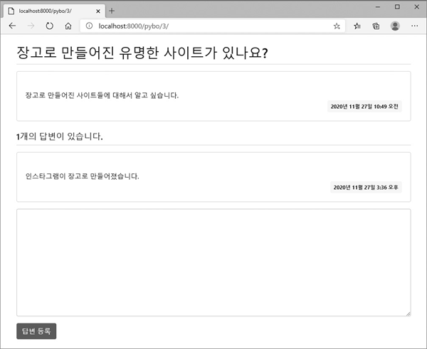

부트스트랩을 사용하면 정말 빠르게 만족스러운 화면을 만들 수 있다.

## 표준 HTML과 템플릿 상속 사용해 보기
혹시 눈치챘는지 모르겠지만, 지금까지 작성한 질문 목록과 질문 상세 템플릿 파일은 표준 HTML 구조가 아니다. 어떤 운영체제나 웹 브라우저를 사용하더라도 웹 페이지가 동일하게 보이고 정상적으로 작동 하게 하려면 반드시 웹 표준을 지키는 HTML 문서를 작성해야 한다.

## 표준 HTML 구조는 어떻게 생겼을까?
표준 HTML 문서의 구조는 다음과 같이 html, head, body 엘리먼트가 있어야 하며, CSS 파일은 head 엘리먼트 안에 있어야 한다. 또한 head 엘리먼트 안에는 meta, title 엘리먼트 등이 포함되어야 한다.

[표준 HTML 구조 예]

```python

<!doctype html>
<html lang="ko">
<head>
    <!-- Required meta tags -->
    <meta charset="utf-8">
    <meta name="viewport" content="width=device-width, initial-scale=1, shrink-to-fit=no">
    <!-- Bootstrap CSS -->
    <link rel="stylesheet" type="text/css" href="">
    <!-- pybo CSS -->
    <link rel="stylesheet" type="text/css" href="">
    <title>Hello, pybo!</title>
</head>
<body>

(... 생략 ...)

</body>
</html>
```

## 템플릿을 표준 HTML 구조로 바꾸기
앞에서 작성한 템플릿 파일을 표준 HTML 구조로 수정해 보자. 그런데 모든 템플릿 파일을 표준 HTML 구조로 변경하면 body 엘리먼트 바깥 부분은 모두 같은 내용으로 중복된다. 그리고 CSS 파일 이름이 변경되거나 새로운 CSS 파일이 추가되면 head 엘리먼트의 내용을 수정하려고 템플릿 파일을 일일이 찾아다녀야 하는 불편함도 있다.

장고는 이런 불편함을 해소하기 위한 템플릿 상속(extends) 기능을 제공한다. 여기서는 단순히 템플릿을 표준 HTML 구조로 바꾸는 것이 아니라 템플릿 상속 기능까지 사용할 것이다. 그러면 파일을 하나씩 수정해 보자.

### [1] 템플릿 파일의 기본 틀 작성하기
우선 템플릿 파일의 기본 틀인 base.html 템플릿을 작성하자. 모든 템플릿에서 공통으로 입력할 내용을 여기에 포함한다고 생각하면 된다.

```python
<!-- ------------------------------- [edit] -------------------------------- -->

<!doctype html>
<html lang="ko">
<head>
    <!-- Required meta tags -->
    <meta charset="utf-8">
    <meta name="viewport" content="width=device-width, initial-scale=1, shrink-to-fit=no">
    <!-- Bootstrap CSS -->
    <link rel="stylesheet" type="text/css" href="">
    <!-- pybo CSS -->
    <link rel="stylesheet" type="text/css" href="">
    <title>Hello, pybo!</title>
</head>
<body>
<!-- 기본 템플릿 안에 삽입될 내용 Start -->


<!-- 기본 템플릿 안에 삽입될 내용 End -->
</body>
</html>
<!-- ----------------------------------------------------------------------- -->
```
body 엘리먼트에 와  템플릿 태그가 있다. 바로 이 부분이 이후 base.html 템플릿 파일을 상속한 파일에서 구현해야 하는 영역이 된다. 이제 question_list.html 템플릿을 다음과 같이 변경하자.

### [2] 질문 목록 템플릿 수정하기
질문 목록을 나타내는 question_list.html 파일을 다음과 같이 수정하자.

```python
<!-- ------------------------------- [edit] -------------------------------- -->


<!-- ----------------------------------------------------------------------- -->
<div class="container my-3">
    <table class="table">
        (... 생략 ...)
    </table>
</div>
<!-- ------------------------------- [edit] -------------------------------- -->

<!-- ----------------------------------------------------------------------- -->
```
base.html 템플릿 파일을 상속받고자  템플릿 태그를 사용했다. 그리고 와  사이에 question_list.html 파일에서만 사용할 내용을 작성했다. 이제 question_list.html은 base.html을 상속받았으므로 표준 HTML 구조를 갖추게 되었다.

### [3] 질문 상세 템플릿 수정하기

```python
<!-- ------------------------------- [edit] -------------------------------- -->


<!-- ----------------------------------------------------------------------- -->
<div class="container my-3">
    <h2 class="border-bottom py-2">{{ question.subject }}</h2>
    (... 생략 ...)
    </form>
</div>
<!-- ------------------------------- [edit] -------------------------------- -->

<!-- ----------------------------------------------------------------------- --
```
### [4] 기존 스타일 파일 내용 비우기
부트스트랩을 사용하게 되었으니 style.css 파일의 내용을 비우자. 이 파일은 이후 부트스트랩으로 표현할 수 없는 스타일을 위해 사용할 것이므로 파일 자체를 삭제하지는 말고 내용만 삭제하자.

```python
/* ---------------------------------- [edit] --------------------------------- */
/* 내용을 전부 삭제하자. */
/* --------------------------------------------------------------------------- */
```
## 질문 등록 기능 만들기
지금까지는 질문을 등록하기 위해 장고 셸이나 장고 Admin을 사용했다. 이번에는 파이보 서비스를 통해 질문을 등록하는 기능을 만들어 보자.

질문 목록 화면 아래에 질문 등록 버튼을 만든 다음, 질문 등록 기능을 완성해 보자. 참고로 질문 등록 기능은 이 장 끝까지 진행해야 완벽하게 작동한다.

### [1] 질문 등록 버튼 만들기
우선 다음처럼 질문 목록 템플릿을 열고 </table> 태그 아래에 질문 등록 버튼을 생성하자.

```python
    (... 생략 ...)
    </table>
<!-- ------------------------------- [edit] -------------------------------- -->
    <a href="" class="btn btn-primary">질문 등록하기</a>
<!-- ----------------------------------------------------------------------- -->    
</div>

```
a 엘리먼트에 href 속성으로 질문 등록 URL을 처럼 추가하고 부트스트랩 클래스 "btn btn-primary"를 지정했다.

### [2] URL 매핑 추가를 위해 pybo/urls.py 수정하기
위에서 이 추가되었으니 pybo/urls.py 파일에 URL 매핑을 추가하자.

```python
(... 생략 ...)
urlpatterns = [
    (... 생략 ...)
# ---------------------------------- [edit] ---------------------------------- #
    path('question/create/', views.question_create, name='question_create'),
# ---------------------------------------------------------------------------- #
]
```

### [3] pybo/views.py 수정하기
그리고 URL 매핑에 의해 실행될 views.question_create 함수를 작성하자

```python
# ---------------------------------- [edit] ---------------------------------- #
from .forms import QuestionForm
# ---------------------------------------------------------------------------- #

(... 생략 ...)

# ---------------------------------- [edit] ---------------------------------- #
def question_create(request):
    """
    pybo 질문등록
    """
    form = QuestionForm()
    return render(request, 'pybo/question_form.html', {'form': form})
# ---------------------------------------------------------------------------- #
```
question_create 함수는 QuestionForm 클래스로 생성한 객체 form을 사용할 것이다. 여기서 QuestionForm 클래스는 질문을 등록하기 위해 사용하는 장고의 폼이다. render 함수에 전달한 {'form': form}은 템플릿에서 폼 엘리먼트를 생성할 때 사용한다. 템플릿을 작성할 때 자세히 알아보겠다.

- QuestionForm을 아직 작성하지 않아 파이참에서는 오류가 표시될 것이다. QuestionForm은 곧 만들 것이니 일단은 오류가 나오는 상태로 놔두자.

### [4] pybo/forms.py에 장고 폼 작성하기
pybo 디렉터리 바로 아래에 forms.py 파일을 새로 만들어 ModelForm을 상속받은 QuestionForm 클래스를 작성하자. QuestionForm 클래스 안에 내부 클래스로 Meta 클래스를 작성하고, Meta 클래스 안에는 model, fields 속성을 다음과 같이 작성하자

```python
# ---------------------------------- [edit] ---------------------------------- #
from django import forms
from pybo.models import Question


class QuestionForm(forms.ModelForm):
    class Meta:
        model = Question
        fields = ['subject', 'content']
# ---------------------------------------------------------------------------- #
```
이 같은 클래스를 장고 폼이라 한다. 장고 폼은 사실 2개의 폼으로 구분할 수 있는데, forms.Form을 상속받으면 폼, forms.ModelForm을 상속받으면 모델 폼이라 부른다. 여기서는 form.ModelForm을 상속받아 모델 폼을 만들었다. 모델 폼은 말 그대로 모델과 연결된 폼이며, 모델 폼 객체를 저장하면 연결된 모델의 데이터를 저장할 수 있다. 아직 모델 폼 객체를 저장한다는 의미가 잘 이해되지는 않겠지만, 곧 질문 등록 기능을 완성하며 이 내용을 자세히 설명하겠다. 내부 클래스로 선언한 Meta 클래스가 눈에 띌 것이다. 장고 모델 폼은 내부 클래스로 Meta 클래스를 반드시 가져야 하며, Meta 클래스에는 모델 폼이 사용할 모델과 모델의 필드들을 적어야 한다. QuestionForm 클래스는 Question 모델과 연결되어 있으며, 필드로 subject, content를 사용한다고 정의했다.

### [5] pybo/question_form.html 만들어 장고 폼 사용
질문 등록을 위해 pybo/question_form.html 파일을 생성하고 다음과 같이 작성하자.

```python
<!-- ------------------------------- [edit] -------------------------------- -->



<div class="container">
    <h5 class="my-3 border-bottom pb-2">질문등록</h5>
    <form method="post" class="post-form my-3">
        
        {{ form.as_p }}
        <button type="submit" class="btn btn-primary">저장하기</button>
    </form>
</div>

<!-- ----------------------------------------------------------------------- -->
```
코드의 {{ form.as_p }}에서 form이 바로 question_create 함수에서 전달한 QuestionForm 객체이다. 여기서 {{ form.as_p }}는 모델 폼과 연결된 입력 항목 subject, content에 값을 입력할 수 있는 HTML 코드를 자동으로 만들어 준다.

### [6] 질문 등록 화면 확인하기
이제 웹 브라우저에서 지금까지 작업한 내용의 결과를 확인해 보자. /pybo/ 페이지를 요청해 보자. 그러면 <질문 등록하기> 버튼이 표시될 것이다. <질문 등록하기> 버튼을 누르자.

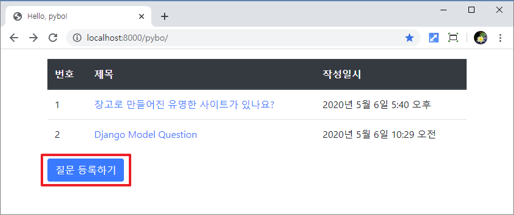

그러면 다음과 같은 질문 등록 화면이 나타나고 질문 등록 화면에는 템플릿에 작성한 {{ form.as_p }}에 의해 나타난 입력 항목 subject, content를 확인할 수 있다. 값을 입력하고 <저장하기> 버튼을 눌러 보자.


그런데 아무런 반응이 없다. 왜냐하면 pybo/views.py 파일에 정의한 question_create 함수에 입력 데이터를 저장하기 위한 코드를 작성하지 않았기 때문이다. 이제 입력 데이터를 저장하는 방법에 대해 알아보자.

### [7] 입력 데이터 저장하기
pybo/views.py 파일의 question_create 함수를 수정하자. 코드가 꽤 기니 주의해서 입력하자.

```python
def question_create(request):
    """
    pybo 질문등록
    """
# ---------------------------------- [edit] ---------------------------------- #
    if request.method == 'POST':
        form = QuestionForm(request.POST)
        if form.is_valid():
            question = form.save(commit=False)
            question.create_date = timezone.now()
            question.save()
            return redirect('pybo:index')
    else:
        form = QuestionForm()
    context = {'form': form}
    return render(request, 'pybo/question_form.html', context)
# ---------------------------------------------------------------------------- #
```
가장 눈에 띄는 부분은 동일한 URL 요청을 POST, GET 요청 방식에 따라 다르게 처리한 부분이다. 질문 목록 화면에서 <질문 등록하기> 버튼을 누르면 /pybo/question/create/가 GET 방식으로 요청되어 질문 등록 화면이 나타나고, 질문 등록 화면에서 입력값을 채우고 <저장하기> 버튼을 누르면 /pybo/question/create/가 POST 방식으로 요청되어 데이터가 저장된다.

그리고 QuestionForm 객체도 GET 방식과 POST 방식일 경우 다르게 생성한 것에 주목하자. GET 방식의 경우 QuestionForm()과 같이 입력값 없이 객체를 생성했고 POST 방식의 경우에는 QuestionForm(request.POST)처럼 화면에서 전달받은 데이터로 폼의 값이 채워지도록 객체를 생성했다. form.is_valid 함수는 POST 요청으로 받은 form이 유효한지 검사한다. 폼이 유효하지 않다면 폼에 오류가 저장되어 화면에 전달될 것이다.

그리고 question = form.save(commit=False)는 form으로 Question 모델 데이터를 저장하기 위한 코드이다. 여기서 commit=False는 임시 저장을 의미한다. 즉, 실제 데이터는 아직 저장되지 않은 상태를 말한다. 이렇게 임시 저장을 사용하는 이유는 폼으로 질문 데이터를 저장할 경우 Question 모델의 create_date에 값이 설정되지 않아 오류가 발생하기 때문이다(폼에는 현재 subject, content 필드만 있고 create_date 필드는 없다). 이러한 이유로 임시 저장을 한 후 question 객체를 반환받아 create_date에 값을 설정한 후 question.save()로 실제 저장하는 것이다.

- form.save(commit=False) 대신 form.save()를 수행하면 create_date 속성값이 없다는 오류 메시지가 나타난다.

### [8] 질문 등록 기능 확인하기
웹 브라우저에서 질문 등록 기능을 확인해 보자. /pybo에 접속하여 <질문 등록하기> 버튼을 눌러 질문 등록 화면으로 이동하자.

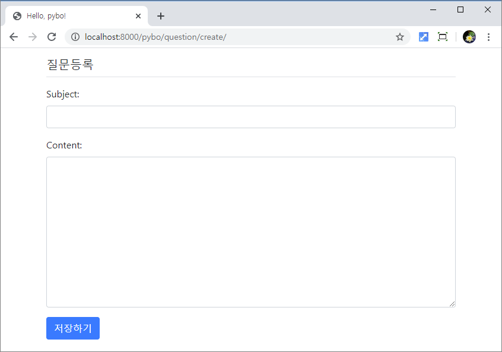

웹 브라우저에서 질문 등록 기능을 확인해 보자. /pybo에 접속하여 <질문 등록하기> 버튼을 눌러 질문 등록 화면으로 이동하자.

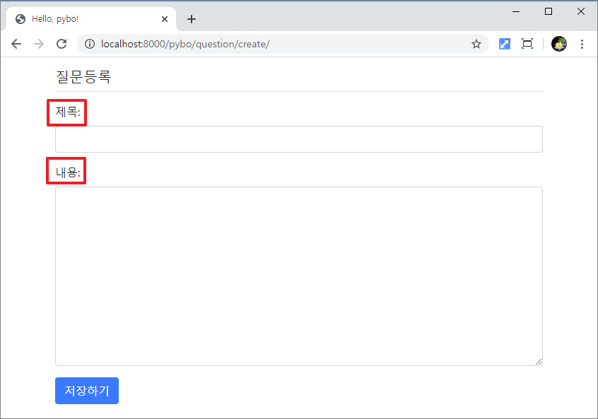

[값 입력 후 <저장하기> 버튼 누르기]

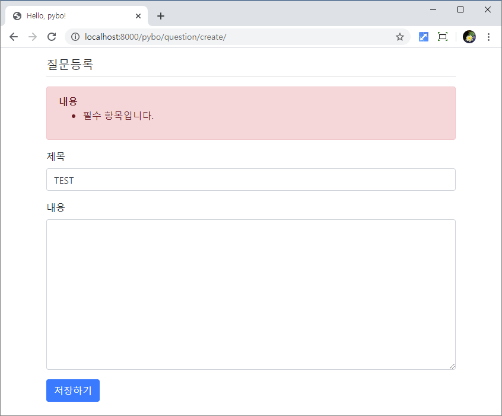

[질문 등록 완료]

### [9] 폼에 부트스트랩 적용하기
여기까지 진행하면 질문 등록 화면에 부트스트랩이 적용되지 않아서 아쉬움이 느껴질 것이다. 그렇다. {{ form.as_p }} 태그는 form 엘리먼트와 입력 항목을 자동으로 생성해 주므로 편리하기는 하지만 부트스트랩을 적용할 수 없다는 단점이 있다. 이 문제를 해결할 수는 없을까? 완벽하지는 않지만, QuestionForm 클래스 내부에 있는 Meta 클래스에 widgets 속성을 다음과 같이 추가하면 이 문제를 해결할 수 있다.

```python
from django import forms
from pybo.models import Question


class QuestionForm(forms.ModelForm):
    class Meta:
        model = Question
        fields = ['subject', 'content']
# ---------------------------------- [edit] ---------------------------------- #
        widgets = {
            'subject': forms.TextInput(attrs={'class': 'form-control'}),
            'content': forms.Textarea(attrs={'class': 'form-control', 'rows': 10}),
        }
# ---------------------------------------------------------------------------- #
```
다시 질문 등록 화면을 요청해 보면 다음과 같이 부트스트랩이 적용된 화면을 볼 수 있다.

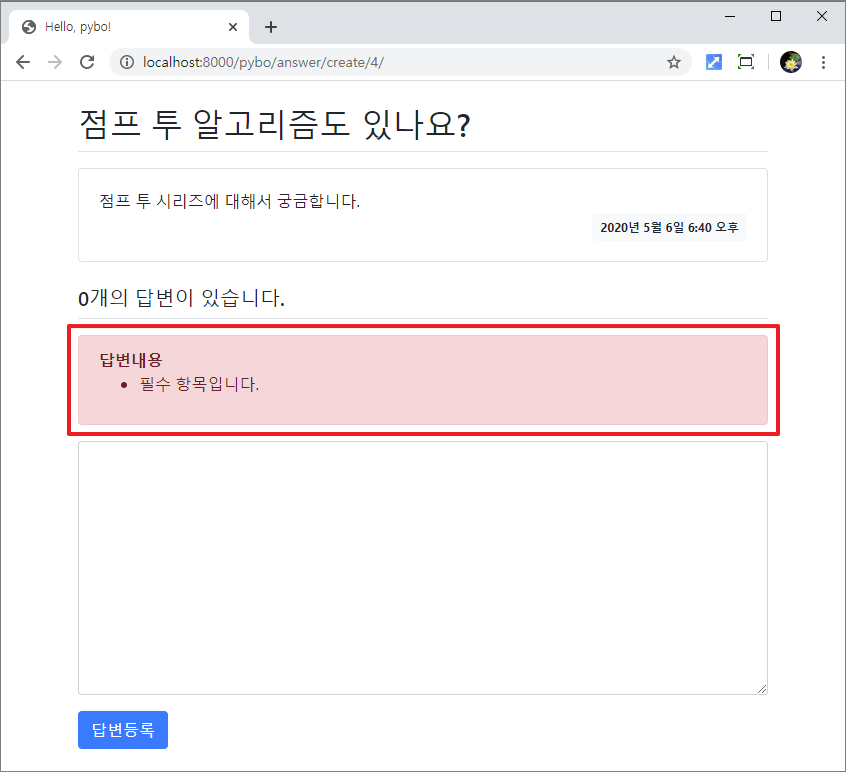

### [10] label 속성 수정하여 Subject, Content 한글로 변경하기
화면의 'Subject', 'Content'를 영문이 아니라 한글로 표시하고 싶다면 label 속성을 지정하면 된다.

```python
from django import forms
from pybo.models import Question


class QuestionForm(forms.ModelForm):
    class Meta:
        model = Question
        fields = ['subject', 'content']
        widgets = {
            'subject': forms.TextInput(attrs={'class': 'form-control'}),
            'content': forms.Textarea(attrs={'class': 'form-control', 'rows': 10}),
        }
# ---------------------------------- [edit] ---------------------------------- #
        labels = {
            'subject': '제목',
            'content': '내용',
        }
# ---------------------------------------------------------------------------- #
```
그러면 'Subject'는 '제목'으로 'Content'는 '내용'으로 변경된다.

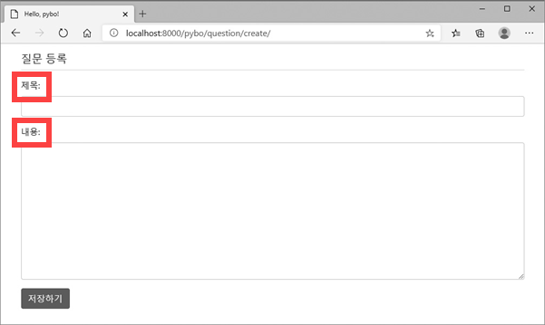

- 장고 폼에 대한 자세한 내용은 장고 공식 문서를 참고하자.
- 장고 공식 문서(폼): docs.djangoproject.com/en/3.0/topics/forms

### [11] 수작업으로 폼 작성하기
{{ form.as_p }}를 사용하면 빠르게 템플릿을 만들 수 있지만 HTML 코드가 자동으로 생성되므로 디자인 측면에서 많은 제한이 생기게 된다. 예를 들어 특정 태그를 추가하거나 필요한 클래스를 추가하는 작업에 제한이 생긴다. 또 디자인 영역과 서버 프로그램 영역이 혼재되어 웹 디자이너와 개발자의 역할을 분리하기도 애매해진다. 이번에는 자동으로 HTML 코드를 생성하지 말고 수작업으로 HTML 코드를 작성해 보자. 우선 forms.py 파일의 widget 항목을 제거하자.

```python
from django import forms
from pybo.models import Question


class QuestionForm(forms.ModelForm):
    class Meta:
        model = Question
        fields = ['subject', 'content']
        labels = {
            'subject': '제목',
            'content': '내용',
        }
# ---------------------------------- [edit] ---------------------------------- #
        # widget 항목 삭제
# ---------------------------------------------------------------------------- #
```
그런 다음 질문 등록 템플릿을 다음과 같이 수정하자.

```python



<div class="container">
    <h5 class="my-3 border-bottom pb-2">질문등록</h5>
    <form method="post" class="post-form my-3">
        
<!-- ------------------------------- [edit] -------------------------------- -->
        <!-- 오류표시 Start -->
        
            <div class="alert alert-danger" role="alert">
            
                
                <strong>{{ field.label }}</strong>
                {{ field.errors }}
                
            
            </div>
        
        <!-- 오류표시 End -->
        <div class="form-group">
            <label for="subject">제목</label>
            <input type="text" class="form-control" name="subject" id="subject"
                   value="{{ form.subject.value|default_if_none:'' }}">
        </div>
        <div class="form-group">
            <label for="content">내용</label>
            <textarea class="form-control" name="content"
                      id="content" rows="10">{{ form.content.value|default_if_none:'' }}</textarea>
        </div>
<!-- ----------------------------------------------------------------------- -->
        <button type="submit" class="btn btn-primary">저장하기</button>
    </form>
</div>

```
{{ form.as_p }}에 의해 자동 생성되는 HTML 대신 제목과 내용을 위한 HTML을 직접 작성했다. 그리고 question_create 함수에서 form.is_valid()가 실패했을 때 오류를 표시하기 위해 오류 표시 영역도 추가했다. 제목의 value에는 {{ form.subject.value|default_if_none:'' }}을 대입했는데, 이는 오류 발생 시 기존 입력값을 유지하기 위함이다. |default_if_none:''는 form.subject.value에 값이 없으면 'None'이라는 문자열이 표시되는데, 이를 공백으로 표시하기 위해 사용한 템플릿 필터이다. 수정 후 질문 등록 화면으로 돌아가 제목만 입력하고 <저장하기> 버튼을 누르면 다음 화면을 볼 수 있다.

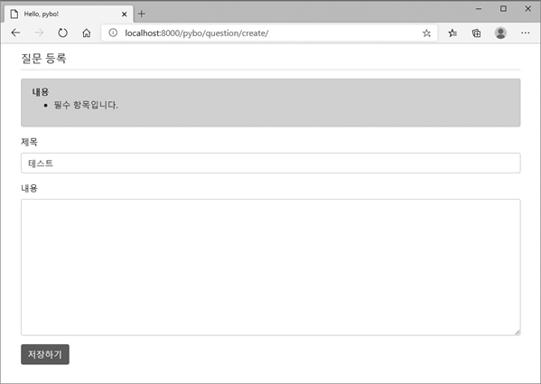

필수 항목인 내용을 입력하지 않았으니 '내용을 입력하라'는 오류 메시지를 볼 수 있다. 또한 오류가 발생해도 이미 입력한 제목에 해당되는 값은 value 설정으로 인해 그대로 유지되는 것도 확인할 수 있다.

## 답변 등록 기능에 장고 폼 적용하기
### [1] AnswerForm 클래스 추가하고 answer_create 함수 수정하기
질문 등록 기능에 장고 폼을 적용한 것처럼 답변 등록 기능에도 장고 폼을 적용하자. 답변을 등록할 때 사용할 AnswerForm 클래스를 pybo/forms.py 파일에 다음과 같이 작성하자.

```python
from django import forms
# ---------------------------------- [edit] ---------------------------------- #
from pybo.models import Question, Answer
# ---------------------------------------------------------------------------- #

(... 생략 ...)

# ---------------------------------- [edit] ---------------------------------- #
class AnswerForm(forms.ModelForm):
    class Meta:
        model = Answer
        fields = ['content']
        labels = {
            'content': '답변내용',
        }
# ---------------------------------------------------------------------------- #
```
그런 다음 pybo/views.py 파일의 answer_create 함수를 수정하자. answer_create 함수는 question_create 함수와 거의 동일하므로 자세한 설명은 생략한다.

```python
(... 생략 ...)
# ---------------------------------- [edit] ---------------------------------- #
from .forms import QuestionForm, AnswerForm
# ---------------------------------------------------------------------------- #
(... 생략 ...)

def answer_create(request, question_id):
    """
    pybo 답변등록
    """
    question = get_object_or_404(Question, pk=question_id)
# ---------------------------------- [edit] ---------------------------------- #
    if request.method == "POST":
        form = AnswerForm(request.POST)
        if form.is_valid():
            answer = form.save(commit=False)
            answer.create_date = timezone.now()
            answer.question = question
            answer.save()
            return redirect('pybo:detail', question_id=question.id)
    else:
        form = AnswerForm()
    context = {'question': question, 'form': form}
    return render(request, 'pybo/question_detail.html', context)
# ---------------------------------------------------------------------------- #
```
### [2] 질문 상세 템플릿에 오류 표시 영역 추가하기
질문 상세 템플릿에 오류 표시 영역을 추가하자.

```python
(... 생략 ...)
<form action="" method="post" class="my-3">
    
<!-- ------------------------------- [edit] -------------------------------- -->
    
    <div class="alert alert-danger" role="alert">
    
        
        <strong>{{ field.label }}</strong>
        {{ field.errors }}
        
    
    </div>
    
<!-- ----------------------------------------------------------------------- -->
    (... 생략 ...)
</form>
(... 생략 ...)
```
이렇게 수정하고 답변 내용 없이 답변을 등록하려고 하면 오류 메시지가 그림처럼 나타난다.

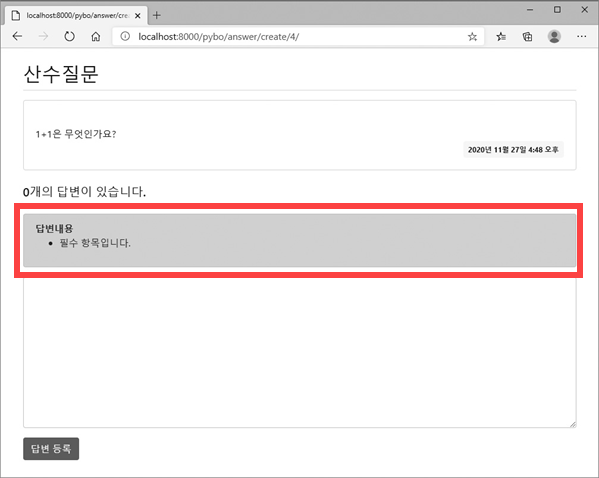

## 내비게이션바 추가하기
### [1] 로고, 로그인 링크 추가하기
내비게이션바는 모든 페이지에서 보여야 하므로 base.html 템플릿 파일을 열어 <body> 태그 바로 아래에 추가하자. 내비게이션바에는 메인 페이지로 이동해 주는 'Pybo' 로고(클래스값 navbar-brand)를 가장 왼쪽에 배치하고, 오른쪽에는 '로그인' 링크를 추가하자.

```python

<!doctype html>
<html lang="ko">
<head>
    <!-- Required meta tags -->
    <meta charset="utf-8">
    <meta name="viewport" content="width=device-width, initial-scale=1, shrink-to-fit=no">
    <!-- Bootstrap CSS -->
    <link rel="stylesheet" type="text/css" href="">
    <!-- pybo CSS -->
    <link rel="stylesheet" type="text/css" href="">
    <title>Hello, pybo!</title>
</head>
<body>
<!-- ------------------------------- [edit] -------------------------------- -->
<!-- 네비게이션바 -->
<nav class="navbar navbar-expand-lg navbar-light bg-light border-bottom">
    <a class="navbar-brand" href="">Pybo</a>
    <button class="navbar-toggler ml-auto" type="button" data-toggle="collapse" data-target="#navbarNav"
        aria-controls="navbarNav" aria-expanded="false" aria-label="Toggle navigation">
        <span class="navbar-toggler-icon"></span>
    </button>
    <div class="collapse navbar-collapse flex-grow-0" id="navbarNav">
        <ul class="navbar-nav">
            <li class="nav-item ">
                <a class="nav-link" href="#">로그인</a>
            </li>
        </ul>
    </div>
</nav>
<!-- ----------------------------------------------------------------------- -->
<!-- 기본 템플릿 안에 삽입될 내용 Start -->


<!-- 기본 템플릿 안에 삽입될 내용 End -->
</body>
</html>
```
# 12월 25일 3장 파이보 서비스 개발!

### [2] 질문 목록 화면에서 상단 내비게이션바 확인하기
이제 질문 목록 페이지를 요청하면 맨 위에 멋진 내비게이션바가 보인다. 또한 내비게이션바의 'Pybo' 로고를 누르면 다른 페이지에서 메인 페이지로 돌아갈 수 있다. 'Pybo' 로고를 눌러서 잘 작동하는지 확인해 보자.


내비게이션바는 모든 화면이 상속하는 base.html 파일에 추가되어서 질문 목록, 질문 상세, 질문 등록 화면 모두에 나타난다. 한번 확인해 보자.

### [3] 부트스트랩이 제공하는 햄버거 메뉴 버튼 확인하기
그런데 부트스트랩 내비게이션바에는 재미있는 기능이 하나 숨어 있다. 아무 페이지나 접속해서(여기서는 질문 목록에 접속했다) 웹 브라우저의 너비를 줄여 보자. 그러면 어느 순간 햄버거 메뉴 버튼이 생긴다. 그리고 '로그인' 링크는 사라진다.

- 햄버거 메뉴 버튼을 눌렀는데 아무 변화가 없더라도 당황하지 말자. 아직은 제대로 작동하지 않는 것이 정상이다.

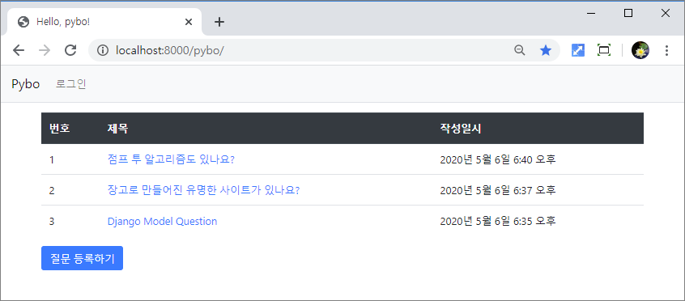

이렇게 부트스트랩은 화면 크기가 작은 기기를 고려한 '반응형 웹'까지 적용되어 있다. 그런데 햄버거 메뉴 버튼을 클릭해도 아무런 변화가 없을 것이다. 그 이유는 부트스트랩 자바스크립트 파일(bootstrap.min.js)이 base.html 파일에 포함되지 않았기 때문이다. 또한 부트스트랩 자바스크립트 파일은 제이쿼리를 기반으로 해서 만들어졌다. 결국 햄버거 메뉴 버튼을 제대로 사용하려면 부트스트랩 자바스크립트 파일과 제이쿼리 파일이 필요하다.

### [4] 부트스트랩에 필요한 파일 추가하기 ― 부트스트랩 자바스크립트 파일
부트스트랩 자바스크립트 파일은 bootstrap-4.5.3-dist.zip 압축 파일에 있다. 이 파일을 찾아 다음과 같은 위치에 복사해 붙여 넣자.

- 부트스트랩 자바스크립트 파일 위치: bootstrap-4.5.3-dist.zip\bootstrap-4.5.3-dist\js\bootstrap.min.js
붙여 넣을 위치: C:\projects\mysite\static\bootstrap.min.js

### [5] 부트스트랩에 필요한 파일 추가하기 - 제이쿼리
제이쿼리는 jquery.com/download에 접속하여 'Download the compressed, production jQuery 3.4.1' 링크를 마우스 오른쪽 버튼으로 누른 다음 '다른 이름으로 링크 저장'을 하면 'jquery-3.4.1.min.js' 파일이 다운로드된다. 이 파일을 다음 위치에 붙여 넣자.

- 붙여 넣을 위치: C:/projects/mysite/static/jquery-3.4.1.min.js


[압축 형식의 제이쿼리 다운로드]


[압축 형식의 제이쿼리 다운로드를 위해 <다른 이름으로 링크 저장> 이용]

### [6] templates/base.html에 파일 추가하기
위 단계를 마치면 다음과 같은 경로에 각 파일이 위치해야 한다. 파일 위치를 확인하자.


[파일 위치와 경로 확인]

파일 위치를 확인하고 base.html 파일을 열어 base.html 파일 </body> 태그 바로 위에 코드를 추가하자. 수정한 다음 햄버거 메뉴 버튼을 누르면 숨어 있는 링크가 표시된다.

```python
(... 생략 ...)
<!-- 기본 템플릿 안에 삽입될 내용 Start -->


<!-- 기본 템플릿 안에 삽입될 내용 End -->
<!-- ------------------------------- [edit] -------------------------------- -->
<!-- jQuery JS -->
<script src=""></script>
<!-- Bootstrap JS -->
<script src=""></script>
<!-- ----------------------------------------------------------------------- -->
</body>
</html>
```


[햄버거 메뉴 버튼을 누르면 나타나는 로그인 링크]

- 혹시 실행이 제대로 되지 않으면 앞에서 다운로드한 제이쿼리 버전이 다르게 입력된 것은 아닌지 확인해 보자.

## include 기능으로 내비게이션바 추가해 보기
이번에는 조금 더 나은 방법으로 내비게이션바를 템플릿에 추가해 보자. 장고에는 템플릿 특정 위치에 템플릿 파일을 삽입하는 include라는 기능이 있다. 이번에는 include 기능으로 내비게이션바를 base.html 파일에 추가해 보자.

### [1] templates/navbar.html 생성하고 코드 작성하기
templates 디렉터리에 navbar.html 파일을 생성하고 다음과 같은 코드를 작성하자.

```python
<!-- ------------------------------- [edit] -------------------------------- -->
<!-- 네비게이션바 -->
<nav class="navbar navbar-expand-lg navbar-light bg-light border-bottom">
    <a class="navbar-brand" href="">Pybo</a>
    <button class="navbar-toggler ml-auto" type="button" data-toggle="collapse" data-target="#navbarNav"
        aria-controls="navbarNav" aria-expanded="false" aria-label="Toggle navigation">
        <span class="navbar-toggler-icon"></span>
    </button>
    <div class="collapse navbar-collapse flex-grow-0" id="navbarNav">
        <ul class="navbar-nav">
            <li class="nav-item ">
                <a class="nav-link" href="#">로그인</a>
            </li>
        </ul>
    </div>
</nav>
<!-- ----------------------------------------------------------------------- -->
```
navbar.html 파일의 코드는 base.html 파일에 작성했던 내비게이션바를 위한 HTML과 같다. 내비게이션바와 관련된 코드를 분리했다고 생각하면 된다.

### [2] templates/base.html에 include 적용하기
이제 include 기능을 이용해 1단계에서 만든 navbar.html 파일을 base.html 파일에 삽입해 보자.

```python

<!doctype html>
<html lang="ko">
<head>
    <!-- Required meta tags -->
    <meta charset="utf-8">
    <meta name="viewport" content="width=device-width, initial-scale=1, shrink-to-fit=no">
    <!-- Bootstrap CSS -->
    <link rel="stylesheet" type="text/css" href="">
    <!-- pybo CSS -->
    <link rel="stylesheet" type="text/css" href="">
    <title>Hello, pybo!</title>
</head>
<body>
<!-- ------------------------------- [edit] -------------------------------- -->

<!-- ----------------------------------------------------------------------- -->
<!-- 기본 템플릿 안에 삽입될 내용 Start -->


<!-- 기본 템플릿 안에 삽입될 내용 End -->
<!-- jQuery JS -->
<script src=""></script>
<!-- Bootstrap JS -->
<script src=""></script>
</body>
</html>
```
이렇게 include 기능은 템플릿의 특정 영역을 중복, 반복해서 사용할 경우에 유용하다. 즉, 중복, 반복되는 템플릿의 특정 영역을 따로 템플릿 파일로 만들고, include 기능으로 그 템플릿을 포함한다. navbar.html 파일은 base.html 파일에서 1번만 사용되지만 따로 파일로 관리해야 이후 유지·보수하는 데 유리하므로 분리했다.

## 임시 질문 데이터 300개 생성하기
페이징을 구현하기 전에 페이징을 테스트할 정도로 충분한 데이터를 생성하자. 여기서는 300개의 테스트 데이터를 생성한다. 대량의 테스트 데이터를 만드는 가장 좋은 방법은 장고셸을 이용하는 것이다.

### [1] 장고 셸 실행하고 필요한 모듈 임포트하기
다음처럼 장고 셸을 실행하자.

```python
(mysite) c:\projects\mysite>python manage.py shell
Python 3.8.2 (tags/v3.8.2:7b3ab59, Feb 25 2020, 22:45:29) [MSC v.1916 32 bit (Intel)] on win32
Type "help", "copyright", "credits" or "license" for more information.
(InteractiveConsole)
>>>
```
이어서 질문 데이터를 생성하기 위한 모듈을 임포트하자.

```python
>>> from pybo.models import Question
>>> from django.utils import timezone
```

### [2] for 문으로 테스트 데이터 300개 만들기
for 문을 이용하여 다음과 같이 300개의 테스트 데이터를 생성하자.

```python
>>> for i in range(300):
...     q = Question(subject='테스트 데이터입니다:[%03d]' % i, content='내용무', create_date=timezone.now())
...     q.save()
...
>>>  
```
이제 장고 셸을 종료하고 개발 서버를 실행한 다음 웹 브라우저에서 질문 목록 페이지를 호출하면 위에서 등록한 300개의 테스트 데이터가 보인다.

```python
(mysite) C:\projects\mysite>python manage.py runserver
```


[엄청나게 길어진 스크롤]

그리고 앞에서 언급했듯 한없이 이어지는 게시물이 문제임을 금방 알아챌 것이다. 이게 바로 페이징이 필요한 이유이다.

## 페이징 기능 살짝 구현해 보기
질문 목록 조회를 위한 index 함수에 페이징 기능을 추가해 보자.

```python
# ---------------------------------- [edit] ---------------------------------- #
from django.core.paginator import Paginator
# ---------------------------------------------------------------------------- #
(... 생략 ...)

def index(request):
    """
    pybo 목록출력
    """
# ---------------------------------- [edit] ---------------------------------- #
    # 입력 파라미터
    page = request.GET.get('page', '1')  # 페이지
# ---------------------------------------------------------------------------- #    

    # 조회
    question_list = Question.objects.order_by('-create_date')

# ---------------------------------- [edit] ---------------------------------- #
    # 페이징처리
    paginator = Paginator(question_list, 10)  # 페이지당 10개씩 보여주기
    page_obj = paginator.get_page(page)

    context = {'question_list': page_obj}
# ---------------------------------------------------------------------------- #
    return render(request, 'pybo/question_list.html', context)
```
index 함수의 형태를 자세히 살펴보자. page = request.GET.get('page', '1')은 다음과 같은 GET 방식 요청 URL에서 page값을 가져올 때 사용한다.

```python
localhost:8000/pybo/?page=1
```
get('page', '1')에서 '1'은 /pybo/처럼 ?page=1과 같은 page 파라미터가 없는 URL을 위해 기본값으로 1을 지정한 것이다. 페이징 구현에 사용한 클래스는 Paginator이다.
```python
paginator = Paginator(question_list, 10) # 페이지당 10개씩 보여 주기
page_obj = paginator.get_page(page)
```
Paginator 클래스는 question_list를 페이징 객체 paginator로 변환한다. 두 번째 파라미터인 10은 페이지당 보여줄 게시물 개수를 의미한다. page_obj = paginator.get_page(page)로 만들어진 page_obj 객체에는 다음과 같은 속성들이 있다. 장고의 Paginator 클래스를 이용하면 별다른 수고 없이 다음 속성들을 사용할 수 있으므로 페이징 처리가 아주 쉬워진다.

paginator.count : 전체 게시물 개수

paginator.per_page : 페이지당 보여줄 게시물 개수

paginator.page_range : 페이지 범위

number : 현재 페이지 번호

previous_page_number : 이전 페이지 번호

next_page_number : 다음 페이지 번호

has_previous : 이전 페이지 유무

has_next : 다음 페이지 유무

start_index : 현재 페이지 시작 인덱스(1부터 시작)

end_index : 현재 페이지의 끝 인덱스(1부터 시작)

- Paginator의 속성들은 템플릿에서 페이징을 처리할 때 사용된다.

이와 같이 index 함수를 수정한 후에 질문 목록 페이지에 접속하면 이제 300개의 질문 데이터가 표시되지 않고 페이징 기능으로 한 페이지에 10건씩 출력됨을 확인할 수 있다.


[한 페이지에 10건의 게시물만 보여주게 됨]

## 페이징 적용하기
이제 한 페이지에 10건씩 게시물을 출력할 수 있게 되었지만 페이지 이동 기능이 없어서 여전히 불편하다. 이번에는 페이지 이동 기능을 템플릿에 구현해 보자.
### [1] 질문 목록 템플릿에 페이징 기능 적용하기
question_list.html 템플릿 파일의 </table> 태그 바로 밑에 다음 코드를 추가하자.

```python
(... 생략 ...)
    </table>
<!-- ------------------------------- [edit] -------------------------------- -->
    <!-- 페이징처리 시작 -->
    <ul class="pagination justify-content-center">
        <!-- 이전페이지 -->
        
        <li class="page-item">
            <a class="page-link" href="?page={{ question_list.previous_page_number }}">이전</a>
        </li>
        
        <li class="page-item disabled">
            <a class="page-link" tabindex="-1" aria-disabled="true" href="#">이전</a>
        </li>
        
        <!-- 페이지리스트 -->
        
            
            <li class="page-item active" aria-current="page">
                <a class="page-link" href="?page={{ page_number }}">{{ page_number }}</a>
            </li>
            
            <li class="page-item">
                <a class="page-link" href="?page={{ page_number }}">{{ page_number }}</a>
            </li>
            
        
        <!-- 다음페이지 -->
        
        <li class="page-item">
            <a class="page-link" href="?page={{ question_list.next_page_number }}">다음</a>
        </li>
        
        <li class="page-item disabled">
            <a class="page-link" tabindex="-1" aria-disabled="true" href="#">다음</a>
        </li>
        
    </ul>
    <!-- 페이징처리 끝 -->
<!-- ----------------------------------------------------------------------- -->    
    <a href="" class="btn btn-primary">질문 등록하기</a>
</div>

```
템플릿에 사용된 {{ question_list }}가 바로 views.py 파일의 page_obj이다. views.py 파일에 다음과 같이 컨텍스트 정보를 입력했고, 이 정보가 템플릿으로 전달되었다.

[views.py의 컨텍스트 정보]
```python
context = {'question_list': page_obj}
```
다시 말해 템플릿의 {{ question_list.previous_page_number }}는 page_obj.previous_page_number와 동일하다.

만약 이전 페이지가 있다면 '이전' 링크가 활성화되지만, 반대로 이전 페이지가 없으면 '이전' 링크는 비활성화된다. '다음' 링크의 경우도 마찬가지이다. 그리고 와  템플릿 태그 사이에서는 페이지 리스트를 돌면서 해당 페이지로 이동할 수 있는 링크를 생성했다. 이때 현재 페이지 번호는 부트스트랩의 active 클래스를 적용하여 강조 표시도 했다. 코드의 양이 많아서 얼핏 복잡해 보이지만, 찬찬히 살펴보면 if 문과 for 문을 조합한 것이므로 생각보다 어렵지 않으니 천천히 분석해 보기 바란다.


[페이지가 너무 많아 부자연스러워짐]

- 여기서는 페이징(1, 2, 3, ...)을 보기 좋게 표시하기 위해 부트스트랩의 pagination 컴포넌트를 사용했다.
- 부트스트랩 pagination 컴포넌트 공식 문서: getbootstrap.com/docs/4.5/components/pagination

## 페이지 표시 제한 기능 구현하기
다만 여러분이 구현한 페이징 기능에는 1가지 문제가 있다. 앞에서 보듯 페이지 개수가 30까지 늘어나면 이동할 수 있는 페이지가 모두 표시되어 덜 다듬어진 서비스처럼 보인다는 점이다.
### [1] 페이징 템플릿 수정하기
이 문제를 해결하기 위해 다음과 같이 템플릿을 수정하자.

```python
(... 생략 ...)
<!-- 페이지리스트 -->

<!-- ------------------------------- [edit] -------------------------------- -->

<!-- ----------------------------------------------------------------------- -->
    
    <li class="page-item active" aria-current="page">
        <a class="page-link" href="?page={{ page_number }}">{{ page_number }}</a>
    </li>
    
    <li class="page-item">
        <a class="page-link" href="?page={{ page_number }}">{{ page_number }}</a>
    </li>
    
<!-- ------------------------------- [edit] -------------------------------- -->

<!-- ----------------------------------------------------------------------- -->

(... 생략 ...)
```
 바로 아래에 다음 코드를 삽입하여 페이지 표시 제한 기능을 구현했다.  ~ 로 까지 입력해야 하니 코드 누락에 주의하자.

[페이지 표시 제한 기능을 위해 삽입한 코드]
```python

(... 생략 ...)

```
위 코드는 페이지 번호가 현재 페이지 기준으로 좌우 5개씩 보이도록 만든다. question_list.number보다 5만큼 크거나 작은 값만 표시되도록 만든 것이다. |add:-5는 5만큼 빼라는 의미이고 |add:5는 5만큼 더하라는 의미이다. 만약 현재 페이지가 15라면 다음 그림과 같이 페이지 번호가 나타날 것이다.

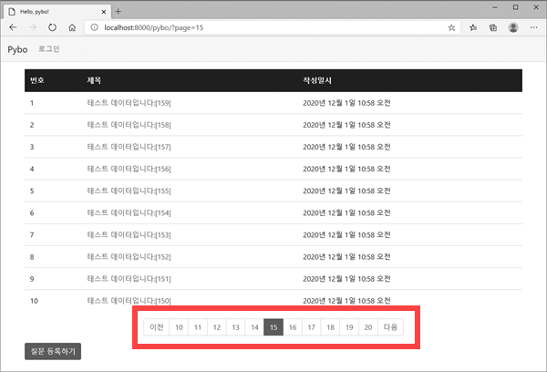

[좌우 5개씩 표시하는 페이징 기능]
- 지금까지 만든 페이징 기능에 '처음'과 '마지막' 링크를 추가하고 '…' 생략 기호까지 추가하면 더 완성도 높은 페이징 기능이 될 것이다.

축하한다! 페이징 기능이 완성되었다. 페이징은 사실 구현하기가 무척 어려운 기술이다. Paginator 클래스의 도움이 없었다면 아마 이렇게 쉽게 해내기는 힘들었을 것이다.

## 템플릿 필터 직접 만들어 보기
여기서는 템플릿 필터를 직접 만드는 방법을 알아본다. 템플릿 필터란 템플릿 태그에서 | 문자 뒤에 사용하는 필터를 말한다. 예를 들어 None 대신 공백 문자열로 보여주기 위해 사용했던 default_if_none과 같은 것을 템플릿 필터라고 한다.

[템플릿 필터 예]
```python
{{ form.subject.value|default_if_none:'' }}
```
## 항상 1로 시작하는 게시물 번호 문제 해결하기
파이보 질문 목록 화면을 유심히 보면 페이지마다 게시물 번호가 항상 1부터 시작되는 문제가 있다. 페이지를 이리저리 이동해 봐도 게시물 번호는 1부터 시작한다. 이 문제를 템플릿 필터를 사용하여 해결해 보자.


[1페이지인데 1로 시작]

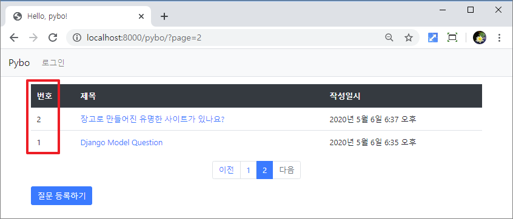

[2페이지도 1로 시작]

### [1] 게시물 번호 공식 만들기
만약 질문 게시물이 12개라면 1페이지에는 12번째~3번째 게시물이, 2페이지에는 2번째~1번째 게시물이 역순으로 표시되어야 한다. 질문 게시물의 번호를 역순으로 정렬하려면 다음과 같은 공식을 적용해야 한다.

[게시물 일련번호 공식 만들기]

```python
일련번호 = 전체 게시물 개수 - 시작 인덱스 - 현재 인덱스 + 1
```
시작 인덱스는 페이지당 시작되는 게시물의 시작 번호를 의미한다. 예를 들어 페이지당 게시물을 10건씩 보여준다면 1페이지의 시작 인덱스는 1, 2페이지의 시작 인덱스는 11이 된다. 현재 인덱스는 페이지에 보여지는 게시물 개수만큼 0부터 1씩 증가되는 번호이다. 따라서 전체 게시물 개수가 12개이고 페이지당 10건씩 게시물을 보여 준다면 1페이지의 일련번호는 12 - 1 - (0~9 반복) + 1 이 되어 12~3까지 표시되고 2페이지의 경우에는 12 - 11 - (0~1 반복) + 1 이 되어 2~1이 표시될 것이다.

템플릿에서 이 공식을 적용하려면 빼기 기능이 필요하다. 앞에서 더하기 필터(|add:5)를 사용한 것처럼 빼기 필터(|sub:3)가 있으면 좋을 것 같다. 하지만 장고에는 빼기 필터가 없다. 그래서 우리는 빼기 필터를 만들 것이다.

|add:-3와 같이 숫자를 직접 입력하면 더하기 필터를 이용하여 원하는 값을 뺀 결과를 화면에 보여줄 수는 있다. 하지만 이 방법은 이곳에는 사용할 수 없다. 왜냐하면 더하기 필터에는 변수를 적용할 수 없기 때문이다.

- add 필터는 인수로 숫자만 가능하다.

### [2] 템플릿 필터 디렉터리 만들기
템플릿 필터 함수는 템플릿 필터 파일을 작성한 다음에 정의해야 한다. 템플릿 필터 파일은 템플릿 파일이나 스태틱 파일과 마찬가지로 pybo/templatetags 디렉터리를 새로 만들어 저장해야 한다.

[템플릿 필터 디렉터리 위치 확인]

```python
C:\projects\mysite\pybo\templatetags
```
pybo/templatetags 디렉터리는 반드시 앱 디렉터리 아래에 생성해야 한다. mysite 디렉터리 아래에 만들면 안 되므로 위치에 주의하자.

[명령 프롬프트]

```python
(mysite) c:\projects\mysite\pybo>mkdir templatetags
```

### [3] 템플릿 필터 작성하기
pybo_filter.py 파일을 만든 후 템플릿 필터 함수를 다음과 같이 작성하자.

```python
# ---------------------------------- [edit] ---------------------------------- #
from django import template

register = template.Library()


@register.filter
def sub(value, arg):
    return value - arg
# ---------------------------------------------------------------------------- #
```
템플릿 필터 함수를 만드는 방법은 무척 간단하다. sub 함수에 @register.filter라는 애너테이션을 적용하면 템플릿에서 해당 함수를 필터로 사용할 수 있게 된다. 템플릿 필터 함수 sub는 기존 값 value에서 입력으로 받은 값 arg를 빼서 반환할 것이다.

### [4] 템플릿 필터 사용하기
템플릿 필터 함수를 템플릿에 사용해 보자. 여러분이 직접 만든 템플릿 필터를 사용하려면 템플릿 파일 맨 위에 와 같이 템플릿 필터 파일을 로드해야 한다. 만약 템플릿 파일 맨 위에 extends 문이 있으면 load 문은 extends 문 다음에 위치해야 한다.

```python

```
다음은 템플릿 필터 로드 후 일련번호를 적용한 것이다.
```python

<!-- ------------------------------- [edit] -------------------------------- -->

<!-- ----------------------------------------------------------------------- -->
(... 생략 ...)
<td>
<!-- ------------------------------- [edit] -------------------------------- -->
    <!-- 번호 = 전체건수 - 시작인덱스 - 현재인덱스 + 1 -->
    {{ question_list.paginator.count|sub:question_list.start_index|sub:forloop.counter0|add:1 }}
<!-- ----------------------------------------------------------------------- -->
</td>
(... 생략 ...)
```
<td>{{ forloop.counter }}</td>에서 {{ forloop.counter }}를 위와 같이 변경했다. 다음은 게시물 일련번호 공식에 사용된 코드를 정리한 표이다.

- 일련번호 공식은 전체 게시물 개수 - 시작 인덱스 - 현재 인덱스 + 1 이다.

question_list.paginator.count : 전체 게시물 개수

question_list.start_index : 시작 인덱스(1부터 시작)

forloop.counter0 : 루프 내의 현재 인덱스(forloop.counter0는 0부터, forloop.counter는 1부터 시작)

코드 수정 후 일련번호를 확인해 보면 항상 1부터 시작했던 문제가 사라졌음을 확인할 수 있다.

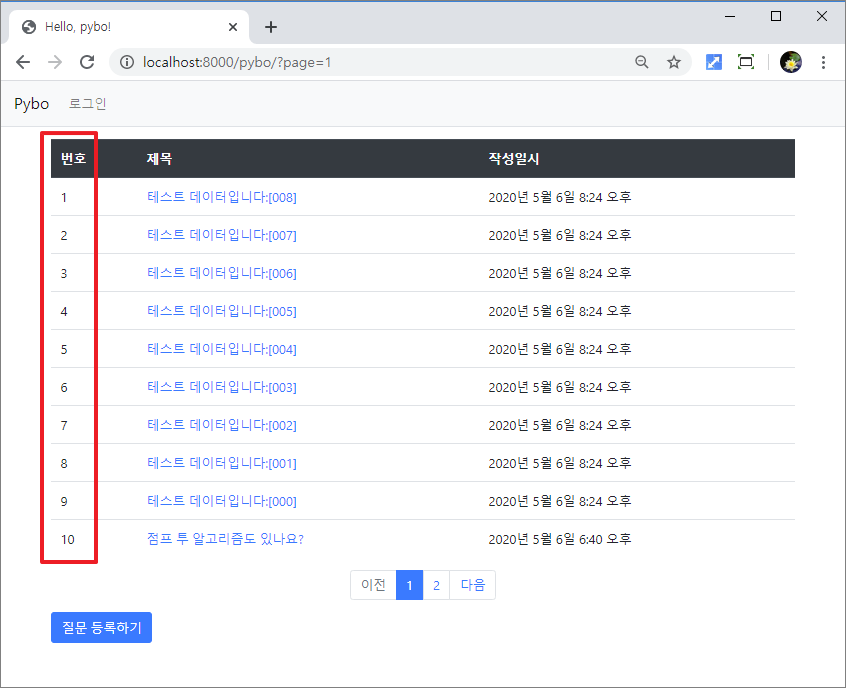

[제대로 표시된 일련번호 - 1페이지]

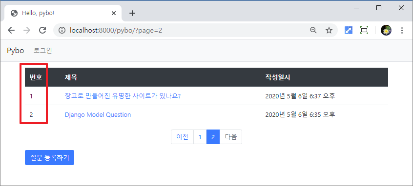

[제대로 표시된 일련번호 - 2페이지]

이제 질문 목록에 '해당 질문에 달린 답변 개수'를 표시할 수 있는 기능을 추가해 보자. 코드의 분량은 많지 않지만, '게시판 서비스를 더욱 서비스답게 만들어 주는 기능'이다.

## 질문에 달린 답변의 개수 표시하기
답변 개수는 다음처럼 게시물 제목 바로 오른쪽에 표시하자.

```python
(... 생략 ...)
<td>
    <a href="">{{ question.subject }}</a>
<!-- ------------------------------- [edit] -------------------------------- -->
    
    <span class="text-danger small ml-2">{{ question.answer_set.count }}</span>
    
<!-- ----------------------------------------------------------------------- -->
</td>
<...>
```
로 답변이 있는 경우를 검사하고, {{ question.answer_set.count }}로 답변 개수를 표시했다. 이제 답변이 있는 질문은 제목 오른쪽에 빨간색 숫자가 표시된다.


이번에는 파이보에 로그인 · 로그아웃을 구현해 보자. 장고는 로그인 · 로그아웃을 쉽게 구현할 수 있도록 django.contrib.auth 앱을 제공한다. 이 앱은 장고 프로젝트 생성 시 mysite/config/settings.py에 자동으로 추가된다.

```python
(... 생략 ...)
INSTALLED_APPS = [
    (... 생략 ...)
    'django.contrib.auth',
    (... 생략 ...)
]
(... 생략 ...)
```
## common 앱 생성 후 초기 설정 작업하기
당장 로그인 · 로그아웃을 구현하고 싶겠지만, 잠시 생각해 볼 문제가 있다. 로그인 · 로그아웃은 pybo 앱에 구현해야 옳을까? 필자는 그렇지 않다고 이야기하고 싶다. 왜냐하면 하나의 웹 사이트에는 파이보와 같은 게시판 서비스 외에도 블로그나 쇼핑몰과 같은 굵직한 단위의 앱들이 함께 있을 수 있기 때문에 공통으로 사용되는 기능인 로그인이나 로그아웃을 이 중의 하나의 앱에 종속시키는 것은 좋지 않기 때문이다. 이러한 이유로 여기서는 로그인 · 로그아웃을 '공통 기능을 가진 앱'이라는 의미의 common 앱에 구현할 것이다.

### [1] common 앱 생성하기
common 앱을 생성하려면, 새로운 앱을 생성하는 것이므로 맨 처음 pybo 앱을 생성했던 것과 동일한 방법으로 생성하면 된다. projects/mysite 디렉터리 위치에서 다음 명령으로 common 앱을 생성하자.

```python
(mysite) c:\projects\mysite>django-admin startapp common
```
common 앱을 생성하고 디렉터리를 열어 보면 pybo 앱의 디렉터리와 같은 구조임을 알 수 있다.
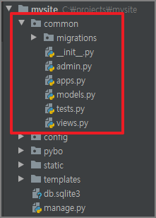

### [2] 설정 파일에 common 앱 등록하기
config/settings.py 파일에 common 앱을 등록하자.

```python
(... 생략 ...)
INSTALLED_APPS = [
# ---------------------------------- [edit] ---------------------------------- #
    'common.apps.CommonConfig',
# ---------------------------------------------------------------------------- #
    (... 생략 ...)
]
(... 생략 ...)
```
IINSTALLED_APPS에 'common.apps.CommonConfig',을 추가해 등록했다. 이어서 common 앱의 urls.py 파일을 사용하기 위해 config/urls.py 파일을 다음과 같이 수정하자.

```python
from django.contrib import admin
from django.urls import include, path

urlpatterns = [
    (... 생략 ...)
# ---------------------------------- [edit] ---------------------------------- #
    path('common/', include('common.urls')),
# ---------------------------------------------------------------------------- #
]
```
이 수정으로 /common/으로 시작하는 URL은 모두 common/urls.py 파일을 참조할 것이다.

### [3] common/urls.py 생성하기
common/urls.py 파일을 새로 생성하고 다음과 같이 작성하자.

```python
# ---------------------------------- [edit] ---------------------------------- #
app_name = 'common'

urlpatterns = [
]
# ---------------------------------------------------------------------------- #
```
아직 common 앱에 어떤 기능도 구현하지 않았으므로 urlpatterns는 빈 상태로 놔두자.

## 로그인 구현하기
이제 common 앱에 로그인 기능을 구현하자.

### [1] 내비게이션바 수정하고 URL 매핑 추가하기
templates/navbar.html 파일을 열어 '로그인' 링크를 수정하자.

```python
(... 생략 ...)
<!-- ------------------------------- [edit] -------------------------------- -->
<a class="nav-link" href="">로그인</a>
<!-- ----------------------------------------------------------------------- -->
(... 생략 ...)
```
템플릿 태그로 를 사용했으므로 common/urls.py 파일에 URL 매핑을 추가하자.

```python
# ---------------------------------- [edit] ---------------------------------- #
from django.urls import path
from django.contrib.auth import views as auth_views
# ---------------------------------------------------------------------------- #

app_name = 'common'

urlpatterns = [
# ---------------------------------- [edit] ---------------------------------- #
    path('login/', auth_views.LoginView.as_view(), name='login'),
# ---------------------------------------------------------------------------- #
]
```
앞에서 언급했듯 로그인 기능은 django.contrib.auth 앱을 사용할 것이므로 common/views.py 파일은 수정할 필요가 없다. 여기서는 django.contrib.auth 앱의 LoginView 클래스를 사용할 것이다.

### [2] 로그인 템플릿 만들기
/pybo/ 페이지에서 내비게이션바의 '로그인' 링크를 눌러 보자. 그러면 아마도 다음과 같은 오류 메시지가 나타날 것이다.

[로그인 링크 클릭 시 확인할 수 있는 오류 메시지]

```python
TemplateDoesNotExist at /common/login/
registration/login.html
```
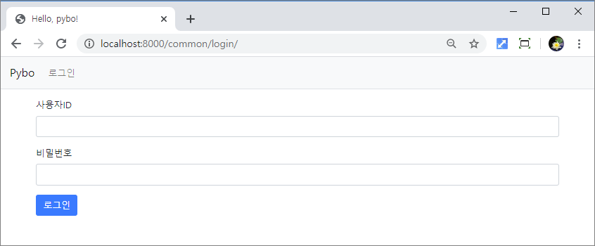

[로그인 링크 클릭 시 오류 발생(템플릿 없음)]

위 오류는 registration 디렉터리에 login.html 파일이 없음을 의미한다. 앞에서 사용한 LoginView는 registration이라는 템플릿 디렉터리에서 login.html 파일을 찾는다. 그런데 이 파일을 찾지 못해 오류가 발생한 것이다. 이 오류를 해결하려면 registration/login.html 템플릿 파일을 작성해야만 한다.

다만! 로그인은 common 앱에 구현할 것이므로 오류 메시지에 표시한 것처럼 registration 디렉터리에 템플릿 파일을 생성하기보다는 common 디렉터리에 템플릿을 생성하는 것이 좋다. 이를 위해 LoginView가 common 디렉터리의 템플릿을 참조할 수 있도록 common/urls.py 파일을 다음과 같이 수정하자.

```python
(... 생략 ...)
urlpatterns = [
# ---------------------------------- [edit] ---------------------------------- #
    path('login/', auth_views.LoginView.as_view(template_name='common/login.html'), name='login'),
# ---------------------------------------------------------------------------- #
]
```
as_view 함수에 template_name으로 'common/login.html'을 설정하면 registration 디렉터리가 아닌 common 디렉터리에서 login.html 파일을 참조하게 된다. 코드 수정 후 로그인 링크를 누르면 여전히 오류 메시지가 나타난다. 하지만 조금만 더 자세히 보면 메시지가 변경되었음을 알 수 있다.

[변경된 오류 메시지]

```python
TemplateDoesNotExist at /common/login/
common/login.html
```
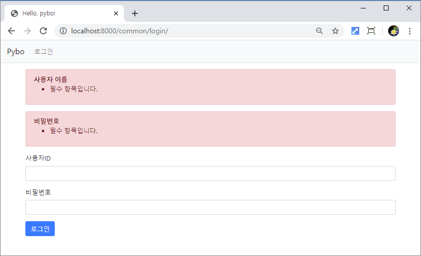

[오류 메시지가 변경되었음]

우리가 설정한 common 디렉터리에서 login.html 파일을 찾으려고 했으나 common 디렉터리에 login.html 파일이 없어서 오류가 발생하였다.

### [3] common 디렉터리 생성 후 login.html 생성하기
common 디렉터리를 생성하고 login.html 파일을 생성한 후 다음처럼 코드를 작성하자.

[명령 프롬프트]

```python
(mysite) c:\projects\mysite\templates>mkdir common
```

```python
<!-- ------------------------------- [edit] -------------------------------- -->


<div class="container my-3">
    <form method="post" class="post-form" action="">
        
        
        <div class="form-group">
            <label for="username">사용자ID</label>
            <input type="text" class="form-control" name="username" id="username"
                   value="{{ form.username.value|default_if_none:'' }}">
        </div>
        <div class="form-group">
            <label for="password">비밀번호</label>
            <input type="password" class="form-control" name="password" id="password"
                   value="{{ form.password.value|default_if_none:'' }}">
        </div>
        <button type="submit" class="btn btn-primary">로그인</button>
    </form>
</div>

<!-- ----------------------------------------------------------------------- -->
```
아이디와 비밀번호를 입력받아 로그인하는 간단한 HTML 코드이다. 입력 항목 username과 password는 모두 django.contrib.auth 앱에서 요구하는 필수 항목이다.

### [4] form_errors.html 만들어 작성하기
위에서 작성한 를 위해 templates/form_errors.html 파일을 생성한 후에 다음과 같이 코드를 작성하자.

```python
<!-- ------------------------------- [edit] -------------------------------- -->

    
          <!-- 필드 오류를 출력한다. -->
            <div class="alert alert-danger">
                <strong>{{ field.label }}</strong>
                {{ error }}
            </div>
        
    
       <!-- 넌필드 오류를 출력한다. -->
        <div class="alert alert-danger">
            <strong>{{ error }}</strong>
        </div>
    

<!-- ----------------------------------------------------------------------- -->
```
form_errors.html 파일은 로그인 실패 시 로그인이 실패한 원인을 알려 준다. 위에서 보듯 폼 오류에는 다음과 같은 두 가지 오류가 있다.

[폼 오류 2가지]

- 필드 오류(입력값이 누락되었거나 형식에 맞지 않음)
- 넌필드 오류(입력값과 관계없이 발생한 오류)

### [5] 엉뚱한 값으로 로그인해 보기
위와 같이 코드를 수정한 다음 내비게이션바의 로그인 링크를 눌러 로그인 화면으로 이동해 보자. 그러면 다음 화면을 볼 수 있다.
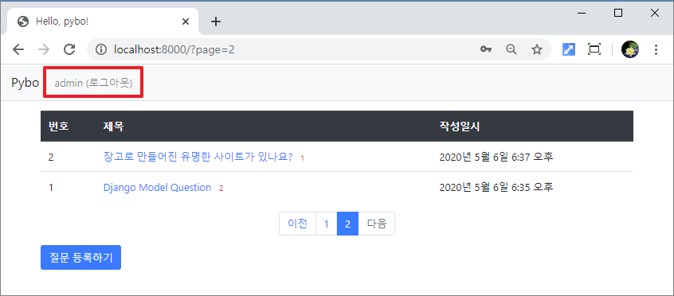

[로그인 화면]

form_errors.html 파일이 잘 작동하는지 시험해 보기 위해 입력값을 누락하거나 엉뚱한 값을 입력한 다음 <로그인>을 눌러 보자. 그러면 적절한 오류 메시지가 표시될 것이다.

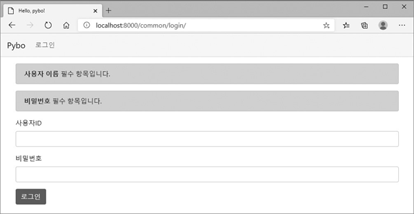

[입력값이 없는 경우 나타나는 오류 메시지]

### [6] 제대로 로그인해 보기
현재 로그인할 수 있는 계정은 슈퍼 유저로 생성한 admin뿐이므로 admin 계정으로 로그인해 보자. 그러면 아마도 다음 오류 메시지를 볼 수 있을 것이다.
- 회원가입은 03-6에서 자세히 알아볼 것이다.

[슈퍼 유저 계정으로 로그인 시 확인할 수 있는 오류 메시지]

```python
Page not found (404)
Request Method: GET
Request URL:    http://localhost:8000/accounts/profile/
```

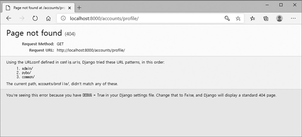

[장고가 /accounts/profile/로 리다이렉트해 발생한 오류]

이 오류는 왜 발생했을까? 로그인은 성공한 것이 맞다. 오류가 발생한 이유는 django.contrib.auth 앱이 로그인 성공 후 /accounts/profile/ 이라는 URL로 페이지를 리다이렉트했기 때문인데, 우리는 아직 이 URL에 대한 준비를 하지 않았다.

### [7] 로그인 성공 시 이동할 페이지 등록하기
다만 /accounts/profile/ URL은 현재 우리가 파이보에 구성한 것과 맞지 않으므로 로그인 성공 시 / 페이지로 이동할 수 있도록 config/settings.py 파일을 수정하자. 마지막 줄에 LOGIN_REDIRECT_URL을 추가하면 된다.

- / 페이지는 기본 URL인 localhost:8000/를 의미하며 보통 index 페이지라 부른다.

```python
(... 생략 ...)
# ---------------------------------- [edit] ---------------------------------- #
# 로그인 성공후 이동하는 URL
LOGIN_REDIRECT_URL = '/'
# ---------------------------------------------------------------------------- #
```
이렇게 수정하고 다시 로그인하면 또다시 오류 메시지가 나타난다!

- 계속해서 오류가 발생하고 있지만 한 걸음씩 나아가고 있으니 두려워 말자.

[다시 발생한 오류 메시지]

```python
Page not found (404)
Request Method: GET
Request URL:    http://localhost:8000/
```

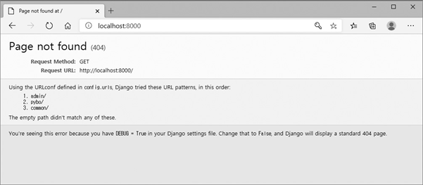

[/ 페이지에 대한 매핑이 없어 발생한 오류]

이 오류 메시지는 / 페이지에 대한 매핑이 없음을 의미한다.

### [8] config/urls.py 수정하기
/ 페이지에 대응하는 urlpatterns를 추가하자.

```python
(... 생략 ...)
from pybo import views


urlpatterns = [
    (... 생략 ...)
# ---------------------------------- [edit] ---------------------------------- #
    path('', views.index, name='index'),  # '/' 에 해당되는 path
# ---------------------------------------------------------------------------- #
]
```
그러면 / 페이지 요청에 대해 path('', views.index, name='index')가 작동하여 pybo/views.py 파일의 index 함수가 실행된다. 여기까지 수정한 다음 로그인이 잘 되는지 직접 확인해 보자.

## 로그아웃 구현하기
로그인에 성공했지만, 내비게이션바에는 여전히 로그인 링크가 보인다. 로그인 후에는 로그인 링크가 로그아웃 링크로 바뀌도록 navbar.html 파일을 수정하자.

### [1] 내비게이션바 수정하기
navbar.html 템플릿 파일에서 로그인 링크 부분을 다음과 같이 수정하자.

```python
(... 생략 ...)
<li class="nav-item">
<!-- ------------------------------- [edit] -------------------------------- -->
    
    <a class="nav-link" href="">{{ user.username }} (로그아웃)</a>
    
<!-- ----------------------------------------------------------------------- -->    
    <a class="nav-link" href="">로그인</a>
<!-- ------------------------------- [edit] -------------------------------- -->    
    
<!-- ----------------------------------------------------------------------- -->    
</li>
(... 생략 ...)
```
은 현재 로그인 상태를 판별하여 로그인 상태라면 로그아웃 링크를, 로그아웃 상태라면 로그인 링크를 보여 준다. 로그인 상태에서는 로그인한 사용자명 {{ user.username }}도 표시했다.

### [2] 로그아웃 URL 매핑하기
로그아웃 링크가 추가되었으므로 에 대응하는 URL 매핑을 common/urls.py 파일에 추가하자.

```python
(... 생략 ...)
urlpatterns = [
    path('login/', auth_views.LoginView.as_view(template_name='common/login.html'), name='login'),
# ---------------------------------- [edit] ---------------------------------- #
    path('logout/', auth_views.LogoutView.as_view(), name='logout'),
# ---------------------------------------------------------------------------- #
]
```
이제 슈퍼 유저로 로그인하면 로그인 링크가 다음과 같이 변경된다.

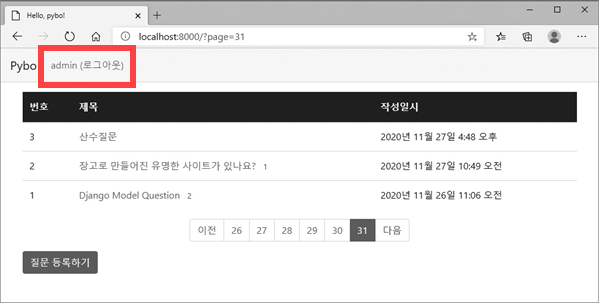

[로그아웃으로 바뀐 링크]

### [3] 로그아웃 성공 시 이동할 페이지 등록하기
로그인 성공 시 리다이렉트할 위치인 LOGIN_REDIRECT_URL을 등록했던 것과 마찬가지로 로그아웃 성공 시 리다이렉트할 위치도 config/settings.py 파일에 추가하자.

```python
...
# 로그인/로그아웃 성공후 이동하는 URL
LOGIN_REDIRECT_URL = '/'
# ---------------------------------- [edit] ---------------------------------- #
LOGOUT_REDIRECT_URL = '/'
# ---------------------------------------------------------------------------- #
```
로그아웃 성공 시 / 페이지로 이동하기 위한 LOGOUT_REDIRECT_URL = '/'을 설정했다. 코드 수정 후 로그인 · 로그아웃을 해보면 잘 작동할 것이다. 여러분이 직접 확인해 보자.
## 회원가입 구현하기
### [1] 회원가입 링크 추가하기
회원가입 링크는 login.html 파일에 추가하자.
```python
(... 생략 ...)
<div class="container my-3">
<!-- ------------------------------- [edit] -------------------------------- -->
    <div class="row">
        <div class="col-4">
            <h4>로그인</h4>
        </div>
        <div class="col-8 text-right">
            <span>또는 <a href="">계정을 만드세요.</a></span>
        </div>
    </div>
<!-- ----------------------------------------------------------------------- -->
    <form method="post" class="post-form" action="">
(... 생략 ...)
```
form 엘리먼트 위에 <div class="row">...</div>를 입력하여 회원가입 링크를 추가했다.

### [2] 회원가입 URL 매핑 추가하기
앞에서 login.html 파일에 를 추가했으므로 여기에 대응하는 URL 매핑을 추가해야 한다. common/urls.py 파일에 회원가입을 위한 URL 매핑을 추가하자.

```python
(... 생략 ...)
# ---------------------------------- [edit] ---------------------------------- #
from . import views
# ---------------------------------------------------------------------------- #
(... 생략 ...)

urlpatterns = [
    (... 생략 ...)
# ---------------------------------- [edit] ---------------------------------- #
    path('signup/', views.signup, name='signup'),
# ---------------------------------------------------------------------------- #
]
```
이제 로그인 화면에서 회원가입 링크를 누르면 views.signup 함수가 실행될 것이다.

### [3] 회원가입에 사용할 폼 만들기
회원가입에 사용할 UserForm을 commons/forms.py 파일에 작성하자.

```python
# ---------------------------------- [edit] ---------------------------------- #
from django import forms
from django.contrib.auth.forms import UserCreationForm
from django.contrib.auth.models import User


class UserForm(UserCreationForm):
    email = forms.EmailField(label="이메일")

    class Meta:
        model = User
        fields = ("username", "email")
# ---------------------------------------------------------------------------- #
```
UserForm은 django.contrib.auth.forms 패키지의 UserCreationForm 클래스를 상속하고 email 속성을 추가했다.

상속한 UserCreationForm은 다음 속성을 가지고 있다.

username : 사용자 이름

password1 : 비밀번호1

password2 : 비밀번호2(비밀번호1을 제대로 입력했는지 대조하기 위한 값)

즉 UserCreationForm이 기본적으로 가지고 있는 username, password1, password2 속성에 부가 정보인 email 속성을 추가하기 위해 UserCreationForm을 상속한 UserForm을 만든 것이다.

UserCreationForm의 is_valid 함수는 회원가입 화면의 필드값 3개가 모두 입력되었는지, 비밀번호1과 비밀번호2가 같은지, 비밀번호의 값이 비밀번호 생성 규칙에 맞는지 등을 검사한다. is_valid 함수는 다음 단계에서 사용할 것이다.

### [4] 회원가입을 위한 signup 함수 정의하기
common/views.py 파일에 signup 함수를 다음과 같이 정의하자.

- common/views.py 파일에는 기본값 외에는 아무 것도 없는 상태일 것이다.

```python
# ---------------------------------- [edit] ---------------------------------- #
from django.contrib.auth import authenticate, login
from django.shortcuts import render, redirect
from common.forms import UserForm


def signup(request):
    """
    계정생성
    """
    if request.method == "POST":
        form = UserForm(request.POST)
        if form.is_valid():
            form.save()
            username = form.cleaned_data.get('username')
            raw_password = form.cleaned_data.get('password1')
            user = authenticate(username=username, password=raw_password)
            login(request, user)
            return redirect('index')
    else:
        form = UserForm()
    return render(request, 'common/signup.html', {'form': form})
# ---------------------------------------------------------------------------- #
```
signup 함수는 POST 요청인 경우 화면에서 입력한 데이터로 새로운 사용자를 생성하고, GET 요청인 경우 common/signup.html 화면을 반환한다. POST 요청에서 form.cleaned_data.get 함수는 회원가입 화면에서 입력한 값을 얻기 위해 사용하는 함수이다. 여기서는 로그인 시 필요한 아이디, 비밀번호를 얻기 위해 사용되었다. 그리고 회원가입이 완료된 이후에 자동으로 로그인되도록 authenticate 함수와 login 함수를 사용했다.

- authenticate, login 함수는 django.contrib.auth 패키지에 있는 함수로 사용자 인증과 로그인을 담당한다.

### [5] 회원가입 템플릿 만들기
common/signup.html 파일을 생성한 다음 아래와 같이 작성하자.

```python
<!-- ------------------------------- [edit] -------------------------------- -->


<div class="container my-3">
    <div class="row my-3">
        <div class="col-4">
            <h4>계정생성</h4>
        </div>
        <div class="col-8 text-right">
            <span>또는 <a href="">로그인 하세요.</a></span>
        </div>
    </div>
    <form method="post" class="post-form">
        
        
        <div class="form-group">
            <label for="username">사용자 이름</label>
            <input type="text" class="form-control" name="username" id="username"
                   value="{{ form.username.value|default_if_none:'' }}">
        </div>
        <div class="form-group">
            <label for="password1">비밀번호</label>
            <input type="password" class="form-control" name="password1" id="password1"
                   value="{{ form.password1.value|default_if_none:'' }}">
        </div>
        <div class="form-group">
            <label for="password2">비밀번호 확인</label>
            <input type="password" class="form-control" name="password2" id="password2"
                   value="{{ form.password2.value|default_if_none:'' }}">
        </div>
        <div class="form-group">
            <label for="email">이메일</label>
            <input type="text" class="form-control" name="email" id="email"
                   value="{{ form.email.value|default_if_none:'' }}">
        </div>
        <button type="submit" class="btn btn-primary">생성하기</button>
    </form>
</div>

<!-- ----------------------------------------------------------------------- -->
```
맨 위에 로그인 페이지로 이동할 수 있는 링크를 추가하고, 오류 표시를 위해 form_errors.html 파일을 include로 포함했다. 그리고 회원가입 시 필요한 UserForm 클래스의 username, password1, password2, email 필드를 추가했다. 코드 수정 후 회원가입을 시도해 보자.

로그인 페이지에서 '계정을 만드세요.' 링크를 눌러 회원가입 페이지로 이동하자.

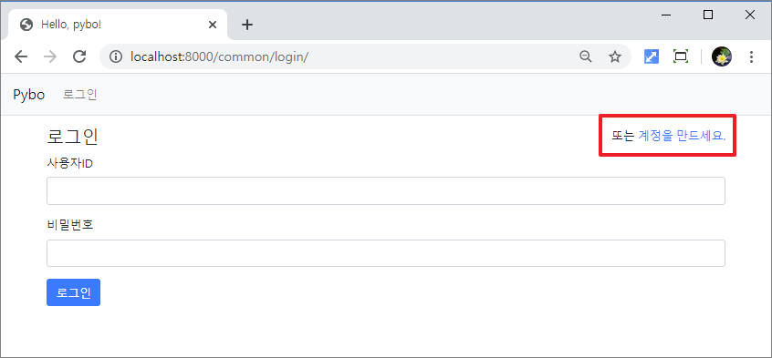

['계정을 만드세요'를 누르면]

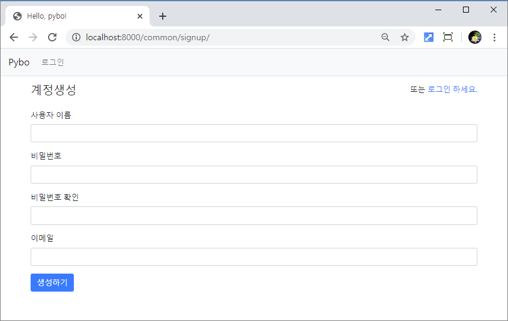

[회원가입 화면으로 이동]

만약 비밀번호와 비밀번호 확인에서 다르게 입력하면 다음 오류 메시지를 볼 수 있을 것이다.

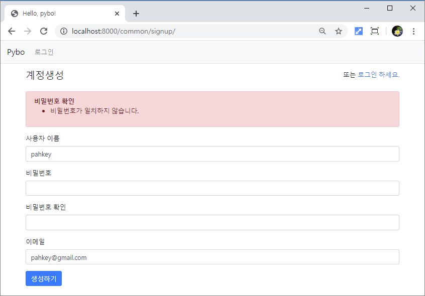

[비밀번호가 일치하지 않으면 나타나는 오류]

필수값, 비밀번호 생성 규칙, 이메일 규칙도 모두 잘 작동할 것이다. 여러분이 직접 확인해 보자.

### [6] 

회원가입을 완료한 다음 장고 admin에 접속하면 슈퍼 유저가 아닌 다른 계정으로 로그인되어 있으므로 다음과 같은 경고 메시지가 나타날 것이다.

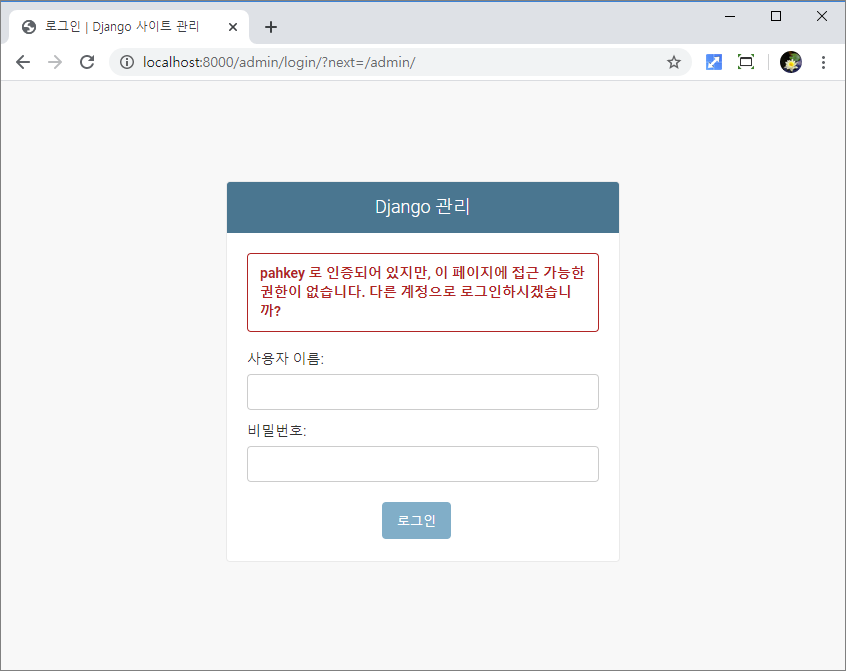

[슈퍼 유저로 로그인한 상태가 아니라서 발생한 오류]

장고 admin은 슈퍼 유저로 접속해야 한다. 슈퍼 유저로 로그인하자. 이어서 [홈 → 사용자(들)] 화면을 보면 새로 회원가입한 계정을 확인할 수 있을 것이다.

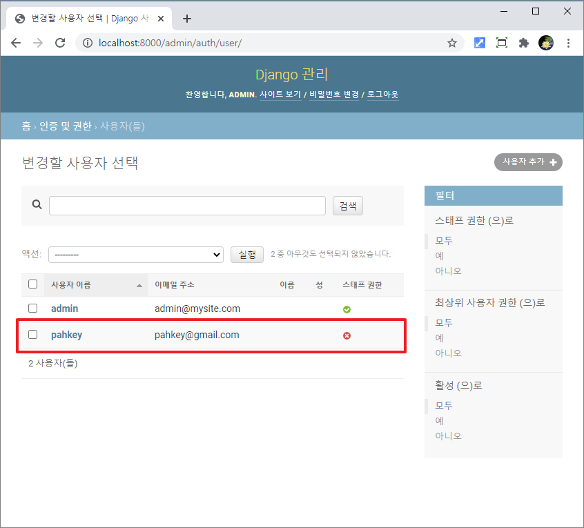

[새로 추가된 계정]

축하한다. 파이보는 이제 회원가입을 할 수 있게 되었다.

## Question 모델 수정하기
### [1] Question 모델에 author 필드 추가하기
Question 모델에 author 필드를 추가하자.

```python
# ---------------------------------- [edit] ---------------------------------- #
from django.contrib.auth.models import User
# ---------------------------------------------------------------------------- #
(... 생략 ...)

class Question(models.Model):
# ---------------------------------- [edit] ---------------------------------- #
    author = models.ForeignKey(User, on_delete=models.CASCADE)
# ---------------------------------------------------------------------------- #
    (... 생략 ...)
```
uthor 필드는 User 모델을 ForeignKey로 적용하여 선언했다. User 모델은 django.contrib.auth 앱이 제공하는 모델이다. on_delete=models.CASCADE는 계정이 삭제되면 계정과 연결된 Question 모델 데이터를 모두 삭제하라는 의미이다.

### [2] makemigrations 명령 실행하고 author 필드 추가 문제 해결하기

모델을 수정했으므로 makemigrations 명령과 migrate 명령을 실행해야 한다. 그런데 makemigrations 명령을 실행하면 다음 메시지를 볼 수 있다.

```python
(mysite) c:\projects\mysite>python manage.py makemigrations
You are trying to add a non-nullable field 'author' to question without a default; we can't do that (the database needs something to populate existing rows).
Please select a fix:
 1) Provide a one-off default now (will be set on all existing rows with a null value for this column)
 2) Quit, and let me add a default in models.py
Select an option: 
```

이 메시지가 나타난 이유는 Question 모델에 author 필드를 추가하면 이미 등록되어 있던 게시물에 author 필드에 해당되는 값이 저장되어야 하는데, 장고는 author 필드에 어떤 값을 넣어야 하는지 모르기 때문이다. 그래서 장고가 여러분에게 기존에 저장된 Question 모델 데이터에는 author 필드값으로 어떤 값을 저장해야 하는지 묻는 것이다.

이 문제를 해결하는 방법에는 2가지가 있다. 첫 번째 방법은 author 필드를 null로 설정하는 방법이고, 두 번째 방법은 기존 게시물에 추가될 author 필드의 값에 강제로 임의 계정 정보를 추가하는 방법이다. 질문, 답변에는 author 필드값이 무조건 있어야 하므로 두 번째 방법을 사용할 것이다. 위 메시지를 유지한 상태에서 '1'을 입력하자.

```python
Select an option: 1
Please enter the default value now, as valid Python
The datetime and django.utils.timezone modules are available, so you can do e.g. timezone.now
Type 'exit' to exit this prompt
>>>
```
그러면 파이썬 셸이 다음처럼 구동된다. 여기서 '1'을 입력하자. 그러면 makemigrations가 완료되고 파이썬 셸이 종료된다.

```python
>>> 1
Migrations for 'pybo':
  pybo\migrations\0002_question_author.py
    - Add field author to question

(mysite) c:\projects\mysite> 
```
파이썬 셸에서 입력한 '1'은 최초 생성했던 슈퍼 유저의 id값이므로 기존 게시물의 author에는 슈퍼 유저가 등록될 것이다.

### [3] migrate 명령 실행하기
이제 migrate 명령으로 변경된 내용을 데이터베이스에 적용하자.

```python
(mysite) c:\projects\mysite>python manage.py migrate
Operations to perform:
  Apply all migrations: admin, auth, contenttypes, pybo, sessions
Running migrations:
  Applying pybo.0002_question_author... OK
```

## Answer 모델 수정하기
### [1] Answer 모델에 author 필드 추가하고 문제 해결하기
Question 모델과 같은 방법으로 Answer 모델에 author 필드를 추가하자.

```python
(... 생략 ...)

class Answer(models.Model):
# ---------------------------------- [edit] ---------------------------------- #
    author = models.ForeignKey(User, on_delete=models.CASCADE)
# ---------------------------------------------------------------------------- #
    (... 생략 ...)
```
이어서 makemigrations 명령을 실행한 다음, Question 모델에 했던 것과 마찬가지로 파이썬 셸 작업을 진행하자.
```python
(mysite) c:\projects\mysite>python manage.py makemigrations
You are trying to add a non-nullable field 'author' to answer without a default; we can't do that (the database needs something to populate existing rows).
Please select a fix:
 1) Provide a one-off default now (will be set on all existing rows with a null value for this column)
 2) Quit, and let me add a default in models.py
Select an option: 1
Please enter the default value now, as valid Python
The datetime and django.utils.timezone modules are available, so you can do e.g. timezone.now
Type 'exit' to exit this prompt
>>> 1
Migrations for 'pybo':
  pybo\migrations\0003_answer_author.py
    - Add field author to answer
```
이어서 migrate 명령을 실행하자.

```python
(mysite) c:\projects\mysite>python manage.py migrate
Operations to perform:
  Apply all migrations: admin, auth, contenttypes, pybo, sessions
Running migrations:
  Applying pybo.0003_answer_author... OK

(mysite) c:\projects\mysite> 
```
여기까지 잘 진행되면 이상 없이 잘 처리된 것이다.

#### author 필드에 null 허용하기
author 필드에 null을 허용하려면 다음처럼 필드 정의 시 null=True를 지정하면 된다.

[Answer, Question 모델의 author 필드 정의]

```python
author = models.ForeignKey(User, on_delete=models.CASCADE, null=True)
```
이렇게 설정하면 author 필드에 null을 허용하므로 기존 게시물의 author 필드가 추가될 때 값이 없어도 된다

## author 필드 적용하기
이제 Question, Answer 모델에 author 필드가 추가되었으므로 질문 등록시에 author 필드를 추가해야 한다.

- 질문, 답변에 글쓴이를 추가한다는 느낌으로 작업을 진행하자.
### [1] 답변 등록 함수 수정하기
answer_create 함수를 수정하자.

```python
def answer_create(request, question_id):
    (... 생략 ...)
        if form.is_valid():
            answer = form.save(commit=False)
# ---------------------------------- [edit] ---------------------------------- #
            answer.author = request.user  # 추가한 속성 author 적용
# ---------------------------------------------------------------------------- #
            (... 생략 ...)
    (... 생략 ...)
```
답변 글쓴이는 현재 로그인한 계정이므로 answer.author = request.user로 처리했다. request.user가 바로 현재 로그인한 계정의 User 모델 객체이다.
### [2] 질문 등록 함수 수정하기
question_create 함수도 마찬가지 방법으로 수정하자.
```python
def question_create(request):
    (... 생략 ...)
        if form.is_valid():
            question = form.save(commit=False)
# ---------------------------------- [edit] ---------------------------------- #
            question.author = request.user  # 추가한 속성 author 적용
# ---------------------------------------------------------------------------- #
    (... 생략 ...)
```
질문 글쓴이도 question.author = request.user로 처리했다. 이제 다시 개발 서버를 시작하고 로그인한 다음 질문 · 답변 등록을 테스트해보자. 잘 될 것이다.

- 개발 서버 종료는 <Ctrl+C>를 누르면 된다.
- 개발 서버 시작은 projects/mysite에서 python manage.py runserver 명령을 실행하면 된다.

## 로그인이 필요한 함수 설정하기
### [1] 로그아웃 상태에서 질문, 답변 등록해 보기
로그아웃 상태에서 질문 또는 답변을 등록하면 다음과 같은 ValueError 오류가 발생한다. 오류는 웹 브라우저, 명령 프롬프트 양쪽에서 모두 확인할 수 있다. 로그아웃 상태에서 직접 오류를 발생시켜 보자.

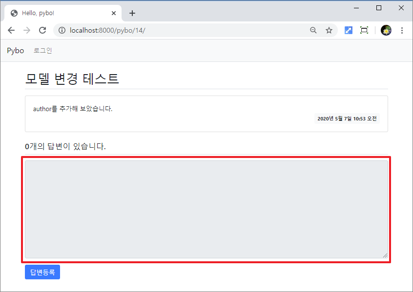
[로그아웃 상태에서 질문 · 답변 등록 시 오류 발생]

```python
(... 생략 ...)
ValueError at /pybo/question/create/
Cannot assign "<SimpleLazyObject: <django.contrib.auth.models.AnonymousUser object at 0x05491FE8>>": "Question.author" must be a "User" instance.
(... 생략 ...)
```
이 오류는 request.user가 User 객체가 아닌 AnonymousUser 객체라서 발생한 것이다. 조금 더 자세히 설명하자면 request.user에는 로그아웃 상태이면 AnonymousUser 객체가, 로그인 상태이면 User 객체가 들어있는데, 앞에서 우리는 author 필드를 정의할 때 User를 이용하도록 했다. 그래서 answer.author = request.user에서 User 대신 AnonymousUser가 대입되어 오류가 발생한 것이다.
### [2] 로그인이 필요한 함수에 @login_required 애너테이션 적용하기
이 문제를 해결하려면 로그인이 필요한 함수 answer_create, question_create에 @login_required 애너테이션을 사용해야 한다.

```python
# ---------------------------------- [edit] ---------------------------------- #
from django.contrib.auth.decorators import login_required
# ---------------------------------------------------------------------------- #
(... 생략 ...)

# ---------------------------------- [edit] ---------------------------------- #
@login_required(login_url='common:login')
# ---------------------------------------------------------------------------- #
def answer_create(request, question_id):
    (... 생략 ...)

# ---------------------------------- [edit] ---------------------------------- #
@login_required(login_url='common:login')
# ---------------------------------------------------------------------------- #
def question_create(request):
    (... 생략 ...)
```
쉽게 말해 answer_create 함수와 question_create 함수는 request.user를 포함하고 있으므로 @login_required 애너테이션을 통해 로그인이 되었는지를 우선 검사하여 앞 단계에서 본 오류를 방지한다. 만약 로그아웃 상태에서 @login_required 애너테이션이 적용된 함수가 호출되면 자동으로 로그인 화면으로 이동할 것이다. @login_required 애너테이션의 login_url은 이동해야 할 로그인 화면의 URL을 의미한다. 코드 수정 후 로그아웃 상태에서 질문 등록, 답변을 등록을 시도하면 로그인 화면으로 이동되는지 확인해 보자.

### [3] URL의 next 인자로 로그인 성공 후 이동할 URL 지정하기
그런데 로그아웃 상태에서 '질문 등록하기'를 눌러 로그인 화면으로 전환된 상태에서 웹 브라우저 주소창의 URL을 보면 next 파라미터가 있을 것이다.
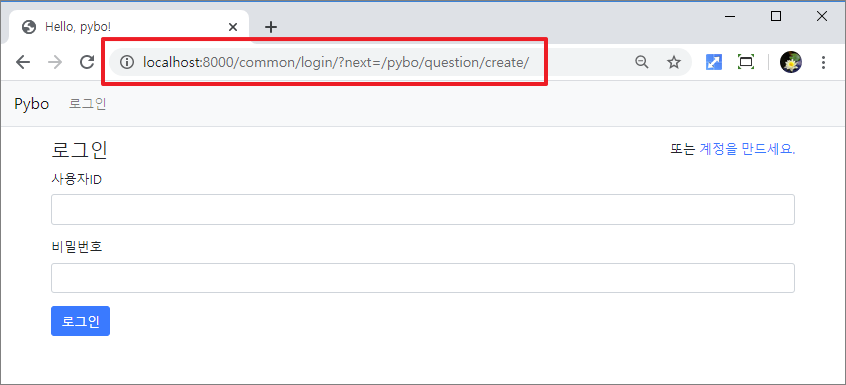

[next 파라미터 확인]

이는 로그인 성공 후 next 파라미터에 있는 URL로 페이지를 이동해야 한다는 의미이다. 그런데 지금은 그렇게 되고 있지 않다.
### [4] 로그인 템플릿에 hidden 항목 추가하여 next 파라미터 활용하기
로그인 후 next 파라미터에 있는 URL로 페이지를 이동하려면 로그인 템플릿에 다음과 같이 hidden 항목 next를 추가해야 한다.
```python
(... 생략 ...)
<form method="post" class="post-form" action="">
    
<!-- ------------------------------- [edit] -------------------------------- -->
    <input type="hidden" name="next" value="{{ next }}">  <!-- 로그인 성공후 이동되는 URL -->
<!-- ----------------------------------------------------------------------- -->
    
(... 생략 ...)
```
그러면 로그인 후 next 파라미터의 URL로 이동할 수 있을 것이다.

### [5] 로그아웃 상태에서 아예 글을 작성할 수 없게 만들기
하나만 더 고쳐 보자. 현재 질문 등록은 로그아웃 상태에서는 아예 글을 작성할 수 없어서 만족스럽다. 하지만 답변 등록은 로그아웃 상태에서도 글을 작성할 수 있다. 물론 답변 작성 후 <저장하기>를 누르면 자동으로 로그인 화면으로 이동되므로 큰 문제는 아니지만 '글을 작성할 수 있는 것처럼 보이는 현상'은 부자연스럽다. 로그아웃 상태에서 아예 답변을 작성할 수 없도록 만드는 방법은 disabled 속성을 사용하는 것이다. pybo/question_detail.html 파일을 다음과 같이 수정하자.
```python
(... 생략 ...)
<div class="form-group">
<!-- ------------------------------- [edit] -------------------------------- -->
    <textarea disabled
              name="content" id="content" class="form-control" rows="10"></textarea>
<!-- ----------------------------------------------------------------------- -->
</div>
<input type="submit" value="답변등록" class="btn btn-primary">
(... 생략 ...)
```
로그인 상태가 아닌 경우 textarea 엘리먼트에 disabled 속성을 적용하여 입력을 못하게 만들었다.

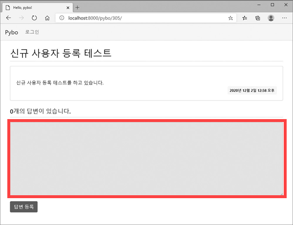

[disable된 상태가 된 입력 창]

## 글쓴이 표시하기

## 질문 목록 화면에 글쓴이 표시하기
### [1] 질문 목록 템플릿 수정하기
글쓴이를 표시하기 위해 테이블 헤더에 글쓴이 항목을 추가하자.
```python
(... 생략 ...)
<!-- ------------------------------- [edit] -------------------------------- -->
<tr class="text-center thead-dark">
<!-- ----------------------------------------------------------------------- -->
    <th>번호</th>
<!-- ------------------------------- [edit] -------------------------------- -->
    <th style="width:50%">제목</th>
    <th>글쓴이</th>
<!-- ----------------------------------------------------------------------- -->
    <th>작성일시</th>
</tr>
(... 생략 ...)
```
<th>글쓴이</th>를 추가했다. 그리고 th 엘리먼트를 가운데 정렬하도록 tr 엘리먼트에 text-center 클래스를 추가하고 제목의 너비가 전체에서 50%를 차지하도록 style="width:50%"도 지정해 주었다. 이어서 for 문에도 글쓴이를 적용하자.

```python
(... 생략 ...)

<!-- ------------------------------- [edit] -------------------------------- -->
<tr class="text-center">
<!-- ----------------------------------------------------------------------- -->
    <td>
        <!-- 번호 = 전체건수 - 시작인덱스 - 현재인덱스 + 1 -->
        {{ question_list.paginator.count|sub:question_list.start_index|sub:forloop.counter0|add:1 }}
    </td>
<!-- ------------------------------- [edit] -------------------------------- -->
    <td class="text-left">
<!-- ----------------------------------------------------------------------- -->
        <a href="">{{ question.subject }}</a>
        
        <span class="text-danger small ml-2">{{ question.answer_set.count }}</span>
        
    </td>
<!-- ------------------------------- [edit] -------------------------------- -->
    <td>{{ question.author.username }}</td>  <!-- 글쓴이 추가 -->
<!-- ----------------------------------------------------------------------- -->
    <td>{{ question.create_date }}</td>
</tr>

(... 생략 ...)
```
<td>{{ question.user.username }}</td>를 삽입하여 질문의 글쓴이를 표시했다. 그리고 테이블 내용을 가운데 정렬하도록 tr 엘리먼트에 text-center 클래스를 추가하고, 제목을 왼쪽 정렬하도록 text-left 클래스를 추가했다. 질문 목록 화면에 글쓴이가 추가되었다. 변경된 질문 목록 화면은 다음 그림과 같다.

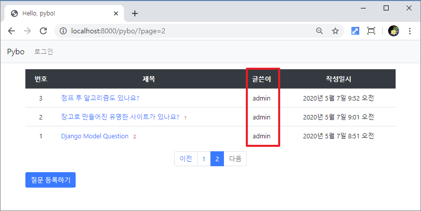

[질문 목록 화면에 추가된 글쓴이 열]

## 질문 상세 조회 화면에 글쓴이 표시하기
### [1] 질문 상세 템플릿 수정하기
질문 상세 화면에도 다음과 같이 글쓴이를 추가한다.
```python
(... 생략 ...)
<div class="card-body">
    <div class="card-text" style="white-space: pre-line;">{{ question.content }}</div>
    <div class="d-flex justify-content-end">
<!-- ------------------------------- [edit] -------------------------------- -->
        <div class="badge badge-light p-2 text-left">
            <div class="mb-2">{{ question.author.username }}</div>
            <div>{{ question.create_date }}</div>
        </div>
<!-- ----------------------------------------------------------------------- -->
    </div>
</div>
(... 생략 ...)
```
글쓴이와 작성일시가 함께 보이도록 수정했다. 그리고 부트스트랩을 이용하여 여백과 정렬 등의 디자인도 살짝 변경했다.

### [2] 답변에 글쓴이 표시 기능 추가하기
답변에도 글쓴이를 추가하자. 1단계와 마찬가지로 작성일시 바로 위에 글쓴이를 표시하면 된다.
```python
(... 생략 ...)
<div class="card-body">
    <div class="card-text" style="white-space: pre-line;">{{ answer.content }}</div>
    <div class="d-flex justify-content-end">
<!-- ------------------------------- [edit] -------------------------------- -->
        <div class="badge badge-light p-2 text-left">
            <div class="mb-2">{{ answer.author.username }}</div>
            <div>{{ answer.create_date }}</div>
        </div>
<!-- ----------------------------------------------------------------------- -->
    </div>
</div>
(... 생략 ...)
```
질문 상세 화면의 질문과 답변에 글쓴이가 추가되었다.
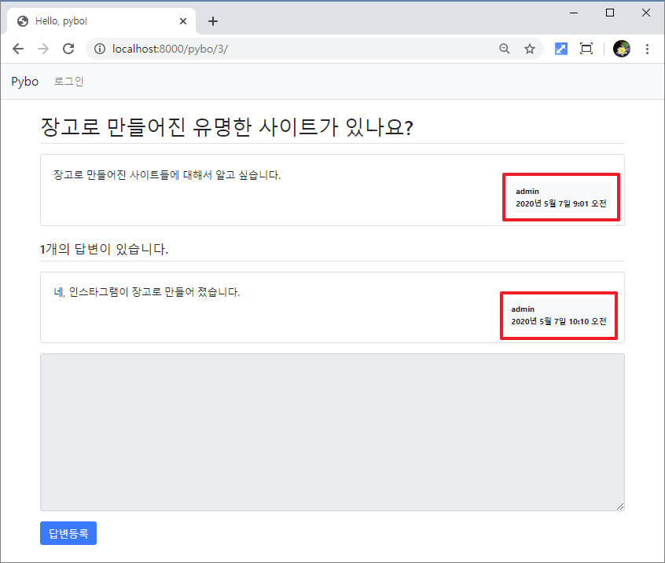

[질문 상세 화면에 추가된 글쓴이 정보]

## 게시물 수정 & 삭제 기능 추가하기
이번에는 작성한 게시물을 수정 & 삭제할 수 있는 기능을 추가할 것이다. 실습을 진행하다 보면 '비슷한 기능을 반복해서 구현한다는 느낌'을 받아 조금 지루할 수 있다. 하지만 게시물 수정 & 삭제 기능은 게시물 작성만큼 중요하다. 장고 개발 패턴을 연습할 수 있는 좋은 기회이므로 실습을 이해하며 따라가 보자.

## 모델 수정하기
### [1] Question, Answer 모델에 modify_date 필드 추가하기
질문, 답변을 언제 수정했는지 확인할 수 있도록 Question 모델과 Answer 모델에 수정일시를 의미하는 modify_date 필드를 추가하자.
```python
(... 생략 ...)

class Question(models.Model):
    (... 생략 ...)
# ---------------------------------- [edit] ---------------------------------- #
    modify_date = models.DateTimeField(null=True, blank=True)
# ---------------------------------------------------------------------------- #
    (... 생략 ...)

class Answer(models.Model):
    (... 생략 ...)
# ---------------------------------- [edit] ---------------------------------- #
    modify_date = models.DateTimeField(null=True, blank=True)
# ---------------------------------------------------------------------------- #
```
null=True는 데이터베이스에서 modify_date 칼럼에 null을 허용한다는 의미이며, blank=True는 form.is_valid()를 통한 입력 폼 데이터 검사 시 값이 없어도 된다는 의미이다. 즉, null=True, blank=True는 어떤 조건으로든 값을 비워둘 수 있음을 의미한다.

수정일시는 수정한 경우에만 생성되는 데이터이므로 null=True, blank=True를 지정했다.

### [2] makemigrations, migrate 명령 수행하기
모델이 변경되었으므로 makemigrations, migrate 명령을 수행하자.

```python
(mysite) c:\projects\mysite>python manage.py makemigrations
Migrations for 'pybo':
  pybo\migrations\0004_auto_20200331_0945.py
    - Add field modify_date to answer
    - Add field modify_date to question

(mysite) c:\projects\mysite>python manage.py migrate
Operations to perform:
  Apply all migrations: admin, auth, contenttypes, pybo, sessions
Running migrations:
  Applying pybo.0004_auto_20200331_0945(... 생략 ...) OK

(mysite) c:\projects\mysite>
```
## 질문 수정 기능 추가하기
### [1] 질문 수정 버튼 추가하기
질문 상세 화면에 질문 수정 버튼을 추가하자.
```python
(... 생략 ...)
<div class="card my-3">
    <div class="card-body">
        <div class="card-text" style="white-space: pre-line;">{{ question.content }}</div>
        <div class="d-flex justify-content-end">
            <div class="badge badge-light p-2 text-left">
                <div class="mb-2">{{ question.author.username }}</div>
                <div>{{ question.create_date }}</div>
            </div>
        </div>
<!-- ------------------------------- [edit] -------------------------------- -->
        
        <div class="my-3">
            <a href="" 
               class="btn btn-sm btn-outline-secondary">수정</a>
        </div>
        
<!-- ----------------------------------------------------------------------- -->
    </div>
</div>
(... 생략 ...)
```
질문 수정 버튼은 로그인한 사용자와 글쓴이가 같은 경우에만 보여야 하므로 와 같이 추가했다.
### [2] 질문 수정 버튼의 URL 매핑 추가하기
 URL이 추가되었으니 pybo/urls.py 파일을 수정하여 URL 매핑을 추가해야 한다.

```python
urlpatterns = [
    (... 생략 ...)
# ---------------------------------- [edit] ---------------------------------- #
    path('question/modify/<int:question_id>/', views.question_modify, name='question_modify'),
# ---------------------------------------------------------------------------- #
    (... 생략 ...)
]
```
### [3] 질문 수정 함수 추가하기
URL 매핑에 등록한 views.question_modify 함수를 추가하자.
```python
# ---------------------------------- [edit] ---------------------------------- #
from django.contrib import messages
# ---------------------------------------------------------------------------- #
(... 생략 ...)

# ---------------------------------- [edit] ---------------------------------- #
@login_required(login_url='common:login')
def question_modify(request, question_id):
    """
    pybo 질문수정
    """
    question = get_object_or_404(Question, pk=question_id)
    if request.user != question.author:
        messages.error(request, '수정권한이 없습니다')
        return redirect('pybo:detail', question_id=question.id)

    if request.method == "POST":
        form = QuestionForm(request.POST, instance=question)
        if form.is_valid():
            question = form.save(commit=False)
            question.author = request.user
            question.modify_date = timezone.now()  # 수정일시 저장
            question.save()
            return redirect('pybo:detail', question_id=question.id)
    else:
        form = QuestionForm(instance=question)
    context = {'form': form}
    return render(request, 'pybo/question_form.html', context)
# ---------------------------------------------------------------------------- #
```
question_modify 함수는 로그인한 사용자(request.user)와 수정하려는 글쓴이(question.author)가 다르면 '수정권한이 없습니다'라는 오류가 발생하도록 작성했다.
- '수정권한이 없습니다' 오류를 발생시키기 위해 messages 모듈을 이용했다.
- messages 모듈은 장고가 제공하는 함수로 오류를 임의로 발생시키고 싶은 경우에 사용한다. 이때 임의로 발생시킨 오류는 폼 필드와 관련이 없으므로 넌필드 오류에 해당된다.
- 03-5에서 필드, 넌필드 오류를 설명했다.

질문 상세 화면에서 <수정>을 누르면 /pybo/question/modify/2/ 페이지가 GET 방식으로 호출되어 질문 수정 화면이 나타나고, 질문 수정 화면에서 <저장하기>를 누르면 /pybo/question/modify/2/ 페이지가 POST 방식으로 호출되어 데이터 수정이 이뤄진다.

- 데이터 저장 시 form 엘리먼트에 action 속성이 없으면 현재의 페이지로 폼을 전송한다.
- 질문 수정에서 사용한 템플릿은 질문 등록 시 사용한 pybo/question_form.html 파일을 그대로 사용한다.

이때 GET 요청으로 질문 수정 화면이 나타날 때 기존에 저장되어 있던 제목, 내용이 반영된 상태에서 수정을 시작할 수 있도록 다음과 같이 폼을 생성했다.

[질문 수정 화면에 기존 제목, 내용 반영]

```python
form = QuestionForm(instance=question)
```
이처럼 instance 매개변수에 question을 지정하면 기존 값을 폼에 채울 수 있다. 그러면 사용자는 질문 수정 시 제목, 내용이 채워진 상태의 폼에서 수정을 시작할 수 있을 것이다. POST 요청으로 수정 내용을 반영하는 경우에는 다음과 같이 폼을 생성해야 한다.

[질문 수정을 위해 값 덮어쓰기]
```python
form = QuestionForm(request.POST, instance=question)
```
위 코드는 조회한 질문 question을 기본값으로 하여 화면으로 전달받은 입력값들을 덮어써서 QuestionForm을 생성하라는 의미이다. 그리고 질문의 수정일시는 다음처럼 현재일시로 저장했다.

[질문 수정일시를 현재일시로 저장]
```python
question.modify_date = timezone.now()
```
### [4] 질문 수정 확인하기
이제 로그인 사용자와 글쓴이가 같으면 질문 상세 화면에 <수정> 버튼이 보일 것이다.

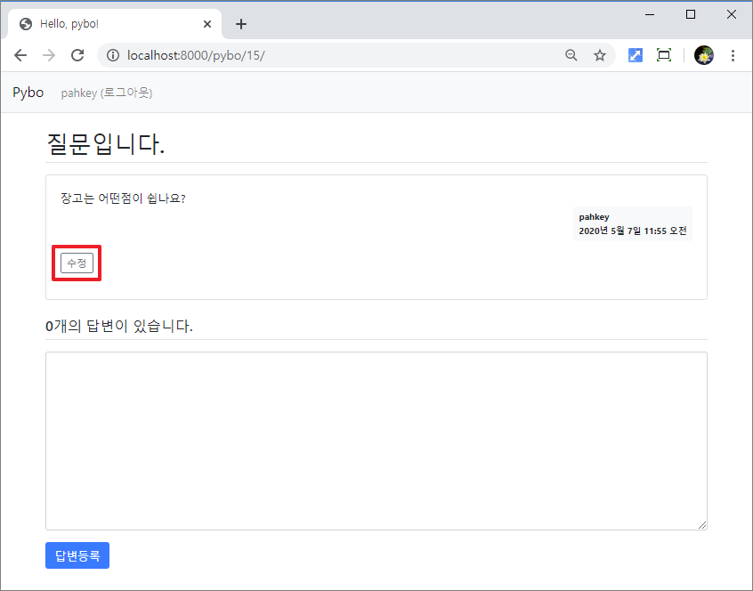

[수정 기능 확인]

수정 기능이 잘 작동하는지 확인해 보자.

## 질문 삭제 기능 추가하기
### [1] 질문 삭제 버튼 추가하기
이제 질문을 삭제하는 기능을 추가해 보자. 다음처럼 <수정> 버튼 바로 옆에 <삭제> 버튼을 추가하자.
```python
(... 생략 ...)

<div class="my-3">
    <a href=""
       class="btn btn-sm btn-outline-secondary">수정</a>
<!-- ------------------------------- [edit] -------------------------------- -->
    <a href="#" class="delete btn btn-sm btn-outline-secondary"
       data-uri="">삭제</a>
<!-- ----------------------------------------------------------------------- -->
</div>

(... 생략 ...)
```
<삭제> 버튼은 <수정> 버튼과는 달리 href 속성값을 "#"로 설정했다. 그리고 삭제를 실행할 URL을 얻기 위해 data-uri 속성을 추가하고, 삭제 함수가 실행될 수 있도록 class 속성에 "delete" 항목을 추가해 주었다.
- data-uri 속성은 제이쿼리에서 $(this).data('uri')와 같이 사용하여 그 값을 얻을 수 있다.
### [2] 질문 삭제 버튼에 jQuery 사용하기
삭제 기능에서 <삭제> 버튼을 구현할 때 '정말로 삭제하시겠습니까?'와 같은 확인 창을 보여주어야 한다. 이를 구현하려면 다음과 같은 코드가 필요하다. 잠시 제이쿼리 코드를 적용해야 하는 단계이므로 손을 떼고 책을 읽어 보자.

[삭제 기능을 위한 제이쿼리 코드]
```python
<script type='text/javascript'>
$(document).ready(function(){
    $(".delete").on('click', function() {
        if(confirm("정말로 삭제하시겠습니까?")) {
            location.href = $(this).data('uri');
        }
    });
});
</script>
```
이 코드에서는 제이쿼리를 사용했다. 제이쿼리가 생소할 수도 있다. 하지만 코드는 크게 어렵지 않다. 정리하자면 <삭제> 버튼을 누르면 확인 창이 나타나고, 확인 창에서 <확인> 버튼을 누르면 앞서 입력했던 data-uri 속성값으로 URL이 호출된다. <취소> 버튼을 누르면 아무 일도 발생하지 않는다.
- $(document).ready(function())은 화면이 로드된 다음 자동으로 호출되는 제이쿼리 함수이다.
### [3] jQuery 실행을 위해 pybo/base.html 파일 수정하기
제이쿼리를 이용하여 자바스크립트를 작성하기 위해서는 제이쿼리 라이브러리 파일을 먼저 로드해야 한다. 알다시피 base.html 파일에 제이쿼리 라이브러리를 로드하는 코드가 이미 추가되어 있다. 따라서 모든 템플릿에서 제이쿼리 라이브러리를 사용하기 위해서는 다음처럼 base.html 파일을 수정해야 한다.
```python
(... 생략 ...)
<!-- jQuery JS -->
<script src=""></script>
<!-- Bootstrap JS -->
<script src=""></script>
<!-- ------------------------------- [edit] -------------------------------- -->
<!-- 자바스크립트 Start -->


<!-- 자바스크립트 End -->
<!-- ----------------------------------------------------------------------- -->
</body>
</html>
```
<script src="{{ url_for('static', filename='jquery-3.4.1.min.js')}}"></script> 문장 이후에 를 추가했다. 이렇게 하면 base.html 파일을 상속받는 템플릿이 이 블록을 구현하여 제이쿼리를 사용한 코드를 작성할 수 있다.
### [4] 질문 템플릿에 삭제 알림 창 기능 추가하기
이제 question_detail.html 파일 아래에 를 추가하고 질문을 삭제할 수 있도록 코드를 추가하자.
```python
(... 생략 ...)

<!-- ------------------------------- [edit] -------------------------------- -->

<script type='text/javascript'>
$(document).ready(function(){
    $(".delete").on('click', function() {
        if(confirm("정말로 삭제하시겠습니까?")) {
            location.href = $(this).data('uri');
        }
    });
});
</script>

<!-- ----------------------------------------------------------------------- -->
```
### [5] 질문 삭제 URL 매핑 추가하기
그리고 data-uri 속성에 이 추가되었으므로 pybo/urls.py 파일에 URL 매핑을 추가해야 한다.
```python
urlpatterns = [
    (... 생략 ...)
# ---------------------------------- [edit] ---------------------------------- #
    path('question/delete/<int:question_id>/', views.question_delete, name='question_delete'),
# ---------------------------------------------------------------------------- #
    (... 생략 ...)
]
```
### [6] 질문 삭제 함수 추가하기
URL 매핑에 추가한 views.question_delete 함수를 다음처럼 작성하자.
```python
(... 생략 ...)
# ---------------------------------- [edit] ---------------------------------- #
@login_required(login_url='common:login')
def question_delete(request, question_id):
    """
    pybo 질문삭제
    """
    question = get_object_or_404(Question, pk=question_id)
    if request.user != question.author:
        messages.error(request, '삭제권한이 없습니다')
        return redirect('pybo:detail', question_id=question.id)
    question.delete()
    return redirect('pybo:index')
# ---------------------------------------------------------------------------- #
```
question_delete 함수 역시 로그인이 필요하므로 @login_required 애너테이션을 적용하고 로그인한 사용자와 글쓴이가 동일한 경우에만 삭제할 수 있도록 했다.

질문 글쓴이와 로그인 사용자가 동일하면 질문 상세 화면에 이제 <삭제> 버튼이 나타날 것이다. 삭제가 잘 실행되는지 확인해 보자.

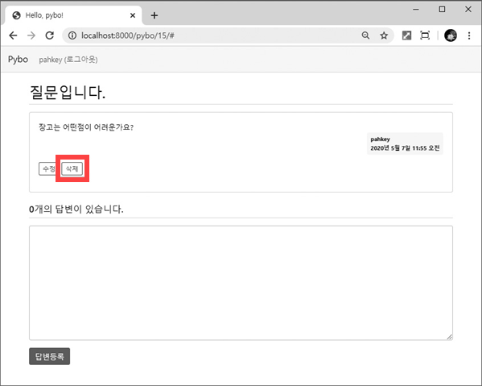

[삭제 기능 확인]

## 답변 수정 & 삭제 기능 추가하기
이번에는 답변 수정 & 삭제 기능을 추가하자. 질문 수정 & 삭제 기능과 거의 비슷한 구성으로 실습을 진행한다. 다만 답변 수정은 답변 등록 템플릿이 따로 없으므로 답변 수정에 사용할 템플릿이 추가로 필요하다.

- 답변 등록은 질문 상세 화면 아래쪽에 텍스트 입력 창을 추가하여 만든 것이므로 질문 상세 템플릿을 답변 수정용으로 사용하는 데는 적합하지 않다.
- 답변 수정 & 삭제 기능은 질문 수정 & 삭제 기능과 크게 차이 나지 않으므로 간단히 설명하고 넘어가겠다.
### [1] 답변 수정 버튼 추가하기
답변 목록이 출력되는 부분에 답변 수정 버튼을 추가하자.
```python
(... 생략 ...)

<div class="card my-3">
    <div class="card-body">
        (... 생략 ...)
<!-- ------------------------------- [edit] -------------------------------- -->
        
        <div class="my-3">
            <a href="" 
               class="btn btn-sm btn-outline-secondary">수정</a>
        </div>
        
<!-- ----------------------------------------------------------------------- -->
    </div>
</div>

(... 생략 ...)
```
### [2] 답변 수정 URL 매핑 추가하기
가 추가되었으므로 pybo/urls.py 파일에 URL 매핑을 추가해야 한다.
```python
urlpatterns = [
    (... 생략 ...)
# ---------------------------------- [edit] ---------------------------------- #
    path('answer/modify/<int:answer_id>/', views.answer_modify, name='answer_modify'),
# ---------------------------------------------------------------------------- #
    (... 생략 ...)
]
```
### [3] 답변 수정 함수 추가하기
계속해서 views.answer_modify 함수를 추가하자.
```python
(... 생략 ...)
# ---------------------------------- [edit] ---------------------------------- #
from .models import Question, Answer
# ---------------------------------------------------------------------------- #
(... 생략 ...)
# ---------------------------------- [edit] ---------------------------------- #
@login_required(login_url='common:login')
def answer_modify(request, answer_id):
    """
    pybo 답변수정
    """
    answer = get_object_or_404(Answer, pk=answer_id)
    if request.user != answer.author:
        messages.error(request, '수정권한이 없습니다')
        return redirect('pybo:detail', question_id=answer.question.id)

    if request.method == "POST":
        form = AnswerForm(request.POST, instance=answer)
        if form.is_valid():
            answer = form.save(commit=False)
            answer.author = request.user
            answer.modify_date = timezone.now()
            answer.save()
            return redirect('pybo:detail', question_id=answer.question.id)
    else:
        form = AnswerForm(instance=answer)
    context = {'answer': answer, 'form': form}
    return render(request, 'pybo/answer_form.html', context)
# ---------------------------------------------------------------------------- #
```
### [4] 답변 수정 폼 작성하기
답변 수정을 위한 템플릿 answer_form.html 파일은 별도로 만들어야 한다. 파일 생성 후 다음과 같은 코드를 입력하자.
```python
<!-- ------------------------------- [edit] -------------------------------- -->



<div class="container my-3">
    <form method="post" class="post-form">
        
        
        <div class="form-group">
            <label for="content">답변내용</label>
            <textarea class="form-control" name="content" id="content" 
                      rows="10">{{ form.content.value|default_if_none:'' }}</textarea>
        </div>
        <button type="submit" class="btn btn-primary">저장하기</button>
    </form>
</div>

<!-- ----------------------------------------------------------------------- -->
```
답변 수정 기능도 질문 수정 기능과 마찬가지로 답변 등록 사용자와 로그인 사용자가 동일할 때만 <수정> 버튼이 나타난다. 답변 수정 기능이 잘 작동하는지 확인해 보자.

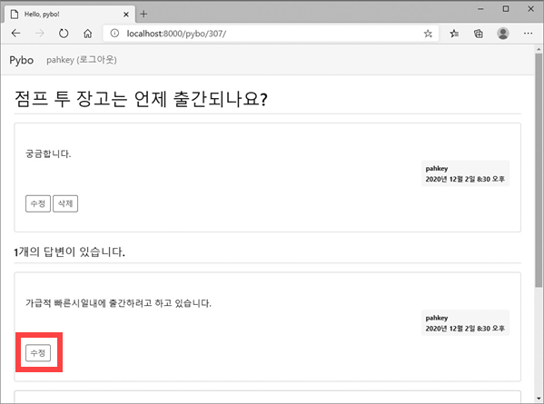

[수정 기능 확인]

### [5] 답변 삭제 버튼 추가하기
질문 상세 화면에 답변 삭제 버튼을 추가하자.
```python
(... 생략 ...)

<div class="card my-3">
    <div class="card-body">
        (... 생략 ...)
        
        <div class="my-3">
            <a href="" 
               class="btn btn-sm btn-outline-secondary">수정</a>
<!-- ------------------------------- [edit] -------------------------------- -->
            <a href="#" class="delete btn btn-sm btn-outline-secondary " 
               data-uri="">삭제</a>
<!-- ----------------------------------------------------------------------- -->
        </div>
        
    </div>
</div>

(... 생략 ...)
```
<수정> 버튼 옆에 <삭제> 버튼을 추가했다. 질문의 <삭제> 버튼과 마찬가지로 <삭제> 버튼에 delete 클래스를 적용했으므로 <삭제> 버튼을 누르면 data-uri 속성에 설정한 url이 실행될 것이다.

### [6] 답변 삭제 URL 매핑 추가하기
이 추가되었으므로 pybo/urls.py 파일에 URL 매핑을 추가하자.
```python
urlpatterns = [
    (... 생략 ...)
# ---------------------------------- [edit] ---------------------------------- #
    path('answer/delete/<int:answer_id>/', views.answer_delete, name='answer_delete'),
# ---------------------------------------------------------------------------- #
    (... 생략 ...)
]
```
### [7] 답변 삭제 함수 추가하기
URL 매핑에 의해 실행될 views.answer_delete 함수를 추가하자.
```python
(... 생략 ...)
# ---------------------------------- [edit] ---------------------------------- #
@login_required(login_url='common:login')
def answer_delete(request, answer_id):
    """
    pybo 답변삭제
    """
    answer = get_object_or_404(Answer, pk=answer_id)
    if request.user != answer.author:
        messages.error(request, '삭제권한이 없습니다')
    else:
        answer.delete()
    return redirect('pybo:detail', question_id=answer.question.id)
# ---------------------------------------------------------------------------- #
```
이제 질문 상세 화면에서 답변을 작성한 사용자와 로그인한 사용자가 같으면 <삭제> 버튼이 나타날 것이다. 잘 작동하는지 확인해 보자.

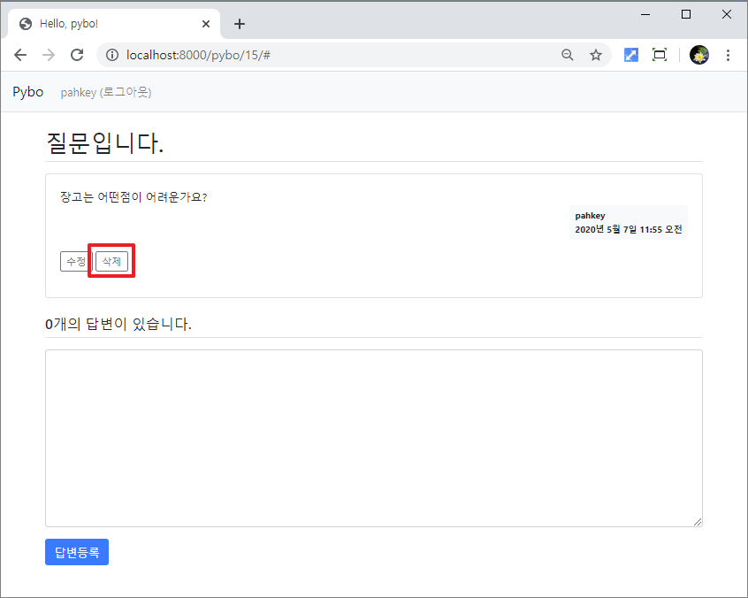

## 수정일시 표시하기
마지막으로 질문 상세 화면에서 수정일시를 확인할 수 있도록 템플릿을 수정해 보자.
### [1] 작성일시 왼쪽에 수정일시 추가하기
질문과 답변에는 이미 작성일시를 표시하고 있다. 작성일시 바로 왼쪽에 수정일시를 추가하자.
```python
(... 생략 ...)
<div class="card-body">
    <div class="card-text" style="white-space: pre-line;">{{ question.content }}</div>
    <div class="d-flex justify-content-end">
<!-- ------------------------------- [edit] -------------------------------- -->
        
        <div class="badge badge-light p-2 text-left mx-3">
            <div class="mb-2">modified at</div>
            <div>{{ question.modify_date }}</div>
        </div>
        
<!-- ----------------------------------------------------------------------- -->
        <div class="badge badge-light p-2 text-left">
            <div class="mb-2">{{ question.author.username }}</div>
            <div>{{ question.create_date }}</div>
        </div>
    </div>
    (... 생략 ...)
</div>
(... 생략 ...)

<div class="card my-3">
    <div class="card-body">
        <div class="card-text" style="white-space: pre-line;">{{ answer.content }}</div>
        <div class="d-flex justify-content-end">
<!-- ------------------------------- [edit] -------------------------------- -->
            
            <div class="badge badge-light p-2 text-left mx-3">
                <div class="mb-2">modified at</div>
                <div>{{ answer.modify_date }}</div>
            </div>
            
<!-- ----------------------------------------------------------------------- -->
            <div class="badge badge-light p-2 text-left">
                <div class="mb-2">{{ answer.author.username }}</div>
                <div>{{ answer.create_date }}</div>
            </div>
        </div>
        (... 생략 ...)
    </div>
</div>

(... 생략 ...)
```
이제 질문이나 답변을 수정하면 다음처럼 수정일시가 표시될 것이다.
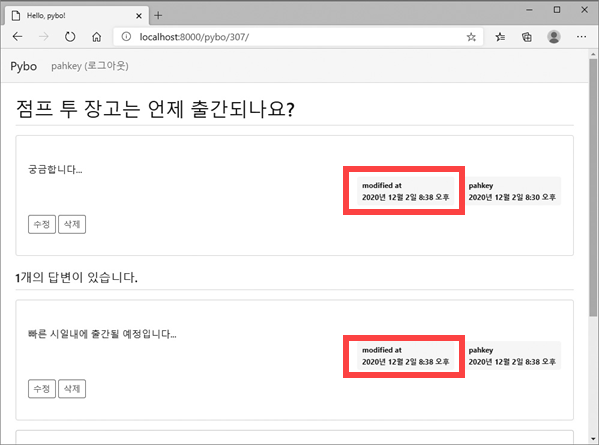

[수정일시 표시 확인]
## 댓글 기능 추가하기
이제 질문과 답변에 댓글 기능을 추가해 보자. 댓글 기능을 추가하다 보면 파이보가 완벽한 게시판 서비스에 가까워지고 있다는 느낌이 들 것이다.
## 댓글에 사용할 모델 만들기
### [1] Comment 모델 만들기
댓글에 사용할 Comment 모델을 작성하자. 필드가 꽤 많으므로 누락되지 않도록 주의하며 입력하자.
```python
(... 생략 ...)
# ---------------------------------- [edit] ---------------------------------- #
class Comment(models.Model):
    author = models.ForeignKey(User, on_delete=models.CASCADE)
    content = models.TextField()
    create_date = models.DateTimeField()
    modify_date = models.DateTimeField(null=True, blank=True)
    question = models.ForeignKey(Question, null=True, blank=True, on_delete=models.CASCADE)
    answer = models.ForeignKey(Answer, null=True, blank=True, on_delete=models.CASCADE)
# ---------------------------------------------------------------------------- #
```
Comment 모델의 필드 구성은 다음과 같다.

author : 댓글 글쓴이

content : 댓글 내용

create_date : 댓글 작성일시

modify_date : 댓글 수정일시

question : 이 댓글이 달린 질문

answer : 이 댓글이 달린 답변

질문에 댓글을 작성하면 Comment 모델의 question 필드에 값이 저장되고, 답변에 댓글이 작성되면 answer에 값이 저장된다. 다시 말해 Comment 모델 데이터에는 question 필드 또는 answer 필드 중 하나에만 값이 저장되므로 두 필드는 모두 null=True, blank=True여야 한다. 또한 question, answer 필드는 질문이나 답변 삭제 시 그에 달린 댓글까지 삭제되도록 on_delete=models.CASCADE를 설정했다.

### [2] makemigrations, migrate 명령 실행하기
Comment 모델이 추가되었으므로 makemigrations, migrate 명령을 실행하자.
```python
(mysite) c:\projects\mysite>python manage.py makemigrations
Migrations for 'pybo':
  pybo\migrations\0005_comment.py
    - Create model Comment

(mysite) c:\projects\mysite>python manage.py migrate
Operations to perform:
  Apply all migrations: admin, auth, contenttypes, pybo, sessions
Running migrations:
  Applying pybo.0005_comment(... 생략 ...) OK
```
## 질문 댓글 기능 추가하기
질문에 댓글을 등록할 수 있는 기능을 추가해 보자. 이제 장고에 새 기능을 추가하는 패턴에 익숙해졌을 것이다. 실습을 조금 빠르게 진행해 보자.
#### 장고 기능 개발 패턴 정리
1.화면에 버튼 등 기능 추가하기

2.urls.py 파일에 기능에 해당하는 URL 매핑 추가하기

3.forms.py 파일에 폼 작성하기

4.views.py 파일에 URL 매핑에 추가한 함수 작성하기

5.함수에서 사용할 템플릿 작성하기
### [1] 질문 상세 화면에 댓글 목록과 댓글 입력 링크 추가하기
질문 상세 화면에 등록한 댓글을 보여 주고, 댓글을 등록할 수 있는 링크를 추가하자.
- div class="comment py-2 text-muted"에서 comment는 styles.css의 글씨를 작게 표시하기 위한 설정이다.
```python
<div class="card-body">
    (... 생략 ...)
<!-- ------------------------------- [edit] -------------------------------- -->
    <!-- 질문 댓글 Start -->
    
    <div class="mt-3">
    
        <div class="comment py-2 text-muted">
            <span style="white-space: pre-line;">{{ comment.content }}</span>
            <span>
                - {{ comment.author }}, {{ comment.create_date }}
                
                (수정:{{ comment.modify_date }})
                
            </span>
            
            <a href="" class="small">수정</a>,
            <a href="#" class="small delete" 
               data-uri="">삭제</a>
            
        </div>
    
    </div>
    
    <div>
        <a href="" 
           class="small"><small>댓글 추가 ..</small></a>
    </div>
    <!-- 질문 댓글 End -->
<!-- ----------------------------------------------------------------------- -->
</div>
```
질문에 등록된 댓글을 보여 주도록 와  사이에 댓글 내용과 글쓴이, 작성일시를 출력했다. 또 댓글 글쓴이와 로그인한 사용자가 같으면 '수정', '삭제' 링크가 보이도록 했다. for 문 바깥쪽에는 댓글을 작성할 수 있는 '댓글 추가 ..' 링크도 추가했다.

'코드를 자세히 보면 for 문으로 표시되는 댓글(div 엘리먼트)에 클래스값으로 comment를 지정했다. comment 클래스는 댓글을 작게 보여주는 클래스로 CSS를 별도로 작성해야 한다.
### [2] comment 클래스의 CSS 작성하기
지금까지 빈 파일로 남아 있던 style.css를 사용할 차례이다. 댓글마다 상단에 점선을 추가하고, 글꼴 크기를 0.7em으로 설정하도록 CSS를 작성하자.
```python
/* ---------------------------------- [edit] --------------------------------- */
.comment {
    border-top:dotted 1px #ddd;
    font-size:0.7em;
}
/* --------------------------------------------------------------------------- */
```
### [3] 질문 댓글 URL 매핑 추가하기
위에서 추가한 <수정>, <삭제>, <댓글 추가 ..>에 해당하는 URL 매핑을 pybo/urls.py 파일에 추가하자.
```python
urlpatterns = [
    (... 생략 ...)
# ---------------------------------- [edit] ---------------------------------- #
    path('comment/create/question/<int:question_id>/', views.comment_create_question, name='comment_create_question'),
    path('comment/modify/question/<int:comment_id>/', views.comment_modify_question, name='comment_modify_question'),
    path('comment/delete/question/<int:comment_id>/', views.comment_delete_question, name='comment_delete_question'),
# ---------------------------------------------------------------------------- #
]
```
댓글 등록, 수정, 삭제에 대한 URL 매핑을 한꺼번에 추가했다. 댓글을 등록할 때는 질문의 id 번호 <int:question_id>가 필요하고 댓글을 수정하거나 삭제할 때는 댓글의 id 번호 <int:comment_id>가 필요함에 주의하자.
### [4] 질문 댓글 폼 작성하기
댓글 등록 시 사용할 CommentForm을 작성하자.
```python
# ---------------------------------- [edit] ---------------------------------- #
from pybo.models import Question, Answer, Comment
# ---------------------------------------------------------------------------- #
(... 생략 ...)
# ---------------------------------- [edit] ---------------------------------- #
class CommentForm(forms.ModelForm):
    class Meta:
        model = Comment
        fields = ['content']
        labels = {
            'content': '댓글내용',
        }
# ---------------------------------------------------------------------------- #
```
댓글은 content 필드 하나면 충분하다.
### [5] 질문 댓글 등록 함수 추가하기
pybo/views.py 파일에 댓글 등록 함수 comment_create_question을 추가하자.
```python
(... 생략 ...)
# ---------------------------------- [edit] ---------------------------------- #
from .forms import QuestionForm, AnswerForm, CommentForm
# ---------------------------------------------------------------------------- #
(... 생략 ...)
# ---------------------------------- [edit] ---------------------------------- #
@login_required(login_url='common:login')
def comment_create_question(request, question_id):
    """
    pybo 질문댓글등록
    """
    question = get_object_or_404(Question, pk=question_id)
    if request.method == "POST":
        form = CommentForm(request.POST)
        if form.is_valid():
            comment = form.save(commit=False)
            comment.author = request.user
            comment.create_date = timezone.now()
            comment.question = question
            comment.save()
            return redirect('pybo:detail', question_id=question.id)
    else:
        form = CommentForm()
    context = {'form': form}
    return render(request, 'pybo/comment_form.html', context)
# ---------------------------------------------------------------------------- #
```
댓글 저장 후에는 댓글을 작성한 질문 상세 화면으로 리다이렉트시켰다. 또한 댓글은 질문에 달리는 것이므로 comment.question = question와 같이 Comment 모델의 question 속성에 질문 객체를 저장했다.
### [6] 질문 댓글 등록을 위한 템플릿 작성하기
댓글 등록을 위한 comment_form.html 템플릿 파일은 다음과 같이 작성하자. 파일 생성 후 다음과 같은 코드를 작성하자.
```python
<!-- ------------------------------- [edit] -------------------------------- -->



<div class="container my-3">
    <h5 class="border-bottom pb-2">댓글등록하기</h5>
    <form method="post" class="post-form my-3">
        
        
        <div class="form-group">
            <label for="content">댓글내용</label>
            <textarea class="form-control"name="content" id="content" 
                      rows="3">{{ form.content.value|default_if_none:'' }}</textarea>
        </div>
        <button type="submit" class="btn btn-primary">저장하기</button>
    </form>
</div>

<!-- ----------------------------------------------------------------------- -->
```
### [7] 질문 댓글 수정 함수 추가하기
질문 댓글 수정을 위한 comment_modify_question 함수를 다음과 같이 추가하자.
```python
(... 생략 ...)
# ---------------------------------- [edit] ---------------------------------- #
from .models import Question, Answer, Comment
# ---------------------------------------------------------------------------- #
(... 생략 ...)

# ---------------------------------- [edit] ---------------------------------- #
@login_required(login_url='common:login')
def comment_modify_question(request, comment_id):
    """
    pybo 질문댓글수정
    """
    comment = get_object_or_404(Comment, pk=comment_id)
    if request.user != comment.author:
        messages.error(request, '댓글수정권한이 없습니다')
        return redirect('pybo:detail', question_id=comment.question.id)

    if request.method == "POST":
        form = CommentForm(request.POST, instance=comment)
        if form.is_valid():
            comment = form.save(commit=False)
            comment.author = request.user
            comment.modify_date = timezone.now()
            comment.save()
            return redirect('pybo:detail', question_id=comment.question.id)
    else:
        form = CommentForm(instance=comment)
    context = {'form': form}
    return render(request, 'pybo/comment_form.html', context)
# ---------------------------------------------------------------------------- #
```
질문 댓글 수정 함수는 질문 댓글 등록 함수와 다르지 않다. GET 방식이면 기존 댓글을 조회하여 폼에 반영하고 POST 방식이면 입력된 값으로 댓글을 업데이트한다. 업데이트 시 modify_date에 수정일시를 반영하는 것도 잊지 말자.
### [8] 질문 댓글 삭제 함수 추가하기
질문 댓글 삭제 함수 comment_delete_question을 추가하자.
```python
# ---------------------------------- [edit] ---------------------------------- #
@login_required(login_url='common:login')
def comment_delete_question(request, comment_id):
    """
    pybo 질문댓글삭제
    """
    comment = get_object_or_404(Comment, pk=comment_id)
    if request.user != comment.author:
        messages.error(request, '댓글삭제권한이 없습니다')
        return redirect('pybo:detail', question_id=comment.question_id)
    else:
        comment.delete()
    return redirect('pybo:detail', question_id=comment.question_id)
# ---------------------------------------------------------------------------- #
```
댓글 삭제 시 댓글이 있던 상세 화면으로 리다이렉트한다. 코드 수정 후 질문 상세 화면에서 <댓글 추가 ..>를 눌러 댓글을 추가해 보고 수정과 삭제 기능도 잘 작동하는지 확인해 보자.

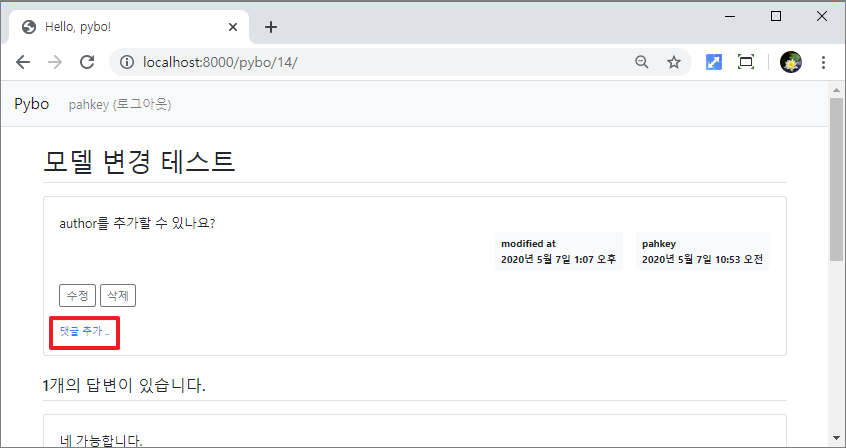

[댓글 추가 .. 기능 확인]

## 답변 댓글 기능 추가하기
답변에 댓글 기능을 추가하는 과정은 질문에 댓글 기능을 추가하는 과정과 크게 차이 나지 않는다. 실습을 빠르게 진행하자.
### [1] 답변에 댓글 목록을 보여주고 댓글 등록 링크 추가하기
질문 상세 화면의 답변 부분에 댓글의 목록을 보여주고 댓글을 추가할 수 있는 링크를 추가하자.

```python

<div class="card my-3">
    <div class="card-body">
        (... 생략 ...)
<!-- ------------------------------- [edit] -------------------------------- -->
        
        <div class="mt-3">
        
            <div class="comment py-2 text-muted">
                <span style="white-space: pre-line;">{{ comment.content }}</span>
                <span>
                    - {{ comment.author }}, {{ comment.create_date }}
                    
                    (수정:{{ comment.modify_date }})
                    
                </span>
                
                <a href="" class="small">수정</a>,
                <a href="#" class="small delete" 
                   data-uri="">삭제</a>
                
            </div>
        
        </div>
        
        <div>
            <a href="" 
               class="small"><small>댓글 추가 ..</small></a>
        </div>
<!-- ----------------------------------------------------------------------- -->
    </div>
</div>

```
질문 부분에 댓글 기능을 추가했던 것과 차이가 없다. 다만 question.comment_set 대신 answer.comment_set을 사용한 점과, 답변의 댓글을 <수정>, <삭제>, <추가> 시 호출되는 URL만 다르다.
### [2] 답변 댓글 URL 매핑 추가하기
urls.py 파일에 앞단계에 해당하는 URL 매핑을 추가하자.
```python
urlpatterns = [
    (... 생략 ...)
# ---------------------------------- [edit] ---------------------------------- #
    path('comment/create/answer/<int:answer_id>/', views.comment_create_answer, name='comment_create_answer'),
    path('comment/modify/answer/<int:comment_id>/', views.comment_modify_answer, name='comment_modify_answer'),
    path('comment/delete/answer/<int:comment_id>/', views.comment_delete_answer, name='comment_delete_answer'),
# ---------------------------------------------------------------------------- #
]
```
댓글을 등록할 때는 답변 id 번호 <int:answer_id>가, 댓글을 수정 또는 삭제할 때는 댓글 id 번호 <int:comment_id>가 사용되니 주의하자.
### [3] 답변 댓글 등록, 수정, 삭제 함수 추가하기
views.py 파일에 답변의 댓글을 등록, 수정, 삭제하기 위한 함수를 추가하자.
```python
(... 생략 ...)
# ---------------------------------- [edit] ---------------------------------- #
@login_required(login_url='common:login')
def comment_create_answer(request, answer_id):
    """
    pybo 답글댓글등록
    """
    answer = get_object_or_404(Answer, pk=answer_id)
    if request.method == "POST":
        form = CommentForm(request.POST)
        if form.is_valid():
            comment = form.save(commit=False)
            comment.author = request.user
            comment.create_date = timezone.now()
            comment.answer = answer
            comment.save()
            return redirect('pybo:detail', question_id=comment.answer.question.id)
    else:
        form = CommentForm()
    context = {'form': form}
    return render(request, 'pybo/comment_form.html', context)


@login_required(login_url='common:login')
def comment_modify_answer(request, comment_id):
    """
    pybo 답글댓글수정
    """
    comment = get_object_or_404(Comment, pk=comment_id)
    if request.user != comment.author:
        messages.error(request, '댓글수정권한이 없습니다')
        return redirect('pybo:detail', question_id=comment.answer.question.id)

    if request.method == "POST":
        form = CommentForm(request.POST, instance=comment)
        if form.is_valid():
            comment = form.save(commit=False)
            comment.author = request.user
            comment.modify_date = timezone.now()
            comment.save()
            return redirect('pybo:detail', question_id=comment.answer.question.id)
    else:
        form = CommentForm(instance=comment)
    context = {'form': form}
    return render(request, 'pybo/comment_form.html', context)


@login_required(login_url='common:login')
def comment_delete_answer(request, comment_id):
    """
    pybo 답글댓글삭제
    """
    comment = get_object_or_404(Comment, pk=comment_id)
    if request.user != comment.author:
        messages.error(request, '댓글삭제권한이 없습니다')
        return redirect('pybo:detail', question_id=comment.answer.question.id)
    else:
        comment.delete()
    return redirect('pybo:detail', question_id=comment.answer.question.id)
# ---------------------------------------------------------------------------- #
```
이번에 추가한 답변 댓글과 관련된 함수들은 질문 댓글의 함수들과 거의 차이가 없으므로 별도의 설명은 생략하겠다. 하나 짚고 넘어가자면 답변의 댓글을 등록하거나 수정하기 위해 사용한 폼과 템플릿은 질문 댓글에서 사용한 CommentForm과 comment_form.html 파일을 재활용할 수 있어서 별도의 코드를 작성할 필요가 없었다는 점이다.
- 답변 댓글에서 question_id를 얻어내기 위해 comment.answer.question과 같이 answer를 통해 question을 참조한 점도 확인하자.

# 12월 26일 4장 세상에 선보이는 파이보 서비스!
